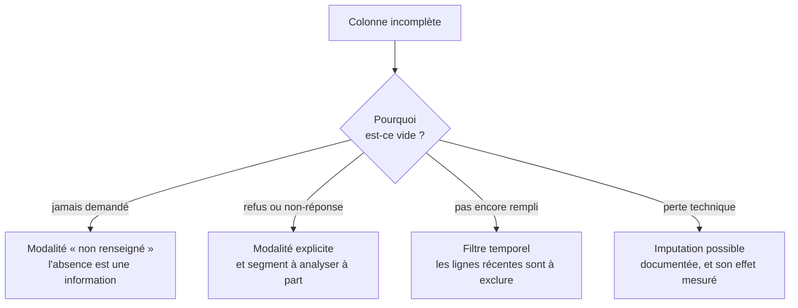

Niveau attendu : **autonomie**. Trancher entre trois mécanismes d'absence engage le résultat, et il n'existe pas de règle générale à appliquer : la décision se prend au cas par cas et se défend.

Le taux ne dit rien, le mécanisme dit tout. Un champ vide parce que la question n'a pas été posée, parce que la personne a refusé de répondre, ou parce que le système ne l'a pas encore renseigné mènent à trois traitements différents.

## Ce qu'il faut savoir faire

- Chercher le mécanisme d'absence avant le traitement, en interrogeant le métier et non le schéma. « Depuis quand ce champ est-il obligatoire » explique souvent 90 % des vides en une phrase.
- Vérifier si l'absence est répartie au hasard ou concentrée. Les lignes incomplètes le sont rarement par hasard : elles décrivent une agence, une période, un canal de vente — et les écarter revient à écarter un segment.
- Créer une modalité « non renseigné » plutôt qu'imputer, chaque fois que l'absence porte du sens. C'est la bonne réponse dans la majorité des cas d'analyse, et elle se lit en restitution.
- N'imputer qu'en le documentant et en mesurant l'effet : refaire l'analyse avec et sans imputation, et regarder si la conclusion bouge. Si elle bouge, l'imputation est le résultat.
- Distinguer le vide du zéro et de la chaîne vide. Les trois coexistent souvent dans la même colonne et signifient trois choses différentes, dont une seule est une absence.
- Annoncer le volume de ce qui a été écarté ou complété dans la restitution, systématiquement.

## Les notions mobilisées

- [[notions/qualite-des-donnees]] — la complétude et ses tests ; l'angle analyste est qu'on nettoie pour une question précise, sans mandat sur la source.
- [[notions/statistiques-descriptives]] — le taux de remplissage colonne par colonne fait partie du premier regard, avant toute conclusion.
- [[notions/pandas]] — les opérations d'inspection et de remplissage, et le piège des valeurs non numériques propagées silencieusement.
- [[notions/apprentissage-supervise]] — si l'imputation devient un modèle, l'analyse a changé de nature et doit être évaluée comme telle.

> [!warning] Piège
> Supprimer 8 % des lignes parce qu'elles sont incomplètes, puis présenter un résultat sans le dire. C'est publier un chiffre sur une population qui n'est pas celle qu'on croit — et comme les lignes incomplètes ne sont presque jamais réparties au hasard, le biais va dans un sens précis, généralement celui qui arrange.

## Pour apprendre

- [scikit-learn — Imputation](https://scikit-learn.org/stable/modules/impute.html) — les méthodes disponibles et, surtout, ce que chacune suppose du mécanisme d'absence.
- [NIST/SEMATECH e-Handbook](https://www.itl.nist.gov/div898/handbook/) — rigoureux et gratuit sur la préparation des données de mesure.
- [tidyr](https://tidyr.tidyverse.org/) — la mise en forme et le traitement des vides côté R, avec une logique explicite.
- [Pandera](https://pandera.readthedocs.io/) — transformer le constat de complétude en contrôle exécutable qui échoue quand la source change.
