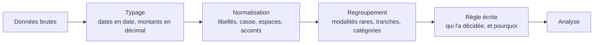

Typage, normalisation des libellés, découpage ou regroupement de modalités. Chaque règle de regroupement est un choix d'analyse — pas une opération technique — et elle se documente comme tel, parce qu'elle change le résultat.

## Ce qu'il faut savoir faire

- Typer avant tout le reste : dates en type date et non en chaîne, montants en décimal, identifiants en texte. Une comparaison de dates sur des chaînes produit un ordre alphabétique, et personne ne le remarque avant la restitution.
- Normaliser les champs libres méthodiquement — casse, espaces, accents, abréviations — en listant d'abord les valeurs distinctes. Un champ rempli par vingt commerciaux porte vingt orthographes de la même chose, et le comptage par valeur brute est faux d'un facteur trois.
- Faire valider les regroupements par le métier. Décider que les modalités sous 2 % deviennent « autres », ou que trois statuts historiques se fondent en un, est un arbitrage d'analyse qui appartient à celui qui décidera derrière.
- Documenter chaque règle à l'endroit où elle s'applique, dans le script, avec la raison métier. Le commentaire utile n'est pas ce que fait la ligne mais pourquoi cette règle-là.
- Garder la colonne d'origine à côté de la colonne transformée quand le volume le permet. Cela rend toute vérification immédiate et toute correction locale.
- Reconnaître la transformation qui répond déjà à la question. Une tranche d'ancienneté ou une catégorie de montant décide en partie du résultat : la choisir revient à choisir ce que l'analyse montrera.

## Les notions mobilisées

- [[notions/qualite-des-donnees]] — la validité et la cohérence des modalités, qui se testent au lieu de se supposer.
- [[notions/pandas]] — les opérations de typage, de remplacement et de catégorisation, et leurs conversions implicites à surveiller.
- [[notions/r-et-tidyverse]] — la grammaire de transformation côté R, plus explicite sur les facteurs et leurs niveaux.
- [[notions/statistiques-descriptives]] — un regroupement modifie une distribution ; il faut regarder les deux avant de retenir l'une.

> [!tip] La table des règles
> Une petite table, à part, qui liste chaque regroupement : valeur d'origine, valeur retenue, qui l'a validé, à quelle date. Elle se joint dans le script plutôt que d'être écrite en conditions successives, elle se relit par le métier sans lire de code, et elle se corrige sans toucher à l'analyse.

## Pour apprendre

- [pandas — Données catégorielles](https://pandas.pydata.org/docs/user_guide/categorical.html) — le type qui rend explicite l'ensemble des modalités attendues.
- [OpenRefine](https://openrefine.org/) — le regroupement de valeurs proches et l'historique des opérations, rejouable sur un nouveau fichier.
- [tidyr](https://tidyr.tidyverse.org/) — la mise en forme longue et large, à comprendre une fois pour toutes.
- [scikit-learn — Prétraitement](https://scikit-learn.org/stable/modules/preprocessing.html) — normalisation et encodage, et pourquoi l'ordre par rapport à la découpe compte.
