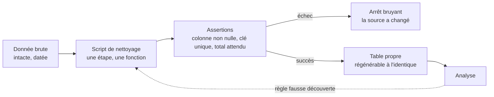

Niveau attendu : **autonomie**. Le script depuis le brut et ses assertions se conçoivent, ils ne se copient pas : c'est ce qui permet de revenir en arrière quand une règle se révèle fausse en pleine analyse.

Le nettoyage est un script rejouable depuis la donnée brute, jamais une suite de corrections manuelles sur une copie. C'est la seule façon de revenir en arrière quand une règle se révèle fausse au milieu de l'analyse — ce qui arrive.

## Ce qu'il faut savoir faire

- Conserver la donnée brute intacte et rejouer le nettoyage par-dessus. Toute correction faite directement sur le fichier de travail est une information perdue.
- Écrire quelques assertions en tête de script : cette colonne n'est jamais nulle, ce montant est positif, cette clé est unique, ce total colle au chiffre officiel du contrôle de gestion. Cinq assertions écrites à la main font déjà le plus gros du travail.
- Compter les lignes après chaque étape et le consigner. C'est le journal qui permet de dire, en une minute, où sont passées les lignes disparues.
- Rendre le script exécutable de bout en bout par quelqu'un d'autre, depuis un poste vierge : chemins relatifs, dépendances déclarées, aucune étape « ouvrir le fichier et corriger la cellule ».
- Rejouer entièrement le nettoyage après toute modification de règle, au lieu de corriger le résultat. Le nettoyage incrémental à la main est la façon la plus sûre de produire deux versions incompatibles du même jeu.
- Rejouer sur la nouvelle extraction quand la source est rafraîchie, et regarder ce qui échoue. Les assertions sont ce qui transforme un changement silencieux de source en erreur visible.

## Les notions mobilisées

- [[notions/qualite-des-donnees]] — les contrôles exécutables, qui remplacent les constats écrits en commentaire.
- [[notions/tests-logiciels]] — pour un analyste, tester c'est vérifier des invariants de données, avec les mêmes exigences de reproductibilité.
- [[notions/collecte-de-donnees]] — la brute datée et sa provenance sont le point de départ obligé de tout rejeu.
- [[notions/python-pour-la-data]] — l'environnement reproductible qui fait qu'un script écrit en mars tourne encore en octobre.

> [!tip] Les cinq assertions qui couvrent la plupart des cas
> La clé est unique. La colonne de date couvre la période attendue. Le nombre de lignes est dans une fourchette connue. Les montants sont du bon signe. Le total colle à une source indépendante — un rapport officiel, un chiffre du contrôle de gestion, un ordre de grandeur que le métier connaît par cœur.

## Pour apprendre

- [Great Expectations](https://docs.greatexpectations.io/) — la formalisation complète des attentes sur un jeu de données, avec rapport lisible par le métier.
- [Pandera](https://pandera.readthedocs.io/) — plus léger : des schémas déclarés à côté du code d'analyse, vérifiés à l'exécution.
- [dbt — Documentation](https://docs.getdbt.com/docs/build/documentation) — à lire comme un catalogue de pratiques de test et de documentation, même sans adopter l'outil.
- [DVC — Prise en main](https://doc.dvc.org/start) — versionner les données et les étapes pour que « rejouer » veuille dire quelque chose de vérifiable.
