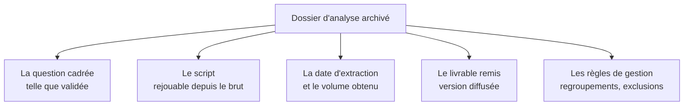

Niveau attendu : **autonomie**. La question cadrée, le script et la date d'extraction se rangent par réflexe : un geste de discipline, pas un sujet d'expertise.

Archiver le livrable avec la question cadrée, le script et la date d'extraction. La question « d'où sort ce chiffre » arrive toujours, et souvent des mois plus tard, posée par quelqu'un qui n'était pas là.

## Ce qu'il faut savoir faire

- Archiver un dossier, pas un fichier : la question cadrée, les données brutes ou le moyen de les réextraire, le script, le livrable diffusé, et les règles de gestion appliquées.
- Rendre le rejeu possible par quelqu'un d'autre. Le test est simple : un collègue doit pouvoir régénérer le chiffre à partir du dossier, sans vous poser de question.
- Dater et versionner le livrable diffusé. La version envoyée au comité n'est pas toujours la dernière du disque, et c'est celle-là qu'on vous opposera.
- Écrire cinq lignes de contexte pour le lecteur futur : ce qui était demandé, ce qui a été livré, ce qui a été écarté, ce qui restait ouvert. C'est ce qui évite de refaire l'analyse dans six mois.
- Produire le livrable depuis le script quand c'est possible, plutôt que de recopier des chiffres dans un document. Le copier-coller est le point où les versions divergent et où les erreurs entrent.
- Purger ce qui doit l'être. Un dossier d'analyse contient souvent des données personnelles ou confidentielles, et son archivage suit les mêmes règles de conservation que la source.

## Les notions mobilisées

- [[notions/redaction-technique]] — le dossier d'analyse est un document destiné à être repris, avec les exigences de structure qui vont avec.
- [[notions/collecte-de-donnees]] — les métadonnées d'extraction sont ce qui rend le rejeu possible, et elles ne se retrouvent pas après coup.
- [[notions/lignage-des-donnees]] — la traçabilité de bout en bout, dont l'archivage d'analyse est la version artisanale et suffisante.
- [[notions/rgpd]] — la durée de conservation s'applique aussi aux extraits gardés « au cas où » dans un dossier d'analyse.

> [!tip] Le format qui rend l'archivage gratuit
> Un document exécutable — notebook ou fichier source qui produit le rapport final — où le texte, le code et les graphiques vivent ensemble. Le livrable se régénère d'une commande, les chiffres du texte ne peuvent pas diverger du calcul, et l'archivage consiste à garder le dossier tel quel.

## Pour apprendre

- [Quarto](https://quarto.org/) — publier un document reproductible depuis Python ou R : le texte, le code et la sortie dans un seul fichier.
- [Jupyter Book](https://jupyterbook.org/) — l'équivalent côté notebooks, pour les dossiers d'analyse qui deviennent volumineux.
- [DVC — Prise en main](https://doc.dvc.org/start) — versionner les données et les étapes, pour que « rejouer » soit vérifiable.
- [Texte du RGPD](https://gdpr-info.eu/) — la durée de conservation et la minimisation, qui s'appliquent aux archives d'analyse comme au reste.
