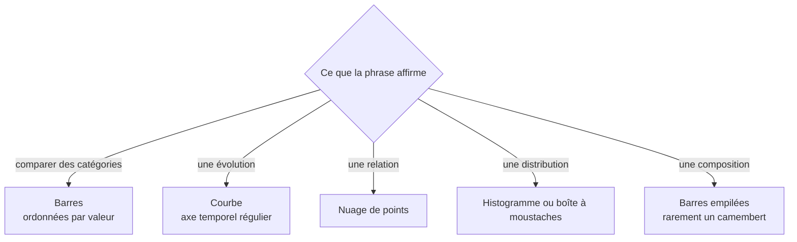

Niveau attendu : **référence**. Le graphique qui démontre une conclusion ponctuelle est son terrain propre ; le tableau de bord durable, lui, appartient au BI Analyst.

Le graphique se choisit à partir de la question, pas du catalogue. Un bon graphique fait porter la comparaison qui compte par l'encodage visuel le plus précis disponible — et retire tout ce qui capte l'attention sans porter d'information.

## Ce qu'il faut savoir faire

- Partir de l'affirmation à démontrer et choisir l'encodage qui la rend lisible sans calcul mental. La position et la longueur se comparent instantanément ; l'aire, l'angle et la couleur beaucoup moins bien.
- Distinguer le graphique d'exploration du graphique de restitution. Le premier est laid, rapide et pour soi ; le second est construit, annoté, et ne montre qu'une chose.
- Annoter le graphique avec la conclusion : un titre qui affirme plutôt qu'il décrit, la valeur clé marquée, le reste en retrait. Un lecteur pressé ne regarde que le titre.
- Respecter les règles qui évitent de mentir sans le vouloir : axe des barres partant de zéro, échelles comparables entre graphiques, pas de double axe vertical, pas d'ordre alphabétique quand l'ordre par valeur est possible.
- Vérifier la lisibilité pour tout le monde : contraste suffisant, information jamais portée par la seule couleur, texte assez grand pour être projeté. Le graphique sera vu sur un écran de salle de réunion, pas sur votre moniteur.
- Supprimer ce qui ne sert pas : grille lourde, effets de relief, dégradés, légendes redondantes. Chaque élément retiré rend le message plus net.

## Les notions mobilisées

- [[notions/visualisation-de-donnees]] — le choix du graphique, la lisibilité et les erreurs classiques ; l'angle analyste est qu'il découle de la phrase à démontrer.
- [[notions/statistiques-descriptives]] — ce qu'on représente est un résumé, avec tout ce qu'il masque.
- [[notions/outils-decisionnels]] — la même règle vaut dans un outil partagé, où la tentation d'ajouter des filtres remplace la hiérarchie du message.

> [!tip] Le test des cinq secondes
> Montrer le graphique à quelqu'un qui n'est pas dans le dossier et lui demander ce qu'il comprend, après cinq secondes. S'il décrit ce qu'il voit au lieu d'énoncer la conclusion, le graphique n'est pas fini — et c'est presque toujours le titre qu'il faut réécrire, pas la visualisation.

## Pour apprendre

- [The Data Visualisation Catalogue](https://datavizcatalogue.com/) — choisir un type de graphique en partant de la question posée.
- [Fundamentals of Data Visualization](https://clauswilke.com/dataviz/introduction.html) — Claus Wilke, libre : la partie sur les couleurs et les échelles est la plus rentable.
- [How To Spot Misleading Charts](https://www.tableau.com/blog/how-spot-misleading-charts-check-axes) — utile dans les deux sens : détecter, et ne pas produire.
- [10 Guidelines for DataViz Accessibility](https://www.highcharts.com/blog/best-practices/10-guidelines-for-dataviz-accessibility/) — contraste, redondance de l'encodage, taille, traités concrètement.
- [matplotlib](https://matplotlib.org/) et [ggplot2](https://ggplot2.tidyverse.org/) — les deux outils de référence ; la grammaire du second vaut d'être comprise même en Python.
