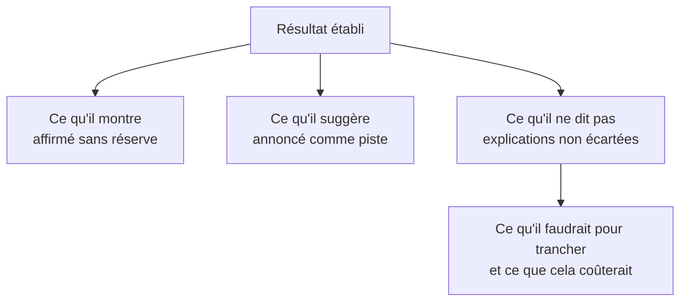

Dire explicitement ce que le résultat ne permet pas de conclure. C'est contre-intuitif et c'est ce qui construit la confiance : un analyste qui ne dit jamais « je ne sais pas » finit par n'être cru sur rien.

## Ce qu'il faut savoir faire

- Séparer trois registres dans la restitution : ce qui est établi, ce qui est probable, ce qui reste ouvert. Les mélanger dans le même ton est ce qui fait qu'un chiffre solide se retrouve contesté avec une hypothèse fragile.
- Donner l'ordre de grandeur de l'incertitude en langage de décideur : une fourchette, une plage de scénarios, pas un intervalle de confiance à 95 % qui sera mal lu.
- Nommer les explications alternatives qu'on n'a pas pu écarter, et dire ce qu'il faudrait pour les écarter. « Il faudrait retenir 10 % du périmètre pendant six semaines » est une information utile, pas un aveu.
- Distinguer « nous n'avons pas trouvé d'effet » de « il n'y a pas d'effet ». La première phrase est vraie, la seconde dépasse ce que les données permettent, et elle sera citée hors contexte.
- Dire ce que la qualité des données limite. Quand un champ n'est renseigné qu'à 60 %, la conclusion porte sur les 60 %, et il faut l'écrire dans la conclusion et non en note de bas de page.
- Refuser une conclusion causale demandée, en proposant la formulation défendable à la place. C'est un moment d'inconfort de quelques secondes qui protège plusieurs mois de crédibilité.

## Les notions mobilisées

- [[notions/tests-hypotheses]] — l'absence de preuve n'est pas une preuve d'absence, et la puissance de l'étude dit laquelle des deux on a.
- [[notions/analyse-correlation]] — la liste des explications concurrentes non écartées est le cœur de ce qu'on annonce ici.
- [[notions/qualite-des-donnees]] — une conclusion ne porte jamais au-delà de ce que la complétude de la source autorise.
- [[notions/redaction-technique]] — écrire une limite sans l'enfouir ni la dramatiser est un exercice de rédaction à part entière.

> [!tip] La formulation qui passe partout
> « Ce que je peux affirmer : X. Ce que je ne peux pas affirmer : que c'est Y qui l'a causé, parce que Z n'a pas pu être écarté. Pour trancher, il faudrait W, qui coûte à peu près V. » Trois phrases, et la conversation passe de la contestation du chiffre à la décision sur l'effort suivant.

## Pour apprendre

- [Statistics Done Wrong](https://www.statisticsdonewrong.com/) — Alex Reinhart, libre : les conclusions qu'on tire ordinairement au-delà des données.
- [Type I & Type II Errors](https://www.scribbr.com/statistics/type-i-and-type-ii-errors/) — la distinction à tenir quand on annonce une absence de résultat.
- [The Effect](https://theeffectbook.net/) — ce qu'il faudrait, concrètement, pour écarter une explication alternative.
