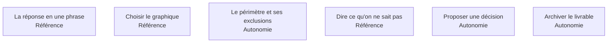

L'étape sur laquelle le métier est jugé. Restituer n'est pas montrer ce qu'on a fait : c'est mettre quelqu'un en position de décider, et savoir ce qu'il risque en décidant.

## Les six sujets

**Porte de sortie** : la personne en face sait ce qu'elle doit faire et ce qu'elle risque en le faisant.

## Ma progression

- [ ] [[parcours/data-analyst/restituer/la-reponse-en-une-phrase|La réponse en une phrase]] — un livrable, un message, le raisonnement après
- [ ] [[parcours/data-analyst/restituer/choisir-le-graphique|Choisir le graphique]] — écrire la conclusion d'abord, construire la démonstration ensuite
- [ ] [[parcours/data-analyst/restituer/le-perimetre-et-ses-exclusions|Le périmètre et ses exclusions]] — période, population, lignes écartées et leur volume
- [ ] [[parcours/data-analyst/restituer/dire-ce-qu-on-ne-sait-pas|Dire ce qu'on ne sait pas]] — ce qui construit la confiance, contre-intuitivement
- [ ] [[parcours/data-analyst/restituer/proposer-une-decision|Proposer une décision]] — sinon l'interprétation revient au plus bavard de la réunion
- [ ] [[parcours/data-analyst/restituer/archiver-le-livrable|Archiver le livrable]] — la question cadrée, le script, la date d'extraction
