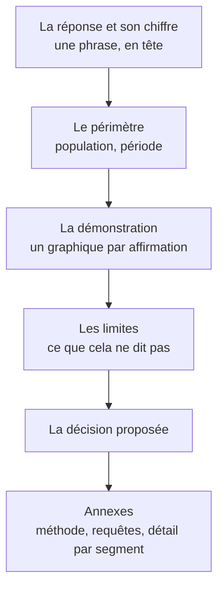

Niveau attendu : **référence**. Un livrable, un message : c'est là-dessus que le métier est jugé, et aucune autre fonction n'écrira cette phrase à sa place.

La réponse en premier, en une phrase, avec son chiffre. Pas la méthode, pas le contexte, pas le cheminement. Le raisonnement vient après, pour ceux qui contestent — et ils existent.

## Ce qu'il faut savoir faire

- Écrire la phrase de conclusion avant de construire le moindre graphique, puis construire le graphique qui la démontre. Si la phrase ne s'écrit pas, l'analyse n'est pas finie — ce n'est pas un problème de restitution.
- Tenir la règle « un livrable, un message ». Si l'analyse porte trois conclusions, ce sont trois blocs distincts avec chacun sa recommandation, pas une planche unique où le lecteur choisit ce qu'il voit.
- Mettre la méthode en annexe, toujours. Elle doit être disponible et jamais en tête : le lecteur qui la demande la trouvera, celui qui ne la demande pas n'a pas à traverser trois pages de méthodologie pour atteindre le chiffre.
- Adapter le niveau, pas le contenu. Le comité de direction reçoit la conclusion et l'ordre de grandeur, l'équipe métier reçoit le détail par segment, et les deux doivent pouvoir remonter à la même requête.
- Donner le chiffre dans l'unité que le décideur manipule : des euros, des dossiers, des jours — pas un taux de variation d'un indicateur composite.
- Préparer la phrase de réponse à la question inverse. On vous demandera « et si c'était l'autre explication ? » ; avoir la réponse prête est ce qui fait la différence entre une analyse défendue et une analyse abandonnée en séance.

## Les notions mobilisées

- [[notions/redaction-technique]] — la structure d'un document qui commence par sa conclusion, genre d'écrit qui s'apprend.
- [[notions/visualisation-de-donnees]] — le graphique existe pour démontrer une phrase, jamais l'inverse.
- [[notions/gestion-parties-prenantes]] — savoir à qui on parle décide du niveau, et le niveau ne change jamais le chiffre.

> [!warning] Piège
> Raconter l'enquête dans l'ordre où on l'a menée. C'est la pente naturelle, parce qu'on est fier du chemin, et c'est ce qui perd l'auditoire : le décideur décroche avant la conclusion, puis pose une question à laquelle on avait répondu à la diapositive quatre.

## Pour apprendre

- [Storytelling with Data — le blog](https://www.storytellingwithdata.com/blog) — gratuit, et la partie sur la hiérarchie du message est la plus directement rentable.
- [Visual Best Practices](https://help.tableau.com/current/blueprint/en-us/bp_visual_best_practices.htm) — la check-list avant publication, indépendante de l'outil.
- [Roadmap Technical Writer](https://roadmap.sh/technical-writer) — le parcours amont sur l'écrit professionnel, pour qui veut structurer cet apprentissage.
