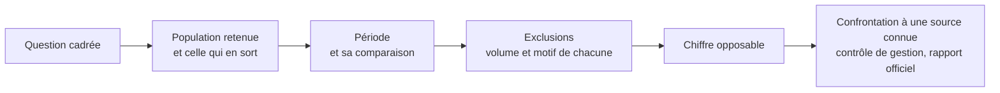

Niveau attendu : **autonomie**. Annoncer période, population et lignes écartées est une rigueur qu'on applique et qu'on assume, pas une autorité qu'on exerce.

Annoncer le périmètre et les exclusions dans la restitution elle-même, pas en annexe : la période, la population, les lignes écartées et leur volume. C'est ce qui rend le chiffre opposable — et ce qui évite qu'il soit démoli par un détail.

## Ce qu'il faut savoir faire

- Écrire le périmètre en tête du livrable, en deux lignes : qui est compté, sur quelle période, comparé à quoi. C'est la première question de tout lecteur qui connaît le sujet.
- Chiffrer chaque exclusion. « 3 200 lignes écartées, soit 6 %, faute de date de souscription » se défend ; « quelques lignes incomplètes ont été retirées » ne se défend pas.
- Dire quand les exclusions ne sont pas réparties au hasard, et sur quoi elles se concentrent. C'est la limite la plus souvent décisive et la plus rarement annoncée.
- Confronter le total à une source indépendante avant de publier : un chiffre du contrôle de gestion, un rapport officiel, un ordre de grandeur que le métier connaît par cœur. Un écart inexpliqué avec la source de référence tue la restitution, quel que soit le reste.
- Expliquer d'avance l'écart avec le chiffre que l'auditoire a en tête. Il en a un ; s'il diffère du vôtre, la réunion portera sur l'écart et sur rien d'autre.
- Reprendre littéralement la définition validée au cadrage. Le mot « client actif » doit avoir en restitution exactement le sens écrit avant l'analyse.

## Les notions mobilisées

- [[notions/qualite-des-donnees]] — le volume des exclusions est un indicateur de qualité, et il se présente comme tel.
- [[notions/collecte-de-donnees]] — la date d'extraction fait partie du périmètre : un chiffre est toujours daté.
- [[notions/cadrage-besoin]] — la définition validée en amont est celle qu'on cite, mot pour mot.
- [[notions/lignage-des-donnees]] — savoir dire d'où vient la donnée et ce qu'elle a subi avant vous, quand la question se pose.

> [!warning] Piège
> Découvrir l'écart avec le chiffre officiel pendant la réunion. Il existe presque toujours — périmètre différent, date d'arrêté différente, règle de gestion différente — et il est explicable en dix minutes quand on l'a cherché avant, indéfendable quand on le découvre en séance. La vérification contre une source connue est la dernière étape obligatoire de toute analyse.

## Pour apprendre

- [Population vs. Sample](https://www.scribbr.com/methodology/population-vs-sample/) — la question à poser en premier, celle qu'on saute en premier.
- [Great Expectations](https://docs.greatexpectations.io/) — transformer les contrôles de périmètre en rapport lisible par le métier.
- [What Is Data Lineage?](https://www.ibm.com/think/topics/data-lineage) — le vocabulaire pour répondre à « d'où sortent ces données ».
