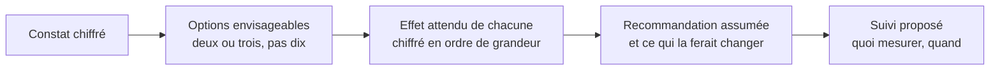

Proposer une décision, même si elle sera écartée. Un analyste qui livre un constat sans recommandation laisse l'interprétation au plus bavard de la réunion — et l'interprétation est l'endroit où la valeur de l'analyse se gagne ou se perd.

## Ce qu'il faut savoir faire

- Formuler deux ou trois options, pas un catalogue, et dire laquelle on recommande. Le rôle n'est pas de décider, il est de rendre la décision possible — et une liste sans hiérarchie ne la rend pas possible.
- Chiffrer l'effet attendu de chaque option en ordre de grandeur, avec l'incertitude qui va avec. Une recommandation sans montant n'est pas comparable aux autres sujets du comité.
- Dire ce qui ferait changer la recommandation. C'est ce qui la rend crédible : elle est conditionnelle à des faits, pas à une opinion.
- Proposer le dispositif de suivi en même temps : quel indicateur, à quelle fréquence, à partir de quel seuil on révise. Sans cela, personne ne saura si la décision a produit ce qu'on annonçait.
- Assumer la recommandation même quand elle déplaît, et la formuler sans mettre personne en cause. Un constat qui met en évidence un dysfonctionnement d'équipe se présente comme un constat de processus, jamais de personne.
- Accepter que la décision prise soit une autre. La valeur de l'analyse est d'avoir posé les termes de l'arbitrage, pas d'avoir eu raison.

## Les notions mobilisées

- [[notions/roi-des-projets-ia]] — chiffrer l'effet attendu et le coût complet d'une option, y compris ce qu'elle mobilise ailleurs.
- [[notions/gestion-parties-prenantes]] — la recommandation s'adresse à quelqu'un qui a un mandat, et se prépare avec ceux qui l'appliqueront.
- [[notions/conduite-du-changement]] — une décision qui contredit une pratique installée ne s'applique que si quelqu'un porte le changement.
- [[notions/mesure-d-usage-produit]] — quand la décision porte sur un produit, le dispositif de suivi se prépare avant le déploiement, pas après.

> [!warning] Piège
> Livrer un tableau de bord quand on attendait une réponse. C'est la dérobade classique : au lieu de conclure, on donne des filtres et on laisse le lecteur trouver. Cela déplace la charge d'interprétation sur quelqu'un de moins bien placé pour l'assumer, et cela fabrique en prime un objet que personne ne maintiendra. Si le besoin est réellement un suivi récurrent, c'est une commande pour [[parcours/bi-analyst]], et il faut le dire.

## Pour apprendre

- [Project management triangle](https://asana.com/resources/project-management-triangle) — poser un arbitrage en termes comparables, ce qui est exactement l'exercice.
- [Stakeholder Management Guide](https://simplystakeholders.com/resources/guides/stakeholder-management/) — préparer une recommandation avec ceux qui l'appliqueront plutôt que contre eux.
- [Storytelling with Data — le blog](https://www.storytellingwithdata.com/blog) — la partie sur l'appel à l'action, souvent l'élément manquant d'une restitution technique.
