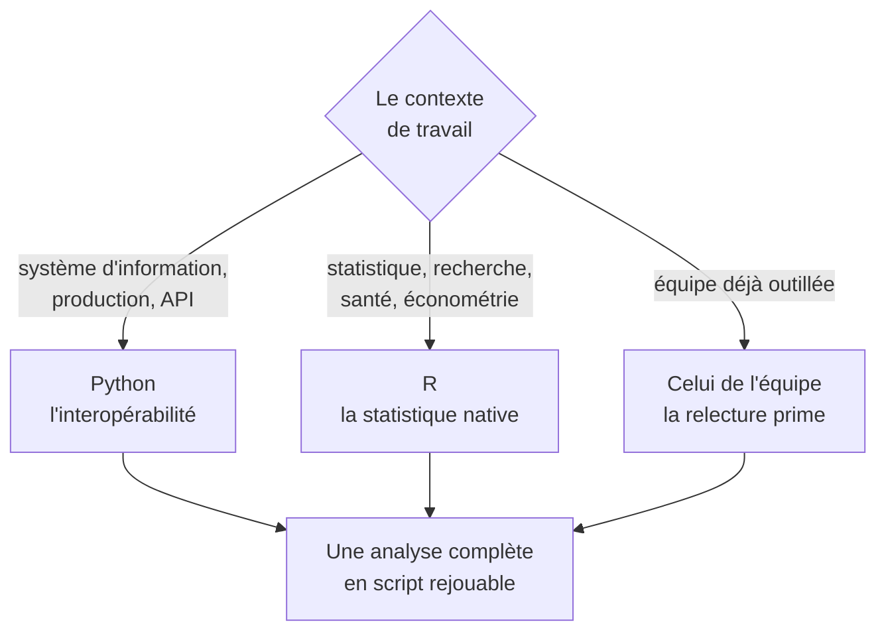

Python ou R : choisis-en un et va au fond. Savoir bricoler dans les deux ne vaut rien ; maîtriser un des deux vaut beaucoup, et la bascule de l'un à l'autre se fait en quelques semaines une fois le premier acquis.

## Ce qu'il faut savoir faire

- Mener une analyse de bout en bout en script rejouable : lecture de la source, nettoyage, agrégation, graphique, export du livrable — sans étape manuelle au milieu.
- Tenir un environnement reproductible : une version de langage fixée, un fichier de dépendances, un environnement par projet. C'est ce qui fait qu'un script écrit en mars tourne encore en octobre.
- Travailler en notebook pour explorer et en script pour livrer. Le notebook autorise l'ordre d'exécution incohérent, ce qui est exactement ce qu'on ne veut pas dans un résultat publié.
- Versionner l'analyse. Git n'est pas réservé aux développeurs : c'est ce qui permet de dire quelle version du script a produit le chiffre de la réunion de mars.
- Savoir lire l'autre langage sans l'écrire, pour reprendre le travail d'un collègue ou une analyse publiée.
- Choisir sur le contexte, pas sur la préférence : Python si l'analyse doit s'interfacer avec le reste du système d'information, R si l'environnement est statistique ou académique, et celui de l'équipe si elle en a déjà un.

## Les notions mobilisées

- [[notions/python-pour-la-data]] — l'environnement, les bibliothèques et les notebooks ; l'angle analyste est la reproductibilité avant la performance.
- [[notions/r-et-tidyverse]] — la grammaire de manipulation et de graphique la plus cohérente du domaine, et ce qui justifie encore R en 2026.
- [[notions/tests-logiciels]] — quelques assertions valent mieux qu'une suite de tests : pour un analyste, tester c'est vérifier des invariants de données.

> [!tip] Ce qui se juge en entretien
> Pas la connaissance de la bibliothèque à la mode, mais la capacité à reprendre son propre script trois mois plus tard. Un dossier d'analyse lisible — données brutes intactes, un script par étape, un fichier de dépendances, un README de cinq lignes — dit plus sur le niveau réel qu'un notebook de trois cents cellules.

## Pour apprendre

- [Le tutoriel Python](https://docs.python.org/3/tutorial/) — la référence officielle, suffisante pour le niveau attendu d'un analyste.
- [Python for Data Analysis](https://wesmckinney.com/book/) — Wes McKinney, libre en ligne : l'entrée en matière la mieux calibrée côté Python.
- [R for Data Science](https://r4ds.hadley.nz/) — Wickham et al., libre en ligne, deuxième édition : l'équivalent côté R, et le meilleur des deux sur la logique d'enchaînement.
- [The R Manuals (CRAN)](https://cran.r-project.org/manuals.html) — la référence du langage, quand la question devient précise.
- [Git — Documentation](https://git-scm.com/doc) — le minimum vital : suivre, revenir en arrière, et savoir quelle version a produit quel chiffre.
