Les outils s'apprennent en quelques semaines et ne distinguent personne. Ce qui distingue, c'est de savoir à quel moment basculer de l'un à l'autre — et ce domaine est organisé autour de ces seuils.

## Les six sujets

```mermaid
flowchart TD
  T["Le tableur et son seuil<br/>Autonomie"]
  S["SQL, l'outil le plus rentable<br/>Autonomie"]
  L["Choisir un langage<br/>Usage"]
  M["Manipuler des tables en code<br/>Autonomie"]
  P["Publier dans un outil partagé<br/>Usage"]
  V["Quand le volume déborde<br/>Notion"]

  click T "/parcours/data-analyst/socle-outillage/le-tableur-et-son-seuil"
  click S "/parcours/data-analyst/socle-outillage/sql-pour-l-analyste"
  click L "/parcours/data-analyst/socle-outillage/choisir-un-langage"
  click M "/parcours/data-analyst/socle-outillage/manipuler-des-tables-en-code"
  click P "/parcours/data-analyst/socle-outillage/publier-dans-un-outil-partage"
  click V "/parcours/data-analyst/socle-outillage/quand-le-volume-deborde"
```

**Par où commencer** : SQL, avant tout le reste. Il rend inutile la majeure partie de ce qui se fait péniblement ailleurs, et trois semaines de pratique quotidienne suffisent à l'autonomie.

## Ma progression

- [ ] [[parcours/data-analyst/socle-outillage/le-tableur-et-son-seuil|Le tableur et son seuil]] — la question n'est pas quelles formules, c'est quand arrêter
- [ ] [[parcours/data-analyst/socle-outillage/sql-pour-l-analyste|SQL pour l'analyste]] — ce qu'il faut maîtriser, et ce qui n'est pas ton sujet
- [ ] [[parcours/data-analyst/socle-outillage/choisir-un-langage|Choisir un langage]] — Python ou R, un seul, jusqu'au bout
- [ ] [[parcours/data-analyst/socle-outillage/manipuler-des-tables-en-code|Manipuler des tables en code]] — l'enchaînement des transformations, lisible et rejouable
- [ ] [[parcours/data-analyst/socle-outillage/publier-dans-un-outil-partage|Publier dans un outil partagé]] — consommer et publier sans devenir l'équipe décisionnelle
- [ ] [[parcours/data-analyst/socle-outillage/quand-le-volume-deborde|Quand le volume déborde]] — ne pas rapatrier, puis DuckDB et Polars, puis seulement distribuer
