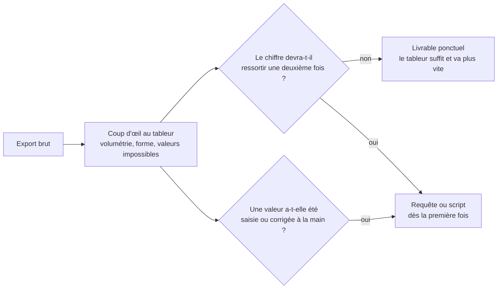

Niveau attendu : **autonomie**. Ce qui se juge n'est pas la connaissance des formules mais le moment où l'on refuse d'y rester — un arbitrage qu'il faut savoir défendre devant un métier attaché à son classeur.

Le tableur est imbattable pour regarder trois mille lignes et comprendre leur forme en dix minutes. La compétence d'analyste n'est pas d'en connaître les formules — elles s'apprennent en une semaine — mais de savoir à quel moment on n'a plus le droit d'y rester.

## Ce qu'il faut savoir faire

- Se servir du tableur pour ce qu'il fait le mieux : le premier regard. Trier une colonne, filtrer, poser un tableau croisé, tracer un histogramme laid — quinze minutes qui disent la forme d'un jeu de données mieux qu'une heure de code.
- Reconnaître le seuil de bascule, qui n'est pas une taille de fichier mais deux conditions : le résultat devra être régénéré, ou une valeur a été saisie à la main dans un fichier qui sert à quelqu'un d'autre. Dans les deux cas, ce qui manque est la trace de ce qui a été fait.
- Écrire les formules d'agrégation, de recherche et de nettoyage de texte sans les chercher, parce que le métier vous enverra ses données sous cette forme et attendra une réponse dans la même session.
- Utiliser un moteur de transformation intégré — Power Query ou son équivalent — quand on doit rester dans le tableur : il rejoue les étapes sur un nouveau fichier, ce que les formules ne font pas.
- Reprendre un classeur écrit par quelqu'un d'autre : repérer les cellules dures au milieu d'une colonne calculée, les plages qui ne couvrent plus toutes les lignes, les onglets masqués. C'est le mode d'échec dominant des chiffres produits en tableur.
- Convertir un classeur en script quand il devient récurrent, plutôt que de le maintenir. Le coût de la conversion est presque toujours inférieur au coût de la prochaine reprise à la main.

## Les notions mobilisées

- [[notions/tableur]] — l'angle analyste : la question utile n'est pas « quelles formules connaître », c'est « à quel moment je n'ai plus le droit de rester ici ».
- [[notions/qualite-des-donnees]] — le classeur reçu du métier est une source comme une autre, à inventorier avant d'être cru.
- [[notions/sql]] — la bascule se fait le plus souvent vers là, et non vers un langage de programmation.

> [!tip] Le seuil a bougé, le problème non
> Les tableurs ont intégré des moteurs de transformation sérieux et du Python natif, ce qui repousse le moment où l'on doit partir. Cela ne change rien au fond : ce qui condamne un chiffre produit en tableur n'est pas sa taille, c'est l'impossibilité de démontrer comment il a été obtenu.

> [!warning] Piège
> Le fichier partagé qui devient une base de données. Trois personnes y écrivent, une colonne sert de statut, personne ne sait quelle version fait foi. Ce n'est plus un outil d'analyse, c'est un système d'information sans administrateur — et le jour où on vous demande d'en tirer un chiffre, le travail réel est de reconstituer son histoire.

## Pour apprendre

- [Fonctions Excel par ordre alphabétique](https://support.microsoft.com/fr-fr/office/fonctions-excel-par-ordre-alphab%C3%A9tique-b3944572-255d-4efb-bb96-c6d90033e188) — la référence officielle, à consulter plutôt qu'à apprendre par cœur.
- [Documentation Power Query](https://learn.microsoft.com/fr-fr/power-query/) — le moteur de transformation rejouable : la seule façon de rester dans le tableur sans perdre la trace des étapes.
- [Python dans Excel](https://support.microsoft.com/fr-fr/office/prise-en-main-de-python-dans-excel-a33fbcbe-065b-41d3-82cf-23d05397f53d) — ce qui repousse le seuil, et ses limites de calcul et de confidentialité.
- [LibreOffice Calc — Documentation](https://documentation.libreoffice.org/en/english-documentation/calc/) — l'équivalent libre, utile quand le poste de travail n'est pas sous licence.
