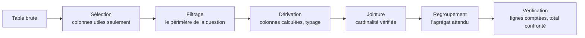

Filtrer, joindre, regrouper, pivoter — les mêmes opérations qu'en SQL, mais dans le langage où vit l'analyse. Pour l'analyste, l'enjeu est la lisibilité de l'enchaînement des transformations bien avant la performance.

## Ce qu'il faut savoir faire

- Écrire une transformation comme une suite d'étapes nommées plutôt qu'une expression unique. L'enchaînement doit se lire à voix haute : on sélectionne, on filtre, on dérive, on joint, on regroupe.
- Vérifier la cardinalité à chaque jointure, dans le code : le nombre de lignes attendu s'écrit en assertion, il ne se constate pas de mémoire.
- Typer explicitement à la lecture — dates en type date, identifiants en chaîne, montants en décimal — au lieu de laisser l'inférence décider. La moitié des bizarreries d'analyse viennent d'un identifiant lu comme un entier et amputé de son zéro initial.
- Préférer les opérations vectorielles aux boucles ligne à ligne, non pour la vitesse mais parce qu'elles expriment l'intention. Une boucle sur les lignes d'une table est presque toujours le signe qu'on n'a pas trouvé l'opération d'ensemble correspondante.
- Passer à un moteur en colonnes quand la table ne tient plus confortablement en mémoire, sans changer de modèle mental — c'est le sujet de [[parcours/data-analyst/socle-outillage/quand-le-volume-deborde]].
- Sortir un résultat intermédiaire en Parquet plutôt que de tout recalculer : les types sont conservés, la relecture est immédiate.

## Les notions mobilisées

- [[notions/pandas]] — la bibliothèque de manipulation tabulaire côté Python, avec ses pièges de copie et d'index que tout analyste finit par rencontrer.
- [[notions/r-et-tidyverse]] — dplyr, dont la grammaire est plus lisible que son équivalent Python et vaut d'être connue même en travaillant en Python.
- [[notions/python-pour-la-data]] — l'écosystème autour : NumPy en dessous, l'environnement, le notebook.
- [[notions/qualite-des-donnees]] — les assertions posées au fil des transformations sont des tests de qualité, pas des commentaires.

> [!warning] Piège
> L'enchaînement de transformations écrit d'un seul jet, sans rien compter entre les étapes. Le résultat sort, il est plausible, personne ne saura dire à quelle étape les douze mille lignes ont disparu. Compter après chaque étape coûte une ligne et évite de refaire l'analyse.

## Pour apprendre

- [pandas — Documentation](https://pandas.pydata.org/docs/) — le guide utilisateur vaut mieux que la plupart des tutoriels qui le paraphrasent.
- [dplyr](https://dplyr.tidyverse.org/) — la grammaire de manipulation côté R, à lire même si l'on code en Python.
- [NumPy — Documentation](https://numpy.org/doc/stable/) — ce sur quoi tout repose ; comprendre la diffusion évite des boucles inutiles.
- [Polars — Guide utilisateur](https://docs.pola.rs/) — le modèle d'expressions et l'exécution différée, qui rendent l'enchaînement à la fois lisible et rapide.
