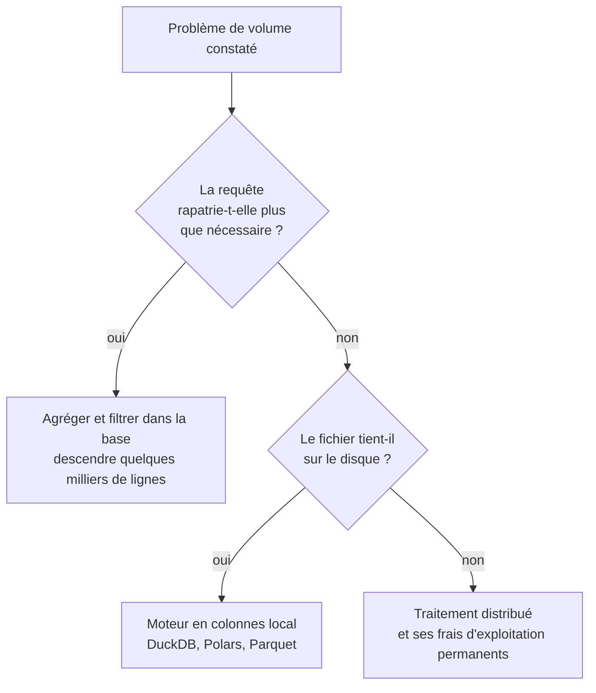

Niveau attendu : **notion**. Il faut reconnaître le seuil et savoir nommer les trois réponses possibles ; le calcul distribué se sous-traite à l'ingénierie de données.

Le réflexe n'est pas de distribuer, c'est de ne pas rapatrier. Un poste de travail courant traite aujourd'hui plusieurs dizaines de millions de lignes sans effort particulier : le seuil à partir duquel la question se pose a beaucoup monté.

## Ce qu'il faut savoir faire

- Déporter l'agrégation, le filtrage et la jointure dans la base, puis ne descendre que le résultat. La plupart des problèmes de volume sont des problèmes de requête.
- Mesurer avant d'invoquer le passage à l'échelle : charger les colonnes utiles au lieu de la table entière, convertir en Parquet, refaire le test. La grande majorité des « il faut du Spark » sont un `SELECT *` sur une table large.
- Travailler en Parquet dès que l'extraction dépasse quelques centaines de milliers de lignes : types conservés, compression, lecture par colonne. Le CSV reste le format d'échange avec les humains, il n'a plus à être le format de stockage de l'analyse.
- Savoir lancer du SQL directement sur des fichiers posés sur un disque, sans serveur ni import — c'est le chemin le plus court entre un export brut et une réponse.
- Distinguer le volume de l'entreprise du volume de l'analyse. Une table de logs de plusieurs téraoctets ne signifie pas que la question porte sur des téraoctets : elle porte le plus souvent sur trois mois, deux colonnes et un segment.
- Regarder ce que coûte une requête sur un entrepôt facturé à l'octet scanné. Le coût du calcul est devenu un coût facturé, et il fait partie du métier.

## Les notions mobilisées

- [[notions/traitement-distribue]] — le seuil à partir duquel distribuer a un sens, et ce que Spark garde d'utile quand c'est le socle imposé.
- [[notions/sql]] — le premier levier de volume est une requête mieux écrite, pas une infrastructure supplémentaire.
- [[notions/entrepot-de-donnees]] — la séparation du stockage et du calcul explique à la fois la puissance et la facture.

> [!warning] Piège
> Monter une infrastructure distribuée pour un problème qui dure dix minutes. Elle ajoute un coût d'exploitation permanent — supervision, versions, compétences, droits — que personne ne rattache au chiffrage initial, et qui reste longtemps après que l'analyse qui l'a justifiée a été oubliée.

## Pour apprendre

- [DuckDB — Documentation](https://duckdb.org/docs/) — l'analytique en colonnes sur un poste de travail : la réponse à la plupart des « il faut un cluster ».
- [Polars — Guide utilisateur](https://docs.pola.rs/) — l'exécution différée et le modèle d'expressions, qui permettent de traiter plus gros que la mémoire.
- [Apache Parquet](https://parquet.apache.org/) — comprendre pourquoi le format colonne est rapide change les choix en amont.
- [Apache Spark](https://spark.apache.org/documentation.html) — la référence du traitement distribué, à ouvrir seulement quand le volume l'impose réellement.
