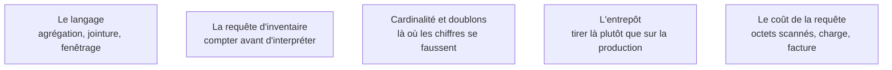

L'outil le plus rentable du métier, avant tout le reste : il rend inutile la majeure partie de ce qui se fait péniblement en formules, et il conditionne l'accès à la donnée d'entreprise. Viser l'autonomie — écrire seul une requête d'agrégation fenêtrée sur une base réelle.

## Ce qu'il faut savoir faire

- Écrire sans aide une requête qui regroupe, joint trois tables et classe le résultat — c'est le niveau attendu à l'embauche, et il s'atteint en trois semaines de pratique quotidienne.
- Maîtriser les fonctions de fenêtrage. C'est le sujet SQL qui sépare l'analyste du débutant : rang, cumul, comparaison à la période précédente, part dans un total, le tout sans sortir de la base.
- Commencer toute mission par une requête d'inventaire plutôt que par une requête métier : combien de lignes, depuis quelle date, combien de valeurs nulles par colonne, quelles valeurs distinctes sur les colonnes censées être normalisées.
- Compter les lignes avant et après chaque jointure. Une jointure sur une clé non unique multiplie les lignes et gonfle un total sans lever la moindre erreur.
- Lire un plan d'exécution sommairement, et savoir ce que coûte une requête sur un entrepôt facturé à l'octet lu. L'optimisation fine et l'administration ne sont pas votre sujet ; le coût de votre propre requête, si.
- Écrire des requêtes qu'un collègue relit : expressions de table communes nommées plutôt que sous-requêtes imbriquées, un filtre par ligne, les commentaires sur les règles métier et non sur la syntaxe.

## Les notions mobilisées

- [[notions/sql]] — le contenu du langage ; l'angle analyste est que l'essentiel tient dans l'agrégation, les jointures, le fenêtrage et les sous-requêtes.
- [[notions/collecte-de-donnees]] — la requête est l'acte de collecte le plus courant du métier, et elle se consigne comme tel.
- [[notions/qualite-des-donnees]] — la requête d'inventaire est le premier diagnostic qualité, et souvent le premier résultat qui intéresse le client.
- [[notions/traitement-distribue]] — le coût d'une requête sur un entrepôt facturé à l'octet lu, et le moment où le volume cesse d'être un problème de requête.
- [[notions/entrepot-de-donnees]] — savoir sur quoi on tire : l'entrepôt est historisé et sans risque pour la production, ce qui n'est pas vrai de la base applicative.

> [!warning] Piège
> Écrire une requête de quarante lignes impeccable sur une table qui contient des doublons de réplication. L'outil ne pose aucune question sur la donnée ; la requête s'exécute, le chiffre est faux, et rien ne le signale. Le contrôle de cardinalité passe avant la sophistication.

## Pour apprendre

- [Documentation PostgreSQL](https://www.postgresql.org/docs/) — la documentation de moteur la mieux écrite du domaine, toutes bases confondues.
- [SQL Window Functions](https://www.thoughtspot.com/sql-tutorial/sql-window-functions) — la meilleure page courte sur le fenêtrage, à lire une fois puis à pratiquer.
- [PostgreSQL Exercises](https://pgexercises.com/) — des exercices corrigés, progressifs, sur une base réaliste : le chemin le plus court vers l'autonomie.
- [Performance Tuning SQL Queries](https://www.thoughtspot.com/sql-tutorial/sql-performance-tuning) — l'optimisation concrète, sans folklore.
- [DuckDB — Documentation](https://duckdb.org/docs/) — pour pratiquer SQL sur ses propres fichiers, sans serveur ni droits à demander.
