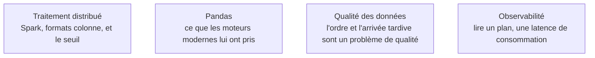

**Usage.** On attend d'un confirmé qu'il se serve d'un moteur distribué et d'un bus d'événements gérés sur un chemin balisé, documentation ouverte ; régler un brassage de partitions ou exploiter un cluster de courtiers est un métier de spécialiste, et l'arbitrage qui compte vraiment — distribuer ou non — se joue en amont, au socle.

Que faire quand le volume ou le débit dépasse ce qu'une machine traite confortablement : distribuer le calcul, ou découpler les producteurs des consommateurs par un bus d'événements.

## Distribuer a un coût, et un seuil

Distribuer, c'est payer du réseau entre les machines, un ordonnanceur à exploiter et un débogage bien plus difficile. La règle empirique : sous cent gigaoctets et sans besoin de parallélisme multi-machines, un moteur mono-nœud gagne en coût, en latence et en simplicité. DuckDB traite couramment quelques dizaines de gigaoctets de Parquet en SQL sur un portable ; Polars couvre le même terrain côté DataFrame avec une exécution paresseuse. Au-delà, ou quand le calcul doit s'exécuter au plus près de données déjà distribuées, Spark redevient le bon outil.

## Une file et un journal ne font pas le même métier

C'est la distinction que l'amont appelle *messages contre streams* et c'est la plus structurante du sujet. Une **file** distribue un message à un consommateur puis l'oublie : bon pour le travail par tâches, inutilisable pour rejouer. Un **journal distribué** conserve les événements et laisse plusieurs consommateurs indépendants relire l'historique depuis la position de leur choix : c'est ce qui permet d'ajouter un consommateur six mois plus tard sans redemander la donnée au producteur.

Dans un journal, la partition est à la fois l'unité d'ordre et l'unité de parallélisme. L'ordre n'est garanti qu'à l'intérieur d'une partition, ce qui fait de la clé de partition une décision de conception et non un détail de configuration.

## Ce qu'il faut savoir faire

- **Mesurer avant de sortir un cluster.** Volume réel des données lues, pas taille de la base ; et coût d'exploitation, pas seulement temps de calcul.
- **Repérer un brassage involontaire.** Une jointure sur une clé non partitionnée ou un regroupement à forte cardinalité redistribue tout le jeu sur le réseau. Cela se lit dans le plan physique ; quand une des tables est petite, la diffuser aux exécuteurs règle le problème.
- **Comprendre la sémantique du stockage objet** : pas de renommage atomique, cohérence à vérifier. Les habitudes héritées d'un système de fichiers distribué y produisent des corruptions silencieuses.
- **Rendre les consommateurs idempotents et prévoir une file d'échec.** La livraison exactement-une-fois de bout en bout reste largement un mythe ; ce qu'on obtient en pratique, c'est au-moins-une-fois plus idempotence, et le résultat est équivalent.
- **Versionner les schémas d'événements** dans un registre, avec des règles de compatibilité. Sans cela, un producteur casse tous ses consommateurs en un déploiement.

> [!tip] Ajout 2026
> Le patron *outbox* reste la façon la plus fiable d'éviter les divergences entre une base et un bus : on écrit l'événement dans la même transaction que la mutation métier, puis on le publie par capture de changements. Cela résout le cas où la base est à jour et l'événement perdu, ou l'inverse — la panne la plus pénible à diagnostiquer de toute la catégorie.

> [!warning] Piège
> Utiliser un bus d'événements comme base de données. La rétention finit par expirer, les requêtes ponctuelles sont impossibles, et personne ne sait quel est l'état courant. Le bus transporte et rejoue ; l'état vit dans un magasin.

## Les notions mobilisées

- [[notions/traitement-distribue]] — le seuil à partir duquel distribuer a un sens, et ce que coûte le franchir.
- [[notions/pandas]] — le point de comparaison : ce que les moteurs à exécution paresseuse font mieux, et sur quels volumes.
- [[notions/qualite-des-donnees]] — en flux, la qualité prend la forme de l'ordre, des doublons et des arrivées tardives plutôt que des nuls.
- [[notions/observabilite]] — lire un plan d'exécution distribué et une latence de consommation, avant de dimensionner quoi que ce soit.

## Pour apprendre

- [Apache Spark — Documentation](https://spark.apache.org/documentation.html) — en particulier la section sur l'optimisation des performances, meilleure que la plupart des tutoriels.
- [DuckDB Documentation](https://duckdb.org/docs/) — pour éprouver en une heure ce qu'une seule machine fait aujourd'hui.
- [Polars — User guide](https://docs.pola.rs/) — l'exécution paresseuse côté DataFrame, et la migration depuis pandas.
- [Apache Kafka Quickstart](https://kafka.apache.org/quickstart) — topics, partitions, groupes de consommateurs, éprouvés en local.
- [What is Apache Kafka?](https://aws.amazon.com/what-is/apache-kafka/) — la mise au point de vocabulaire avant la documentation officielle.
- [RabbitMQ Tutorials](https://www.rabbitmq.com/getstarted.html) — l'autre modèle, celui des files et du routage, à connaître pour ne pas l'employer à la place du premier.
