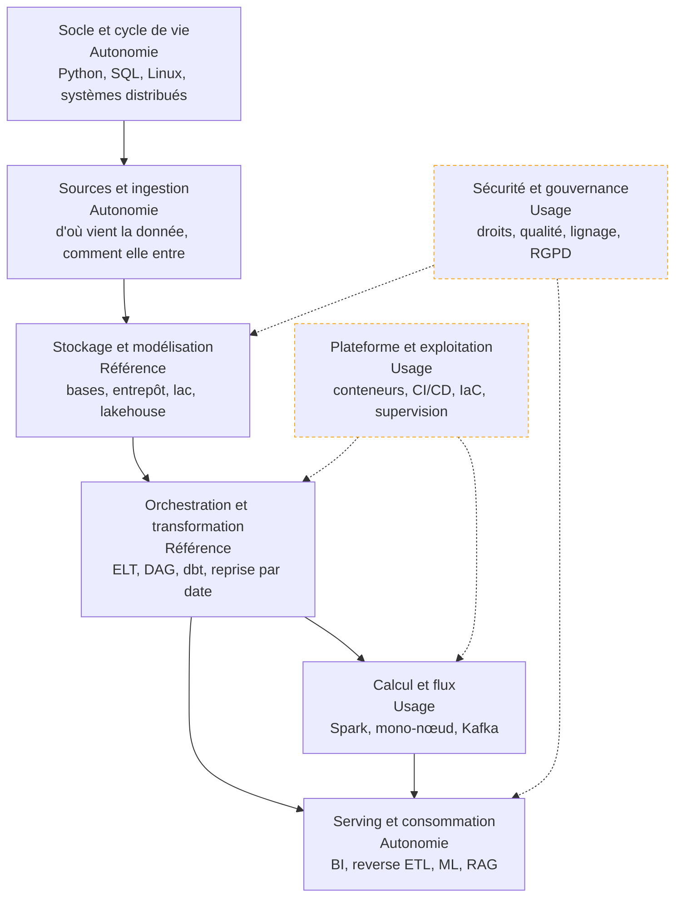

Construire et exploiter les systèmes qui rendent la donnée utilisable par d'autres : la faire arriver, la stocker là où elle sera interrogée, la transformer en tables dont on peut se servir — et garantir qu'elle est encore juste demain matin.

## La roadmap

Chaque case porte le niveau attendu d'un profil confirmé — de **notion** (reconnaître le sujet, savoir qui appeler) à **référence** (faire autorité dans la salle), en passant par **usage** (chemin balisé) et **autonomie** (concevoir, déboguer sous pression, arbitrer). Chaque case mène à sa page. Cochez les étapes acquises en bas de page pour suivre votre progression.

## Ma progression

- [ ] [[parcours/data-engineer/socle-et-cycle-de-vie|Socle et cycle de vie]] — les langages, le système, le réseau, et le fil rouge génération → stockage → ingestion → serving
- [ ] [[parcours/data-engineer/sources-et-ingestion|Sources et ingestion]] — bases, API, journaux, documents ; batch, temps réel, capture de changements
- [ ] [[parcours/data-engineer/stockage-et-modelisation|Stockage et modélisation]] — transactionnel contre analytique, familles de bases, entrepôt, lac, lakehouse
- [ ] [[parcours/data-engineer/orchestration-et-transformation|Orchestration et transformation]] — ELT, graphes de tâches, dbt, idempotence et reprise
- [ ] [[parcours/data-engineer/calcul-et-flux|Calcul et flux]] — quand distribuer, quand une machine suffit, et ce qu'un bus d'événements apporte
- [ ] [[parcours/data-engineer/plateforme-et-exploitation|Plateforme et exploitation]] — conteneurs, CI/CD, infrastructure déclarative, tests de données, supervision
- [ ] [[parcours/data-engineer/serving-et-consommation|Serving et consommation]] — couche sémantique, BI, reverse ETL, features de modèles, corpus documentaires
- [ ] [[parcours/data-engineer/securite-et-gouvernance|Sécurité et gouvernance]] — droits fins, chiffrement, qualité, lignage, catalogue, RGPD et AI Act
