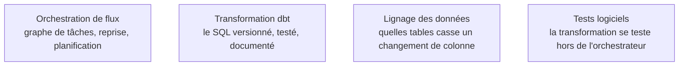

Le cœur du métier : déplacer et transformer la donnée de manière fiable, reproductible et observable — c'est-à-dire pouvoir dire, à tout moment, ce qui a tourné, avec quelles données, et comment le rejouer.

## ELT plutôt qu'ETL, et ce que ça déplace

Le changement structurant des dix dernières années tient en une inversion de lettres : on **charge d'abord le brut** dans l'entrepôt, on transforme **ensuite**, en SQL versionné, là où la puissance de calcul se trouve déjà. Trois conséquences concrètes. La transformation devient du code relu en revue plutôt qu'une boîte noire dans un outil graphique. On rejoue une correction sans réingérer la source. Et la frontière de responsabilité se déplace : l'ingénieur livre des tables brutes fidèles, la logique métier vit dans des modèles que l'analyste peut lire.

L'orchestrateur, lui, ne transforme pas. Il déclenche, réessaie, planifie, alerte et garde l'historique. Un graphe qui contient quatre cents lignes de traitement est intestable et irrejouable hors de l'orchestrateur, ce qui est exactement ce qu'on voulait éviter en l'adoptant.

## Ce qu'il faut savoir faire

- **Concevoir chaque tâche paramétrée par la date d'exécution, dès le premier jour.** C'est la seule chose qui rend une reprise sur une plage de dates possible sans réécrire le pipeline le jour où on en a besoin — et on en a toujours besoin.
- **Rendre chaque étape idempotente** : rejouer la même fenêtre deux fois produit le même résultat. Écriture par partition remplacée plutôt qu'ajoutée, clé de déduplication explicite.
- **Séparer le traitement de l'ordonnancement.** La tâche appelle un module ou une requête, elle ne les contient pas. Le module se teste en local, en une seconde, sans planificateur.
- **Poser des tests sur les modèles de transformation** : unicité de clé, non-nullité, intégrité référentielle, fraîcheur, plages de valeurs. Un échec bloque la publication au lieu de propager des chiffres faux.
- **Lire un lignage avant de modifier une colonne**, et le tenir à jour : c'est ce qui transforme « je ne sais pas qui utilise ça » en une liste de tables et de rapports impactés.
- **Choisir entre écrire un connecteur et en louer un** : les connecteurs d'extraction gérés couvrent les sources standard, votre code garde de la valeur sur vos sources propres.

> [!tip] Ajout 2026
> Le basculement conceptuel utile s'appelle l'orientation **asset** : on déclare les tables et les fichiers à produire, et l'orchestrateur en déduit le graphe, plutôt que de déclarer des tâches dont on espère qu'elles s'enchaînent bien. Le lignage et la re-matérialisation deviennent alors naturels au lieu d'être un outil de plus à brancher. Dagster a popularisé ce modèle, Airflow 3 a modernisé son ordonnancement et l'exécution distante des tâches ; les deux restent des choix défendables.

> [!warning] Piège
> Alerter uniquement sur le succès technique des tâches. Un graphe tout vert qui charge zéro ligne pendant trois jours est un incident majeur invisible. Les métriques à surveiller sont métier — nombre de lignes, fraîcheur maximale, écart au jour précédent — et elles se posent dans le pipeline, pas dans le tableau de bord de l'ordonnanceur.

## Les notions mobilisées

- [[notions/orchestration-de-flux]] — graphe de dépendances, reprises, planification ; l'orchestrateur est un chef d'orchestre, jamais un moteur de calcul.
- [[notions/transformation-dbt]] — modèles, tests et documentation générée : le T de l'ELT, et le point où l'analyste peut relire ce que fait l'ingénieur.
- [[notions/lignage-des-donnees]] — pour le data engineer, c'est d'abord un outil d'analyse d'impact avant d'être un artefact de gouvernance.
- [[notions/tests-logiciels]] — appliqués à des transformations : jeu de données figé en entrée, résultat attendu en sortie, exécution hors orchestrateur.

## Pour apprendre

- [dbt Documentation](https://docs.getdbt.com/docs/build/documentation) — la référence sur les modèles, les tests et la documentation générée.
- [dbt Official Courses](https://learn.getdbt.com/catalog) — les cours gratuits de l'éditeur, le chemin le plus court vers un premier projet propre.
- [Apache Airflow Docs](https://airflow.apache.org/docs) — la documentation officielle, à lire en particulier sur les dates d'exécution et les reprises.
- [Dagster Documentation](https://docs.dagster.io/) — pour comprendre l'orientation asset en pratique, même si vous restez sur Airflow.
- [Building Pipelines In Apache Airflow – For Beginners](https://towardsdatascience.com/building-pipelines-in-apache-airflow-for-beginners-58f87a1512d5/) — un premier graphe complet, commenté.
