**Usage.** Un confirmé applique des droits fins, branche un catalogue et fait remonter un lignage en suivant une règle qu'on lui a donnée ; la qualification juridique du RGPD et de l'AI Act est hors de son périmètre réel et reste à la notion — savoir que la question se pose, et qui appeler avant d'ouvrir un accès.

Les sujets qui arrivent en fin de roadmap et devraient arriver au début de vos projets : rattraper une gouvernance absente coûte dix fois plus cher que de la poser d'emblée.

```mermaid
flowchart TD
  AC["Contrôle d'accès<br/>identifier, autoriser, propager l'identité"]
  DS["Données sensibles<br/>classer, masquer, cloisonner"]
  QU["Qualité des données<br/>mesurée en continu, pas constatée"]
  LI["Lignage des données<br/>d'où vient cette colonne, qui casse si je la change"]
  RG["RGPD<br/>base légale, minimisation, effacement"]
  GO["Gouvernance IA<br/>AI Act, traçabilité des jeux d'entraînement"]

  click AC "/notions/controle-d-acces"
  click DS "/notions/donnees-sensibles"
  click QU "/notions/qualite-des-donnees"
  click LI "/notions/lignage-des-donnees"
  click RG "/notions/rgpd"
  click GO "/notions/gouvernance-ia"
```

## Trois questions, pas une

**Qui a le droit ?** L'authentification identifie, l'autorisation décide de ce qui est permis, et dans un entrepôt cela descend jusqu'à la ligne et la colonne. Le chiffrement protège au repos et en transit, avec des clés gérées et une rotation planifiée.

**Que peut-on montrer ?** Tokenisation, masquage et obfuscation permettent de travailler sur des données sensibles sans les exposer. La différence qui compte en pratique : le jeton est réversible via un coffre, le masquage ne l'est pas — c'est ce qui le rend adapté aux environnements hors production.

**Qu'est-ce que ça veut dire ?** C'est la part gouvernance, et la plus négligée : qui produit cette table, d'où viennent ses colonnes, à quel point est-elle fiable, jusqu'à quand la garde-t-on. Sans réponse, les deux premières questions n'ont pas d'objet stable sur lequel porter.

## Ce qu'il faut savoir faire

- **Mesurer la qualité en continu** — complétude, unicité, fraîcheur, cohérence référentielle, plages de valeurs — et publier le résultat là où les consommateurs le voient, pas dans un rapport trimestriel.
- **Savoir supprimer une personne dans un stockage immuable.** Le droit à l'effacement se conçoit avant le premier chargement : partitionnement par identifiant, chiffrement par clé effaçable, table de correspondance séparée. Après, c'est une réécriture complète.
- **Poser des durées de rétention par jeu de données**, avec une base légale et une finalité écrites. Un lac sans rétention est une dette juridique qui grossit toute seule.
- **Tenir le lignage à jour** pour répondre en minutes à « qu'est-ce qui casse si je change cette colonne » — et, côté conformité, à « d'où vient cette donnée ».
- **Documenter les jeux de données qui alimentent un entraînement** : provenance, période, transformations, licences. C'est l'obligation qui touche le plus directement le data engineer dans la réglementation européenne sur l'IA.
- **Séparer les environnements techniquement**, pas par note de service. Voir le piège ci-dessous.

> [!tip] Ajout 2026
> Le **catalogue** est devenu le vrai point de contrôle de la plateforme : découverte, lignage, droits et qualité au même endroit, là où l'amont éclate le sujet en quatre rubriques distinctes. Unity Catalog côté Databricks, DataHub et OpenMetadata en logiciel libre, et les catalogues de tables ouverts pour les formats comme Iceberg. Le choix du catalogue engage désormais plus que le choix du moteur de requête.

> [!warning] Piège
> Copier la production vers un environnement de développement « juste pour tester ». C'est la fuite de données la plus banale et la plus fréquente du métier. Générez des jeux synthétiques ou masqués, et rendez la copie brute techniquement impossible — droits d'accès, réseau — plutôt qu'interdite par une règle que la première urgence fera oublier.

## Les notions mobilisées

- [[notions/controle-d-acces]] — authentification, autorisation, moindre privilège ; dans un entrepôt, cela descend jusqu'à la ligne et à la colonne.
- [[notions/donnees-sensibles]] — classification, anonymisation, cloisonnement ; le data engineer est celui qui peut rendre la mauvaise pratique impossible plutôt qu'interdite.
- [[notions/qualite-des-donnees]] — ici comme mesure continue et publiée, et non comme constat ponctuel après incident.
- [[notions/lignage-des-donnees]] — l'outil commun de l'analyse d'impact technique et de la réponse à une demande de conformité.
- [[notions/rgpd]] — base légale, minimisation, rétention, effacement : des contraintes de conception du stockage, pas une formalité juridique en aval.
- [[notions/gouvernance-ia]] — obligations graduées par niveau de risque ; côté data, la traçabilité des jeux d'entraînement et la documentation technique.

## Pour apprendre

- [Le texte du RGPD](https://gdpr-info.eu/) — consultable article par article ; les articles 5, 6, 17 et 32 suffisent pour commencer.
- [The EU AI Act Explorer](https://artificialintelligenceact.eu/ai-act-explorer/) — le règlement européen sur l'IA, navigable par obligation et par niveau de risque.
- [OpenMetadata — Documentation](https://docs.open-metadata.org/) — un catalogue libre, à installer pour comprendre ce que recouvrent découverte, lignage et qualité réunis.
- [DataHub — Documentation](https://docs.datahub.com/docs) — l'autre catalogue libre de référence, à comparer au précédent.
- [What is Data Lineage? - IBM](https://www.ibm.com/topics/data-lineage) — la mise au point de vocabulaire avant de choisir un outil.
