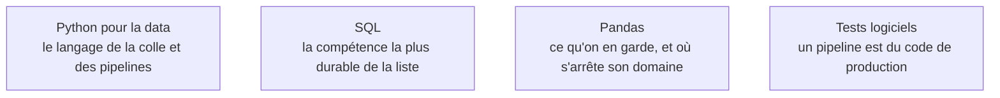

Ce qu'il faut savoir faire avant de toucher un seul outil de la chaîne, et la grille de lecture qui range tous les outils appris ensuite : génération, stockage, ingestion, serving.

## Le cycle de vie, et à quoi il sert

Quatre étapes se suivent : la donnée est **générée** par une source qu'on ne contrôle pas, **stockée** quelque part où elle sera interrogée, **ingérée** — c'est-à-dire déplacée et transformée — puis **servie** à des tableaux de bord, des modèles ou des applications. Chaque outil du métier occupe une de ces quatre cases, et savoir laquelle évite la moitié des mauvais choix d'architecture : un orchestrateur ne stocke pas, un entrepôt n'ingère pas, un bus de messages ne sert pas de base.

La frontière avec le data scientist se dit en une phrase — l'un garantit que la donnée arrive, propre, fraîche et au bon format, l'autre en tire un modèle ou une décision. Elle bouge selon la taille de l'équipe, et c'est presque toujours le data engineer qui hérite du dernier kilomètre de fiabilité.

## Ce qu'il faut savoir faire

- **Écrire un extracteur qui ressemble à du logiciel, pas à un notebook promu par accident** : packagé, typé progressivement, testé, avec des journaux structurés et un code de sortie qui veut dire quelque chose.
- **Lire un plan d'exécution SQL avant d'accuser l'orchestrateur.** Le goulot d'étranglement est presque toujours dans la base ou dans le format de stockage. Voir [[notions/sql]].
- **Se débrouiller seul sur un serveur** : permissions, processus, `systemd`, redirections et tubes ; et côté réseau, DNS, TLS, proxy d'entreprise, sous-réseaux. La moitié des incidents de production se règlent là, sans ouvrir un seul fichier de pipeline.
- **Raisonner en système partiellement défaillant** : partitionnement, réplication, idempotence, reprise. Un pipeline n'est pas un programme qui marche ou qui plante, c'est un programme dont une partie a échoué pendant que le reste continuait.
- **Choisir une technologie sur le volume réel, la latence exigée, le coût d'exploitation et les compétences de l'équipe.** Trois de ces quatre critères sont mesurables avant de décider.
- **Situer les langages** : Python d'abord, pour l'orchestration, la transformation légère et la colle ; Java et Scala parce que Spark, Kafka et Flink vivent sur la JVM et que leurs messages d'erreur en viennent ; Go pour l'outillage d'infrastructure.

> [!tip] Ajout 2026
> Rust s'est imposé dans les moteurs de données sans qu'on ait à l'écrire : Polars, DataFusion, delta-rs. Conséquence pratique — des traitements de quelques dizaines de gigaoctets qui exigeaient un cluster tiennent sur une seule machine. Côté outillage Python, `uv` pour les environnements et le verrouillage des dépendances, `ruff` pour le formatage et le contrôle, ont remplacé la pile `pip` + `flake8` + `black`.

> [!warning] Piège
> Se déclarer data engineer en sachant écrire un graphe de tâches mais pas lire un plan d'exécution. Corollaire du même aveuglement : un travail qui a réussi une fois n'est pas correct pour autant. Sans idempotence, la première relance après incident duplique les lignes, et personne ne le voit avant le rapport du mois suivant.

## Les notions mobilisées

- [[notions/python-pour-la-data]] — l'environnement, le packaging et les bibliothèques ; côté data engineer, c'est du code livré en production, pas un carnet d'exploration.
- [[notions/sql]] — fenêtrage, expressions de table, jointures anti et semi, plans d'exécution : la compétence qui se déprécie le moins vite du métier.
- [[notions/pandas]] — utile pour l'exploration et les petits volumes ; dans un pipeline, il devient le point où la mémoire explose sans prévenir.
- [[notions/tests-logiciels]] — unitaires sur les transformations, intégration contre une base éphémère : un pipeline non testé casse en silence, ce qui est pire qu'un plantage.

## Pour apprendre

- [Data Engineering 101](https://www.redpanda.com/guides/fundamentals-of-data-engineering) — le tour d'horizon du cycle de vie, à lire d'une traite avant de choisir quoi apprendre.
- [Fundamentals of Data Engineering](https://www.youtube.com/watch?v=mPSzL8Lurs0) — la même matière en vidéo, par les auteurs de l'ouvrage de référence.
- [Automate the Boring Stuff with Python](https://automatetheboringstuff.com/) — le livre en ligne gratuit pour arriver au niveau où l'on écrit des scripts qu'on n'a pas honte de livrer.
- [Bash Reference Manual](https://www.gnu.org/software/bash/manual/bashref.html) — la référence, à parcourir pour les 20 % qui servent tous les jours : codes de retour, redirections, `set -euo pipefail`.
- [Git Cheat Sheet](https://cs.fyi/guide/git-cheatsheet) — les commandes qu'on cherche au mauvais moment, rassemblées.
- [SQL Tutorial](https://www.w3schools.com/sql/) — le rappel de syntaxe le plus rapide à consulter quand on bute sur une jointure.
