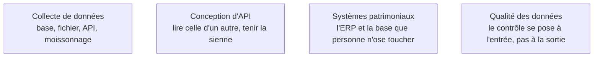

D'où vient la donnée et comment elle entre : le point d'entrée décide de tout le reste de la chaîne, et une erreur commise ici se repaie trois fois plus loin.

## Chaque source impose son mode d'entrée

| Source | Ce qu'elle impose | Le mode d'entrée qui marche |
|---|---|---|
| Base transactionnelle | ne pas peser sur la production | extraction incrémentale sur clé, ou capture de changements par le journal de transactions |
| API tierce | quotas, pagination, pannes intermittentes | appels rejouables avec repli exponentiel et clé d'idempotence, réponse brute stockée avant tout découpage |
| Journaux applicatifs | volume élevé, ordre non garanti, format instable | flux continu, horodatage à l'émission **et** à la réception |
| Application mobile, objets connectés | connectivité intermittente, horloges désynchronisées | fenêtres de retraitement pour les arrivées tardives de plusieurs heures |
| Documents non structurés | structure à préserver, pas de schéma | même discipline qu'ailleurs, mais la charge se déplace vers l'extraction et le découpage |

Le choix entre lot, micro-lot et flux continu se dérive de la fraîcheur exigée par l'usage, jamais de la mode. Le lot traite des fenêtres closes et se rejoue facilement ; le flux impose de gérer l'ordre et l'arrivée tardive et coûte nettement plus cher à exploiter. Le micro-lot couvre la majorité des besoins réels, où « temps réel » veut dire quelques minutes.

## Ce qu'il faut savoir faire

- **Stocker le brut avant de transformer.** Le payload d'origine, daté, en ajout seul. Sans cette copie immuable, le jour où une règle métier change ou qu'un bug d'analyse est découvert, il faut re-solliciter la source — quand elle existe encore.
- **Obtenir un contrat de schéma explicite avec le producteur**, et le faire vivre : un champ ajouté, renommé ou retypé en amont casse le pipeline en silence si personne ne s'est engagé sur rien.
- **Mettre en place une capture de changements** plutôt qu'une extraction complète nocturne, dès que la table dépasse quelques millions de lignes ou que la source est une production sensible.
- **Rendre chaque consommateur idempotent.** C'est ce qui permet de rejouer sans réfléchir, et ce qui rend acceptable une livraison au-moins-une-fois.
- **Poser dès la collecte les questions de consentement, de rétention et de droit d'usage** : qui produit, pour quelle finalité, combien de temps on garde. Les reprendre après coup coûte dix fois plus — voir [[parcours/data-engineer/securite-et-gouvernance]].
- **Valider à l'entrée** : schéma, plages de valeurs, taux de nuls, volumétrie attendue. Un contrôle posé à l'ingestion bloque ; le même contrôle posé en aval constate.

> [!tip] Ajout 2026
> Une source absente de la roadmap amont pèse aujourd'hui lourd : les documents non structurés — PDF, courriels, tickets, pages web — ingérés pour alimenter des systèmes de récupération documentaire. Le pipeline est le même en esprit, avec versionnement du corpus et idempotence, mais la valeur se joue dans l'extraction et la préservation de la structure du document. Voir [[notions/rag]].

> [!warning] Piège
> Écrire soi-même un connecteur vers un service du commerce. Les connecteurs d'extraction gérés couvrent les sources standard et absorbent leurs changements d'API à votre place. Gardez votre code pour les sources spécifiques à votre métier — c'est le seul endroit où il a de la valeur.

## Les notions mobilisées

- [[notions/collecte-de-donnees]] — les quatre familles de sources et leurs métadonnées d'extraction ; côté data engineer, c'est la fiabilité de l'extraction qui compte, pas la richesse de la source.
- [[notions/conception-d-api]] — on en consomme bien plus qu'on n'en écrit : pagination, limitation de débit, versionnement vus depuis le client.
- [[notions/systemes-patrimoniaux]] — l'ERP ou la base historique dont le modèle documenté ne décrit plus l'usage réel depuis quinze ans.
- [[notions/qualite-des-donnees]] — ici sous sa forme la plus utile : une porte à l'entrée, qui refuse plutôt qu'elle n'alerte.

## Pour apprendre

- [Data Ingestion Patterns](https://docs.aws.amazon.com/whitepapers/latest/aws-cloud-data-ingestion-patterns-practices/data-ingestion-patterns.html) — le catalogue des schémas d'ingestion, neutre malgré le fournisseur.
- [Data pipeline design patterns](https://towardsdatascience.com/data-pipeline-design-patterns-100afa4b93e3/) — les patrons récurrents, dont l'extraction incrémentale et la reprise.
- [Debezium Documentation](https://debezium.io/documentation/reference/stable/index.html) — la référence sur la capture de changements par le journal de transactions.
- [What is a Data Pipeline? - IBM](https://www.ibm.com/topics/data-pipeline) — la mise au point de vocabulaire, utile avant une réunion d'architecture.
- [Apache Kafka Quickstart](https://kafka.apache.org/quickstart) — pour éprouver en une heure ce que change une entrée en flux continu.
