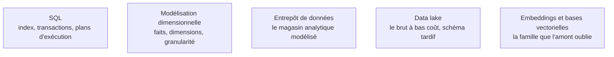

Niveau attendu : **référence**. Premier des deux domaines où le data engineer fait autorité dans la salle : personne d'autre ne rattrapera un modèle de données bancal, et l'erreur ne se voit qu'au moment où la corriger coûte une migration.

Où la donnée se pose et sous quelle forme : le choix du magasin engage la modélisation, les performances et la facture pour des années, bien plus que le choix de l'orchestrateur.

## La ligne de partage utile n'est pas SQL contre NoSQL

C'est **transactionnel contre analytique**. D'un côté des écritures nombreuses et petites, en ligne, normalisées ; de l'autre des lectures massives sur peu de colonnes, dénormalisées, en stockage colonne. Un entrepôt attaqué comme une base transactionnelle, ou l'inverse, produit des factures absurdes et des délais inexplicables.

Les familles se choisissent ensuite sur l'accès dominant : relationnel par défaut ; document quand la forme varie vraiment ; colonne pour l'écriture massive à clé connue ; graphe quand les relations sont la question posée ; clé-valeur pour le cache ; vectoriel pour la recherche par similarité. En cas de partition réseau, le théorème CAP dit qu'il faut arbitrer entre cohérence et disponibilité — c'est la clé de lecture des bases distribuées, pas une curiosité théorique.

Entrepôt et lac ont convergé : les entrepôts lisent des fichiers sur stockage objet, les lacs ont gagné des transactions. Le **data mart** est une découpe métier de l'entrepôt ; le **data mesh** déplace la responsabilité vers les équipes qui produisent la donnée, avec contrats et engagements de service — c'est une organisation avant d'être une architecture, et elle suppose une maturité qui manque le plus souvent.

## Ce qu'il faut savoir faire

- **Modéliser un entrepôt en étoile** : une table de faits au grain explicitement choisi, des dimensions dénormalisées autour. Le flocon économise du stockage au prix de requêtes plus lourdes — rarement le bon arbitrage aujourd'hui. Voir [[notions/modelisation-dimensionnelle]].
- **Historiser correctement.** Dimension à évolution lente de type 1, on écrase ; de type 2, on ajoute une ligne avec période de validité — la seule façon de rejouer un rapport tel qu'il était l'an dernier. Ce choix se fait dimension par dimension, avant le premier chargement.
- **Indexer avec parcimonie** : B-tree, hachage, index inversé pour le JSON et le texte, index partiels. Un index de trop pénalise chaque écriture, et personne ne le remarque avant la montée en charge.
- **Lire une facture d'entrepôt.** Facturation à l'octet scanné, séparation stockage-calcul, entrepôt sans serveur : trois modèles économiques différents, qui punissent trois erreurs de conception différentes.
- **Partitionner et conventionner dès le premier fichier déposé** dans un lac : chemin normalisé, format colonne, propriétaire nommé, enregistrement au catalogue.

> [!tip] Ajout 2026
> Deux manques dans l'amont. La famille **vectorielle** : `pgvector` suffit jusqu'à quelques millions de vecteurs et évite d'exploiter un système de plus ; au-delà, ou avec un besoin de filtrage hybride, un magasin dédié se justifie — en gardant à l'esprit que les index approximatifs font du rappel un paramètre de configuration, pas une garantie. Et le **lakehouse**, standardisé autour d'Apache Iceberg : les données restent en Parquet dans votre espace de stockage, plusieurs moteurs les attaquent, le catalogue devient le point de contrôle. Si vous démarrez une plateforme, posez la question Iceberg avant de choisir un moteur.

> [!warning] Piège
> Choisir une base document « parce que le schéma va évoluer ». Le schéma existe toujours ; il migre simplement dans le code applicatif, où personne ne le documente. Postgres avec des colonnes JSONB couvre la majorité de ces cas en gardant les transactions et les jointures. Symétriquement, un lac sans catalogue ni propriétaire devient un marécage de fichiers que plus personne n'ose supprimer.

## Les notions mobilisées

- [[notions/sql]] — ici sous l'angle du moteur : index, transactions, niveaux d'isolation, verrous morts, plan d'exécution.
- [[notions/modelisation-dimensionnelle]] — faits et dimensions ; le data engineer livre les tables, le grain est une décision qu'il prend avec le métier.
- [[notions/entrepot-de-donnees]] — le magasin analytique modélisé et sa facturation, qui est un paramètre de conception à part entière.
- [[notions/data-lake]] — le stockage brut à schéma tardif, et les conventions sans lesquelles il se dégrade en dépôt de fichiers.
- [[notions/embeddings-et-bases-vectorielles]] — devenue une famille de magasins comme une autre, à sauvegarder, superviser et dimensionner.

## Pour apprendre

- [Andy Pavlo — Intro to Database Systems (CMU)](https://15445.courses.cs.cmu.edu/) — le cours public le plus solide sur les entrailles des moteurs : stockage, index, transactions.
- [Data Lake VS Data Warehouse](https://towardsdatascience.com/data-lake-vs-data-warehouse-2e3df551b800/) — la comparaison qui évite de confondre les deux dans une réunion d'architecture.
- [Apache Iceberg — Documentation](https://iceberg.apache.org/docs/latest/) — le format de table ouvert et ce que le time travel change en pratique.
- [BigQuery overview](https://cloud.google.com/bigquery/docs/introduction) — un entrepôt sans serveur expliqué par son éditeur, à lire pour le modèle de facturation.
- [Snowflake in 20 minutes](https://docs.snowflake.com/en/user-guide/tutorials/snowflake-in-20minutes) — la séparation stockage-calcul éprouvée en une session.
- [PostgreSQL Website](https://www.postgresql.org/) — la documentation de référence, et le défaut raisonnable tant qu'on n'a pas démontré le contraire.
