Les deux extrémités du travail, et celles qui décident de la valeur de tout ce qu'il y a entre : convertir une demande formulée en langage d'entreprise en une cible, une population, une fenêtre de temps et un seuil — puis rendre un résultat sous une forme qui engage une décision.

```mermaid
flowchart TD
  CAD["Cadrage du besoin<br/>la demande n'est jamais la question"]
  ROI["ROI des projets IA<br/>le seuil d'utilité, fixé avant"]
  ABT["A/B testing<br/>mesurer l'effet du modèle déployé"]
  USA["Mesure d'usage produit<br/>ce que la décision devient réellement"]
  VIZ["Visualisation de données<br/>rendre un résultat lisible sans le fausser"]
  RED["Rédaction technique<br/>la note qui survit à la réunion"]

  click CAD "/notions/cadrage-besoin"
  click ROI "/notions/roi-des-projets-ia"
  click ABT "/notions/ab-testing"
  click USA "/notions/mesure-d-usage-produit"
  click VIZ "/notions/visualisation-de-donnees"
  click RED "/notions/redaction-technique"
```

## De la demande à la question mesurable

Une demande arrive toujours sous une forme qui n'est pas traitable. Le travail de traduction consiste à répondre à quatre questions dont aucune n'est technique, et à écrire les réponses avant d'ouvrir un jeu de données.

| La demande telle qu'elle arrive | Ce qu'il faut avoir écrit avant de commencer |
|---|---|
| « Prédire les clients qui partent » | Qui est considéré comme parti, observé à quelle date, sur quelle fenêtre, et que fait-on du score |
| « Optimiser les stocks » | Quelle décision change, à quelle fréquence, et quel écart de prévision coûte combien |
| « Comprendre pourquoi les ventes baissent » | Une question causale, donc un protocole d'identification — pas un modèle prédictif |
| « Mettre de l'IA sur ce processus » | La référence actuelle chiffrée, et le gain minimal qui justifierait le projet |

## Ce qu'il faut savoir faire

- **Distinguer une question de compréhension d'une question de prédiction.** Elles ne mobilisent ni les mêmes méthodes ni les mêmes garanties, et les confondre produit un modèle performant dont on tire une conclusion fausse sur les causes.
- **Écrire la définition opérationnelle de la cible** — la date d'observation, la fenêtre, les exclusions — avant toute extraction. Sans elle, deux personnes construiront deux jeux d'entraînement différents à partir de la même phrase.
- **Chiffrer la référence avant de modéliser** : ce que l'organisation obtient aujourd'hui, sans modèle, avec sa règle actuelle. Un projet dont la référence n'est pas mesurée ne pourra jamais démontrer sa valeur, même s'il en crée.
- **Fixer le seuil d'utilité à l'avance** : la performance en dessous de laquelle le modèle ne sera pas déployé. Il se négocie avant l'entraînement, jamais après, parce qu'après il s'ajuste au résultat obtenu.
- **Prévoir la mesure d'impact dès le cadrage.** Un modèle mis en service sans dispositif de comparaison ne produit aucune preuve : il faut avoir décidé au départ s'il y aura essai contrôlé, déploiement progressif ou groupe témoin.
- **Restituer en trois éléments** : ce qu'on sait, avec quelle marge, et ce qu'il faut en faire. Une restitution qui s'arrête au deuxième renvoie la décision à celui qui l'a commandée.

> [!warning] Piège
> Le modèle sans décision en aval. On livre un score de propension, tout le monde félicite, et personne n'a prévu quel service appelle quel client ni avec quel budget. Le test de réalité se pose au cadrage, en une phrase : *qui fera quoi différemment quand ce chiffre existera ?* Sans réponse nommant une personne et une action, le projet produira une démonstration, pas un effet.

## Les notions mobilisées

- [[notions/cadrage-besoin]] — la traduction d'une demande en spécification est ici la première décision technique, pas une formalité administrative.
- [[notions/roi-des-projets-ia]] — le seuil d'utilité et le coût complet, qui donnent son sens au « le modèle est-il assez bon ».
- [[notions/ab-testing]] — le seul dispositif qui permette d'attribuer au modèle l'écart observé après mise en service.
- [[notions/mesure-d-usage-produit]] — l'instrumentation des actions prises à partir du score, sans quoi l'impact reste une hypothèse.
- [[notions/visualisation-de-donnees]] — la restitution d'une incertitude est un problème de graphique autant que de statistique.
- [[notions/redaction-technique]] — la note de cadrage écrite est ce qui empêche la cible de se déplacer silencieusement en cours de projet.

## Pour apprendre

- [Rules of Machine Learning](https://developers.google.com/machine-learning/guides/rules-of-ml) — quarante-trois règles issues du terrain, dont les premières disent de commencer sans apprentissage automatique et de soigner l'infrastructure avant le modèle.
- [CS 329S — Machine Learning Systems Design](https://stanford-cs329s.github.io/) — le cours de Stanford qui part du cadrage métier et non de l'algorithme ; les notes et lectures sont libres.
- [Made With ML](https://madewithml.com/) — un parcours complet qui traite explicitement la formulation du produit avant la modélisation.
- [Machine Learning Crash Course — Framing](https://developers.google.com/machine-learning/crash-course) — la section de cadrage, courte, sur la transformation d'un problème en tâche supervisée.
