Niveau attendu : **autonomie**. Le pipeline continue sans son auteur : il faut savoir le concevoir, le déboguer sur une machine qu'on ne voit pas, et justifier le choix d'un outil contre un autre.

Le code est le seul artefact qui survit au projet. La compétence visée n'est pas « savoir programmer » mais produire un pipeline reproductible : versionné, testé, paramétré, exécutable par quelqu'un d'autre sur une autre machine, six mois plus tard.

```mermaid
flowchart TD
  PYT["Python pour la data<br/>environnement, dépendances, carnets"]
  PAN["pandas<br/>manipulation tabulaire et ses pièges"]
  SQL["SQL<br/>fenêtrage, agrégation, plan d'exécution"]
  RTI["R et tidyverse<br/>là où R garde un avantage réel"]
  DIS["Traitement distribué<br/>et le seuil à partir duquel il a un sens"]
  TES["Tests logiciels<br/>sur les transformations et les métriques"]
  ASS["Assistants de codage<br/>le travail se déplace vers la revue"]

  click PYT "/notions/python-pour-la-data"
  click PAN "/notions/pandas"
  click SQL "/notions/sql"
  click RTI "/notions/r-et-tidyverse"
  click DIS "/notions/traitement-distribue"
  click TES "/notions/tests-logiciels"
  click ASS "/notions/assistants-de-codage"
```

## Ce qu'il faut savoir faire

- **Rendre une analyse relançable par un tiers.** Dépendances déclarées et figées, chemins relatifs, paramètres externalisés, graines fixées, aucune donnée ni secret dans le dépôt. C'est le test le plus discriminant sur un profil, et le plus souvent échoué.
- **Écrire du SQL de niveau analytique** — expressions de table communes, fonctions de fenêtre, agrégations conditionnelles. C'est ce qui est testé en entretien et ce qui sert tous les jours, et cela évite de rapatrier des millions de lignes pour faire un décompte.
- **Vectoriser.** Une boucle Python sur un tableau de données est deux ordres de grandeur plus lente que l'opération vectorisée équivalente ; sur un jeu qui grossit, c'est la différence entre une minute et une nuit.
- **Faire migrer hors du carnet tout ce qui doit tourner deux fois.** Le carnet de calcul sert à explorer ; les fonctions de transformation et de calcul de métriques vivent dans un module importé, où elles peuvent être testées.
- **Tester là où un bogue reste silencieux** : transformations de variables, jointures qui dupliquent des lignes, calcul des métriques. Une erreur d'agrégation ne lève aucune exception, elle change simplement le résultat.
- **Choisir l'outil selon le volume plutôt que par habitude.** En mémoire jusqu'à quelques giga-octets, un moteur analytique embarqué au-delà, un moteur distribué seulement quand la donnée ne tient plus sur une machine — ce qui arrive beaucoup plus rarement qu'on ne le suppose.
- **Travailler en Git avec discipline** : branches courtes, commits atomiques, messages lisibles, revue par un pair sur tout ce qui ira en production.

> [!tip] Ce qui a changé
> Trois déplacements récents. L'outillage Python s'est unifié autour d'un gestionnaire d'environnements unique et d'un formateur-linteur unique, en remplacement d'une pile de quatre ou cinq outils. Les tableaux de données en mémoire ne sont plus le choix par défaut unique : les moteurs colonnes et les moteurs SQL embarqués apportent un ordre de grandeur sur des tables de plusieurs giga-octets, sur un simple poste de travail. Enfin, l'assistance par modèle de langage est devenue standard, et elle déplace le travail utile vers la spécification, la revue et le test plutôt que vers la frappe.

> [!warning] Piège
> Le carnet de calcul comme livrable : exécution dans le désordre, état caché en mémoire, chemins absolus, secrets en clair, aucune fonction réutilisable. Il paraît convaincant en réunion et ne se rejoue pas. Un carnet dont les cellules ne passent pas dans l'ordre depuis un noyau vide n'est pas un résultat, c'est un souvenir.

## Les notions mobilisées

- [[notions/python-pour-la-data]] — l'environnement et sa reproductibilité, qui conditionnent tout le reste du parcours.
- [[notions/pandas]] — l'outil du quotidien, et ses pièges de performance et de copie qui produisent des résultats faux sans avertissement.
- [[notions/sql]] — la compétence la plus transférable du métier, et souvent la plus rentable à approfondir.
- [[notions/r-et-tidyverse]] — l'avantage réel de R en statistique inférentielle, en exploration graphique et en reporting, encore dominant en recherche et en pharmacie.
- [[notions/traitement-distribue]] — pour savoir à partir de quel volume la distribution cesse de coûter plus qu'elle ne rapporte.
- [[notions/tests-logiciels]] — appliqués aux transformations de données, où l'erreur est silencieuse par nature.
- [[notions/assistants-de-codage]] — utiles à condition que la revue et le test restent du côté humain.

## Pour apprendre

- [Python for Data Analysis](https://wesmckinney.com/book/) — le livre de l'auteur de pandas, libre en ligne, troisième édition.
- [Python Data Science Handbook](https://jakevdp.github.io/PythonDataScienceHandbook/) — libre, avec carnets exécutables, pour NumPy, pandas et la visualisation.
- [R for Data Science](https://r4ds.hadley.nz/) — la référence libre du tidyverse, deuxième édition.
- [Documentation uv](https://docs.astral.sh/uv/) et [documentation ruff](https://docs.astral.sh/ruff/) — les deux outils qui remplacent la pile historique d'environnement et de qualité de code.
- [Documentation DuckDB](https://duckdb.org/docs/) et [documentation Polars](https://docs.pola.rs/) — le SQL analytique sur fichiers colonnes et le tableau de données multi-cœur, à connaître avant d'envisager un cluster.
