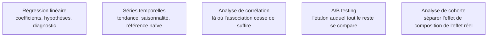

Niveau attendu : **usage**. Le confirmé reconnaît une question causale, pose un design quasi-expérimental balisé et teste la stationnarité avant de régresser ; une identification contestée se traite avec un économètre, pas à sa place.

La branche qui prend au sérieux le fait que les données ne viennent pas d'une expérience contrôlée. Elle apporte deux choses que l'apprentissage automatique ignore largement : l'interprétation causale d'un coefficient, et le traitement rigoureux de la dépendance temporelle.

## Ce qu'il faut savoir faire

- **Répondre à « de combien la promotion a-t-elle augmenté les ventes » et non à « combien vais-je vendre demain ».** Les deux questions se ressemblent, mobilisent parfois le même modèle, et n'ont pas les mêmes conditions de validité : la première exige une stratégie d'identification, la seconde une évaluation hors échantillon.
- **Connaître les hypothèses des moindres carrés et ce qui arrive quand elles tombent** : erreurs standard fausses en cas d'hétéroscédasticité ou d'autocorrélation, coefficients biaisés en cas de variable omise corrélée, inférence invalide dans les deux cas.
- **Tester la stationnarité avant toute régression entre séries.** Deux séries non stationnaires produisent des corrélations fantômes très convaincantes, avec un coefficient de détermination élevé et une signification apparente forte.
- **Poser une baseline de prévision honnête.** La valeur de la veille, ou celle de la même semaine l'an passé, bat un nombre considérable de modèles élaborés. Un modèle qui ne la dépasse pas nettement n'a aucune raison d'être déployé.
- **Utiliser les designs quasi-expérimentaux quand la randomisation est impossible** : différence de différences avec vérification des tendances parallèles, régression sur discontinuité, contrôle synthétique. Ce sont les outils de fait de l'évaluation d'impact en entreprise.
- **Manier les variables instrumentales avec prudence.** Puissant et fragile : un instrument faible produit des estimations plus biaisées que la régression naïve qu'il prétend corriger.
- **Absorber l'hétérogénéité inobservée par des effets fixes** quand on dispose de plusieurs observations par entité — la manière la moins chère d'éliminer tout ce qui est constant dans le temps pour un individu.

> [!tip] Ce qui a changé
> La prévision a basculé vers deux approches absentes des parcours classiques. Les modèles globaux entraînés simultanément sur des milliers de séries — gradient boosting sur variables de décalage, architectures spécialisées — qui dominent les compétitions depuis plusieurs années. Et les modèles de fondation pour séries temporelles, utilisables sans entraînement sur une série jamais vue. Ils ne remplacent pas un modèle spécialisé bien réglé, mais donnent en quelques minutes une référence solide sur un portefeuille de milliers de séries.

> [!warning] Piège
> Évaluer une série temporelle par validation croisée aléatoire. Le mélange des indices fait fuiter le futur dans l'entraînement et produit des scores magnifiques et faux. Il faut un découpage temporel strict, idéalement un backtest glissant à horizon fixe, avec un intervalle reproduisant le délai réel entre la disponibilité de la donnée et la décision qu'elle alimente.

## Les notions mobilisées

- [[notions/regression-lineaire]] — lue ici comme un outil d'estimation d'effet, ce qui impose des exigences que la seule prédiction n'impose pas.
- [[notions/series-temporelles]] — décomposition, saisonnalité et référence naïve, le socle avant toute prévision élaborée.
- [[notions/analyse-correlation]] — le point de départ de toute discussion causale, et la confusion la plus répandue à désamorcer.
- [[notions/ab-testing]] — l'expérience randomisée reste l'étalon ; les méthodes de cette page servent quand elle est impossible.
- [[notions/analyse-de-cohorte]] — l'outil qui distingue une dégradation réelle d'un simple changement de composition de la population observée.

## Pour apprendre

- [Forecasting: Principles and Practice](https://otexts.com/fpp3/) — la référence libre sur les séries temporelles ; le chapitre sur la [validation croisée temporelle](https://otexts.com/fpp3/tscv.html) devrait être lu avant tout backtest.
- [Causal Inference: The Mixtape](https://mixtape.scunning.com/) — l'inférence causale appliquée, libre en ligne, avec code R, Stata et Python.
- [Applied Causal Inference Powered by ML and AI](https://causalml-book.org/) — le pont explicite entre économétrie et apprentissage automatique, PDF libre.
- [Introduction to Econometrics with R](https://www.econometrics-with-r.org/) — le manuel libre qui couvre moindres carrés, panel, instruments et séries avec le code correspondant.
- [statsmodels](https://www.statsmodels.org/stable/index.html) — la bibliothèque Python qui fournit les erreurs standard robustes, les tests de spécification et les modèles de panel que scikit-learn ne propose pas.
