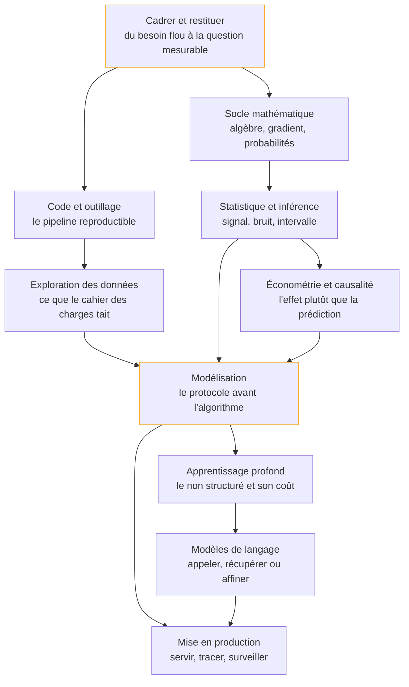

Transformer une question métier incertaine en une réponse mesurée, puis en un modèle qui tient hors du carnet de calcul — avec, à chaque étage, la discipline d'évaluation qui décide si le chiffre annoncé vaut quelque chose.

## La roadmap

Chaque case mène à sa page. Cochez les étapes acquises en bas de page pour suivre votre progression.

## Ma progression

- [ ] [[parcours/data-scientist/cadrer-et-restituer|Cadrer et restituer]] — traduire une demande en question mesurable, et rendre le résultat décidable
- [ ] [[parcours/data-scientist/socle-mathematique|Socle mathématique]] — l'algèbre, le gradient et les probabilités, là où ils se voient vraiment
- [ ] [[parcours/data-scientist/statistique-et-inference|Statistique et inférence]] — séparer le signal du bruit et rapporter une marge
- [ ] [[parcours/data-scientist/econometrie-et-causalite|Économétrie et causalité]] — mesurer un effet quand on ne peut pas randomiser
- [ ] [[parcours/data-scientist/code-et-outillage|Code et outillage]] — un pipeline versionné, testé, relançable par un tiers
- [ ] [[parcours/data-scientist/exploration-des-donnees|Exploration des données]] — qualité, fuite, structure, variables construites
- [ ] [[parcours/data-scientist/modelisation|Modélisation]] — métrique, validation, calibration, interprétation
- [ ] [[parcours/data-scientist/apprentissage-profond|Apprentissage profond]] — quand le non structuré justifie le coût, et comment diagnostiquer
- [ ] [[parcours/data-scientist/modeles-de-langage|Modèles de langage]] — l'arbitrage prompt, récupération, affinage, et son évaluation
- [ ] [[parcours/data-scientist/mise-en-production|Mise en production]] — versionner, servir, surveiller la dérive, revenir en arrière
