Niveau attendu : **usage**. Le confirmé livre un modèle qu'une équipe d'exploitation accepte de prendre en charge, sur les rails qu'elle a posés ; la plateforme et ses garanties sont le métier du [[parcours/mlops/index|MLOps]].

Un modèle non déployé n'a produit aucune valeur, et un modèle déployé sans surveillance produit de la valeur négative dès que la distribution change. L'objectif n'est pas de devenir ingénieur plateforme, mais de livrer quelque chose qu'une équipe d'exploitation accepte de prendre en charge.

```mermaid
flowchart TD
  ORC["Orchestration de flux<br/>ordonnancement, reprise, dépendances"]
  CON["Conteneurisation<br/>la même exécution partout"]
  CIC["Intégration continue<br/>tests et livraison du modèle"]
  PLA["Plateforme de déploiement<br/>où le modèle tourne réellement"]
  OBS["Observabilité<br/>traces, journaux, métriques"]
  LIG["Lignage des données<br/>reproduire un résultat et instruire un incident"]
  GOU["Gouvernance IA<br/>documentation, traçabilité, obligations"]

  click ORC "/notions/orchestration-de-flux"
  click CON "/notions/conteneurisation"
  click CIC "/notions/integration-continue"
  click PLA "/notions/plateforme-de-deploiement"
  click OBS "/notions/observabilite"
  click LIG "/notions/lignage-des-donnees"
  click GOU "/notions/gouvernance-ia"
```

## Ce qu'il faut savoir faire

- **Versionner ensemble le code, les données et le modèle.** Sans les trois, un résultat n'est pas reproductible et un incident n'est pas diagnosticable ; c'est le prérequis de tout le reste, pas une bonne pratique optionnelle.
- **Tracer chaque expérience automatiquement** : hyperparamètres, métriques, artefacts, empreinte du jeu de données. Un registre d'expériences répond à la question « qu'est-ce qui tourne en production, et comment l'a-t-on obtenu », que personne ne sait traiter de mémoire trois mois plus tard.
- **Éliminer l'écart entraînement-service.** Le code qui transforme les variables à l'entraînement et celui qui les transforme à l'inférence doivent être le même code, appelé de deux endroits — pas deux implémentations qu'on espère équivalentes.
- **Surveiller trois dérives distinctes** : la distribution des variables d'entrée, la distribution de la cible, et la métrique métier. Elles ne surviennent pas en même temps, et la première est un signal précoce des deux autres.
- **Prévoir le retour arrière avant la mise en service** : déploiement progressif, exécution en parallèle silencieuse, comparaison contrôlée contre le modèle en place. Un système sans chemin de retour n'est pas déployable.
- **Poser une porte de qualité sur tout ré-entraînement automatique** : un seuil de performance sur un jeu de référence figé, et un échec bruyant plutôt qu'un déploiement silencieux.
- **Documenter le modèle pour un tiers** : usage prévu, population d'entraînement, limites connues, performances par sous-groupe. C'est ce qui est demandé en audit, et c'est aussi ce qui sert à l'équipe qui reprendra le système.

> [!tip] Ce qui a changé
> Le cadre classique ne couvre pas les systèmes fondés sur des modèles de langage, qui représentent aujourd'hui une part importante du travail. S'y ajoutent une suite d'évaluations versionnée exécutée à chaque changement de consigne ou de modèle, une observabilité par traces capturant toute la chaîne — requête, récupération, appels d'outils, réponse —, un suivi du coût et de la latence par requête, et des filtres en entrée et en sortie. Côté réglementaire, les obligations européennes pour les systèmes à haut risque — documentation technique, gestion des risques, supervision humaine, journalisation — concernent directement la documentation de modèle.

> [!warning] Piège
> Le ré-entraînement automatique sans porte de qualité. Le modèle se réentraîne chaque nuit sur des données fraîches, une source amont casse, le modèle apprend du bruit et se déploie seul. Le symptôme n'apparaît que dans la métrique métier, quelques semaines plus tard, quand l'effet est déjà chiffrable.

## Les notions mobilisées

- [[notions/orchestration-de-flux]] — l'ordonnancement, les dépendances et la reprise sur incident, qui transforment un script en traitement fiable.
- [[notions/conteneurisation]] — la garantie que l'environnement d'entraînement et celui d'exécution sont bien le même.
- [[notions/integration-continue]] — les tests automatiques appliqués au modèle et à ses données, pas seulement au code.
- [[notions/plateforme-de-deploiement]] — le choix entre traitement par lots, service d'interface et exécution embarquée, qui détermine toute l'architecture en amont.
- [[notions/observabilite]] — la capacité d'expliquer une prédiction donnée trois mois après qu'elle a été rendue.
- [[notions/lignage-des-donnees]] — remonter d'une sortie du modèle aux sources qui l'ont alimentée, condition d'un diagnostic d'incident.
- [[notions/gouvernance-ia]] — la documentation de modèle et les obligations qui s'appliquent dès que la décision touche des personnes.

## Pour apprendre

- [MLOps Principles](https://ml-ops.org/) — la synthèse libre la plus claire sur les pratiques, avec une carte des outils par fonction.
- [Practitioners guide to MLOps](https://cloud.google.com/architecture/mlops-continuous-delivery-and-automation-pipelines-in-machine-learning) — le document de référence sur les niveaux de maturité et l'automatisation progressive.
- [CS 329S — Machine Learning Systems Design](https://stanford-cs329s.github.io/) — les notes de cours sur le service, la surveillance et la dérive.
- [Documentation MLflow](https://mlflow.org/docs/latest/index.html) — suivi d'expériences, registre de modèles et empaquetage, suffisant dans la majorité des cas.
- [Documentation Evidently](https://docs.evidentlyai.com/) — la détection de dérive de données et de qualité de prédiction, avec les tests correspondants.
- [Le texte de l'AI Act européen](https://artificialintelligenceact.eu/) — l'explorateur libre, pour situer les obligations qui s'appliquent à un système donné.
