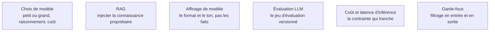

Pour un data scientist généraliste, la question n'est presque jamais « dois-je entraîner un modèle » mais « dois-je appeler une interface de programmation, servir un modèle ouvert, ou en affiner un ». L'ordre de préférence suit le coût croissant, et chaque marche doit être justifiée par une mesure.

## L'ordre des marches

| Marche | Ce qu'elle résout | Ce qu'elle ne résout pas |
|---|---|---|
| Consigne seule | le format de sortie, le ton, une tâche bien décrite | l'accès à des connaissances que le modèle n'a pas |
| Récupération sur corpus propriétaire | les faits internes, la fraîcheur, la citation de source | un vocabulaire ou un style de sortie très particulier |
| Affinage à faible rang | le format, le style, un domaine étroit, la latence à qualité égale | l'injection de connaissances factuelles nouvelles |
| Entraînement complet | un domaine sans équivalent public | à peu près tout le reste, pour un coût sans commune mesure |

## Ce qu'il faut savoir faire

- **Refuser de monter une marche sans mesure.** Chaque passage au niveau supérieur doit être justifié par un écart observé sur un jeu d'évaluation, pas par une intuition sur ce que le modèle « devrait » mieux faire.
- **Construire le jeu d'évaluation avant le système.** Quelques dizaines de cas réels, avec la réponse attendue et le critère de réussite écrit ; il se versionne avec le code et se rejoue à chaque changement de consigne ou de modèle.
- **Traiter la variance comme un objet de mesure.** Une différence de deux points sur cinquante requêtes n'est rien. Intervalles par rééchantillonnage, tests appariés entre variantes, température consignée : la même rigueur statistique que partout ailleurs dans ce parcours.
- **Rattacher l'affinage à une dette.** Un modèle affiné doit être réentraîné à chaque évolution du modèle de base, et le jeu d'entraînement doit rester disponible et traçable. C'est un engagement de maintenance, pas une opération ponctuelle.
- **Instrumenter le coût par requête dès le prototype.** Le prix d'un système se décide à l'architecture — longueur de contexte, nombre d'appels, mise en cache, traitement par lots — et devient très difficile à corriger ensuite.
- **Poser des garde-fous en entrée et en sortie** et savoir dégrader proprement plutôt que de répondre n'importe quoi quand la confiance est insuffisante.

> [!tip] Ce qui dure et ce qui périme
> La moitié de la boîte à outils de 2020 est obsolète, l'autre moitié ne l'est pas du tout, et savoir distinguer les deux est la compétence la plus rentable du métier. Durée de vie longue : algèbre linéaire, probabilités, inférence causale, conception d'expériences, rigueur du protocole, traduction d'un problème métier en question mesurable. Durée de vie courte : noms de bibliothèques, classements de modèles, cadres d'agents, tarifs d'interfaces. À suivre sans s'y attacher — et en privilégiant les travaux d'évaluation et de reproduction aux annonces de modèles.

> [!warning] Piège
> Attendre de l'affinage qu'il enseigne des faits. Il impose une forme, il ne remplit pas une base de connaissances : les faits appartiennent à la récupération. Un affinage lancé pour « apprendre la documentation interne au modèle » produit un modèle qui parle le style de la documentation et invente son contenu avec beaucoup d'aplomb.

## Les notions mobilisées

- [[notions/choix-de-modele]] — l'arbitrage entre taille, capacité de raisonnement et coût, à refaire à chaque génération de modèles.
- [[notions/rag]] — le mécanisme de récupération, ses modes d'échec typiques, et pourquoi il précède l'affinage dans l'ordre des marches.
- [[notions/affinage-de-modele]] — ce qu'il apporte réellement, et la dette de ré-entraînement qu'il engage.
- [[notions/evaluation-llm]] — la suite d'évaluations versionnée, exécutée à chaque changement de consigne ou de modèle.
- [[notions/cout-et-latence-inference]] — le budget par requête, à instrumenter dès le prototype et non à la mise en service.
- [[notions/garde-fous]] — le filtrage et la dégradation contrôlée, sans lesquels un système ouvert au public n'est pas livrable.

## Pour apprendre

- [Hugging Face LLM Course](https://huggingface.co/learn/llm-course/chapter1/1) — le parcours libre le plus complet, du jeton à l'affinage, avec carnets exécutables.
- [Hugging Face NLP Course](https://huggingface.co/learn/nlp-course/chapter1/1) — la partie classique, encore utile pour les tâches d'extraction et de classification qui n'exigent pas un grand modèle.
- [A Gentle Introduction to Conformal Prediction](https://arxiv.org/abs/2107.07511) — comment livrer une incertitude avec garantie de couverture, applicable aux sorties d'un système génératif.
- [Rules of Machine Learning](https://developers.google.com/machine-learning/guides/rules-of-ml) — toujours valable ici : la première règle reste de vérifier qu'un système sans apprentissage ne suffirait pas.
