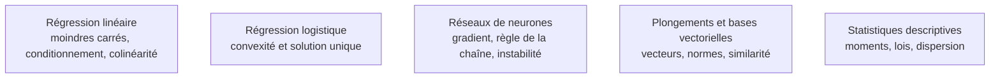

Le niveau de mathématiques exigé s'est déplacé plutôt qu'il n'a baissé : les bibliothèques écrivent le modèle, mais diagnostiquer un entraînement qui diverge, lire un papier ou comprendre pourquoi une quantification dégrade un modèle et pas un autre en demande davantage qu'avant.

## Où ces mathématiques se voient

Quatre blocs suffisent, et chacun sert à comprendre un échec précis. L'**algèbre linéaire** est le langage dans lequel s'écrivent les données : une table est une matrice, un plongement un vecteur, une couche un produit matriciel ; la décomposition en valeurs singulières fonde l'analyse en composantes principales, les approximations de rang faible et, par filiation directe, les techniques d'affinage à faible rang. Le **calcul différentiel** explique la rétropropagation et l'endroit où elle casse. Les **probabilités** donnent le vocabulaire de l'incertitude, sans lequel une prédiction n'est qu'un chiffre nu. L'**optimisation** décrit ce que fait réellement un entraînement : minimiser une fonction dans un espace de très grande dimension.

## Ce qu'il faut savoir faire

- **Lire une forme de tenseur et anticiper une diffusion de dimensions.** La moitié des erreurs NumPy et PyTorch sont des erreurs de forme, pas de logique, et elles produisent souvent un résultat silencieusement faux plutôt qu'une exception.
- **Reconnaître une matrice mal conditionnée.** Un déterminant proche de zéro, des valeurs propres étalées sur plusieurs ordres de grandeur : les coefficients deviennent instables et changent de signe d'un rééchantillonnage à l'autre. C'est un diagnostic de colinéarité, pas un caprice numérique.
- **Diagnostiquer un gradient.** Savoir dire si une perte qui stagne relève du taux d'apprentissage, de l'initialisation ou d'un signal absent des données ; reconnaître un gradient qui explose ou s'annule à la forme de la courbe plutôt qu'à l'intuition.
- **Distinguer un problème convexe d'un problème qui ne l'est pas.** Cela explique pourquoi une régression logistique a une solution unique et reproductible, et pourquoi deux entraînements d'un même réseau avec deux graines différentes ne donnent pas le même modèle.
- **Manipuler entropie, entropie croisée et divergence de Kullback-Leibler.** La fonction de coût de classification, la distillation et la régularisation des autoencodeurs variationnels sont des divergences déguisées ; les traiter comme des boîtes noires interdit de comprendre ce qu'on optimise.
- **Situer la stabilité numérique** : pourquoi on calcule une log-vraisemblance plutôt qu'un produit de probabilités, pourquoi l'entraînement en demi-précision impose des précautions, ce que coûte une quantification en quatre bits.

> [!warning] Piège
> Passer six mois sur des cours de mathématiques avant de toucher un jeu de données. Le seul mode d'apprentissage qui tient est l'aller-retour concept, implémentation, cas réel. L'erreur symétrique — n'ouvrir aucun livre et empiler des appels de bibliothèques — produit un praticien incapable de dire si un résultat est faux, ce qui est plus coûteux encore.

## Les notions mobilisées

- [[notions/regression-lineaire]] — le cas d'école où le conditionnement de la matrice se lit directement dans l'instabilité des coefficients.
- [[notions/regression-logistique]] — la convexité rendue concrète : un optimum unique, donc un modèle reproductible à la décimale près.
- [[notions/reseaux-de-neurones]] — la règle de la chaîne appliquée à des couches empilées, c'est-à-dire toute la rétropropagation.
- [[notions/embeddings-et-bases-vectorielles]] — l'endroit où normes, produits scalaires et similarité cosinus cessent d'être abstraits.
- [[notions/statistiques-descriptives]] — moments et lois usuelles, le préalable au raisonnement sur l'incertitude.

## Pour apprendre

- [Mathematics for Machine Learning](https://mml-book.github.io/) — le seul livre de mathématiques calibré exactement sur les besoins du domaine, libre en PDF.
- [Probabilistic Machine Learning — An Introduction](https://probml.github.io/pml-book/book1.html) — la référence moderne pour le versant probabiliste, PDF libre, à consulter par chapitre.
- [MLU-Explain](https://mlu-explain.github.io/) — des explications visuelles et interactives des notions centrales, utiles pour ancrer une intuition avant de passer aux formules.
- [Principal Component Analysis expliquée visuellement](https://setosa.io/ev/principal-component-analysis/) — la meilleure entrée pour relier projection, variance et valeurs propres.
- [NumPy — règles de diffusion](https://numpy.org/doc/stable/user/basics.broadcasting.html) — quelques pages qui suppriment une classe entière de bogues.
