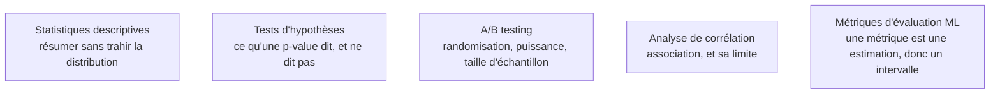

La discipline qui répond à la seule question qui compte devant un décideur : ce que j'observe est-il un signal ou du bruit, et avec quelle marge. C'est aussi elle qui fournit le cadre du protocole d'évaluation, bien avant que le premier modèle soit entraîné.

## Ce qu'il faut savoir faire

- **Lire le compromis biais-variance dans un résultat concret.** C'est la grille de lecture universelle du sous-apprentissage et du surapprentissage, et elle s'applique aussi bien à une estimation statistique qu'à un modèle à plusieurs millions de paramètres.
- **Produire un intervalle sur n'importe quelle métrique par rééchantillonnage.** Le bootstrap coûte cinq lignes de code, ne suppose presque rien, et fonctionne sur une aire sous la courbe comme sur un score d'un système de récupération. Il désamorce la moitié des discussions stériles sur des écarts non significatifs.
- **Énoncer correctement ce qu'est une p-value** : la probabilité des données sous l'hypothèse nulle, jamais la probabilité que l'hypothèse nulle soit vraie. C'est la confusion la plus coûteuse du métier, et elle se propage jusque dans les rapports de direction.
- **Dimensionner un essai avant de le lancer.** Un test sous-dimensionné ne prouve rien, ni dans un sens ni dans l'autre : il produit une absence de conclusion qu'on lira à tort comme une absence d'effet.
- **Corriger les comparaisons multiples.** Dès qu'on teste vingt variantes, on trouve un effet à 5 % par construction. Bonferroni quand les tests sont peu nombreux, Benjamini-Hochberg quand ils se comptent par dizaines.
- **Estimer par maximum de vraisemblance et savoir passer au cadre bayésien** quand l'information antérieure existe et compte — petits effectifs, effets hiérarchiques, décisions séquentielles.
- **Séparer explicitement la phase exploratoire de la phase confirmatoire**, et écrire l'hypothèse testée avant de regarder le résultat du test.

> [!tip] Ce qui a changé
> Deux zones longtemps absentes des parcours ont pris beaucoup d'importance. L'évaluation statistique des systèmes fondés sur des modèles de langage d'abord : un jeu de test de cinquante requêtes ne permet aucune conclusion, il faut des intervalles par rééchantillonnage sur les scores, des tests appariés entre variantes, et une gestion explicite de la variance due à la température. Le cadre bayésien ensuite, redevenu praticable : les bibliothèques d'inférence variationnelle rendent accessible un raisonnement en distribution là où l'on se contentait d'un point et d'une étoile.

> [!warning] Piège
> Le p-hacking involontaire. On explore, on remarque un segment intéressant, on le teste, on obtient 0,03 et on l'écrit dans le rapport. Le test n'était pas préenregistré, l'espace de recherche parcouru était énorme, le résultat ne se reproduira pas. La parade n'est pas morale mais procédurale : consigner les hypothèses avant l'analyse et traiter tout le reste comme de la génération d'hypothèses.

## Les notions mobilisées

- [[notions/statistiques-descriptives]] — la photographie initiale, dont le choix de résumé oriente déjà toute la suite de l'analyse.
- [[notions/tests-hypotheses]] — la mécanique et ses limites, y compris ce qu'une absence de significativité n'autorise pas à conclure.
- [[notions/ab-testing]] — le cadre expérimental complet : randomisation, puissance, durée, métriques de ratio.
- [[notions/analyse-correlation]] — la mesure d'association et la raison pour laquelle elle ne suffit jamais à établir un effet.
- [[notions/metriques-evaluation-ml]] — toute métrique calculée sur un échantillon est une estimation, donc assortie d'une incertitude qu'il faut rapporter.

## Pour apprendre

- [An Introduction to Statistical Learning](https://www.statlearning.com/) — les chapitres 2, 5 et 6 sont la meilleure entrée sur biais-variance, rééchantillonnage et sélection ; versions R et Python libres.
- [Statistical Rethinking](https://xcelab.net/rm/statistical-rethinking/) — la meilleure entrée en statistique bayésienne appliquée, cours vidéo et exercices inclus.
- [Computational and Inferential Thinking](https://www.inferentialthinking.com/) — le manuel libre de Berkeley, qui construit l'inférence par simulation avant les formules.
- [Common statistical tests are linear models](https://lindeloev.github.io/tests-as-linear/) — la démonstration que la batterie des tests classiques est un seul modèle sous plusieurs noms ; cela simplifie durablement la mémoire.
- [NIST/SEMATECH e-Handbook of Statistical Methods](https://www.itl.nist.gov/div898/handbook/) — l'ouvrage de référence à consulter ponctuellement, notamment sur les plans d'expérience.
