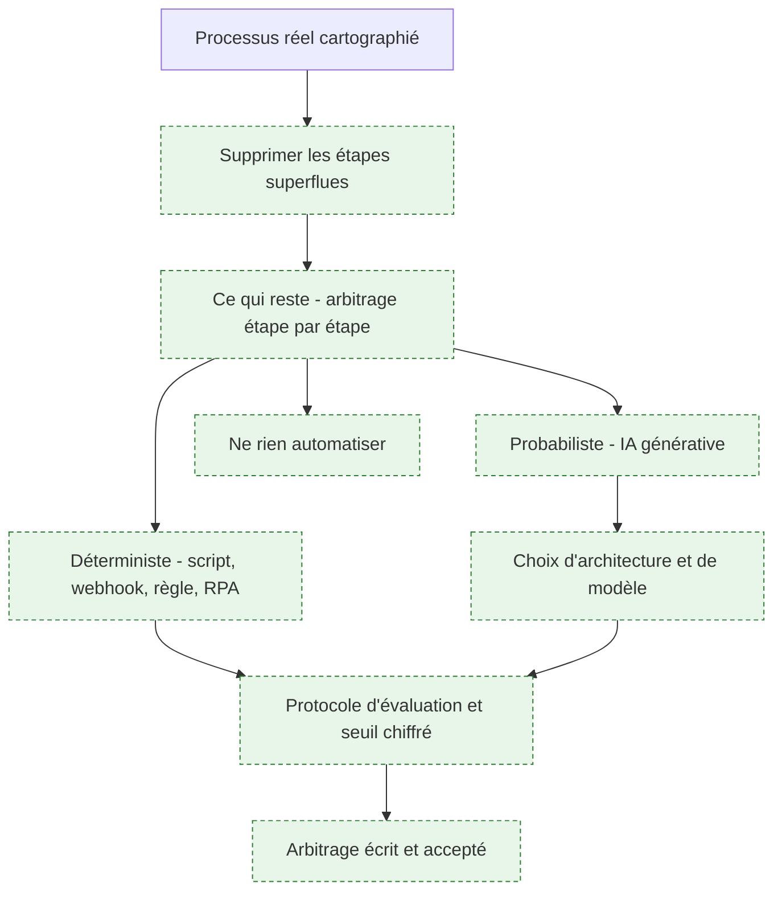
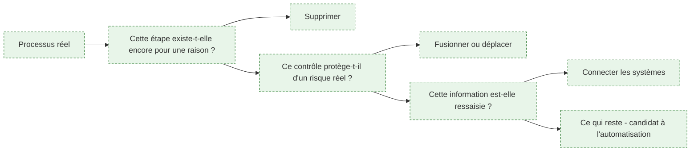
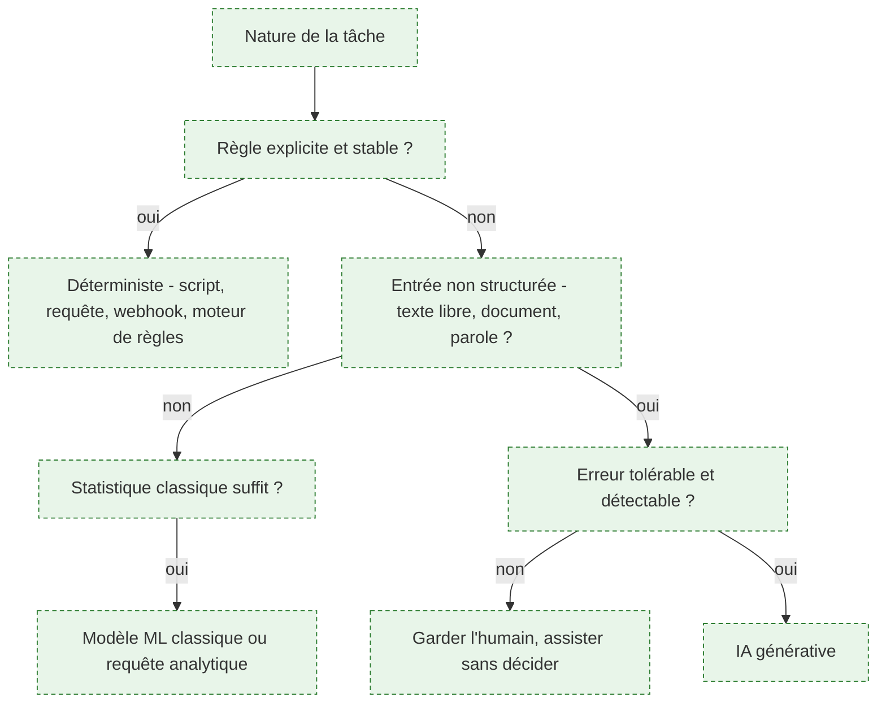
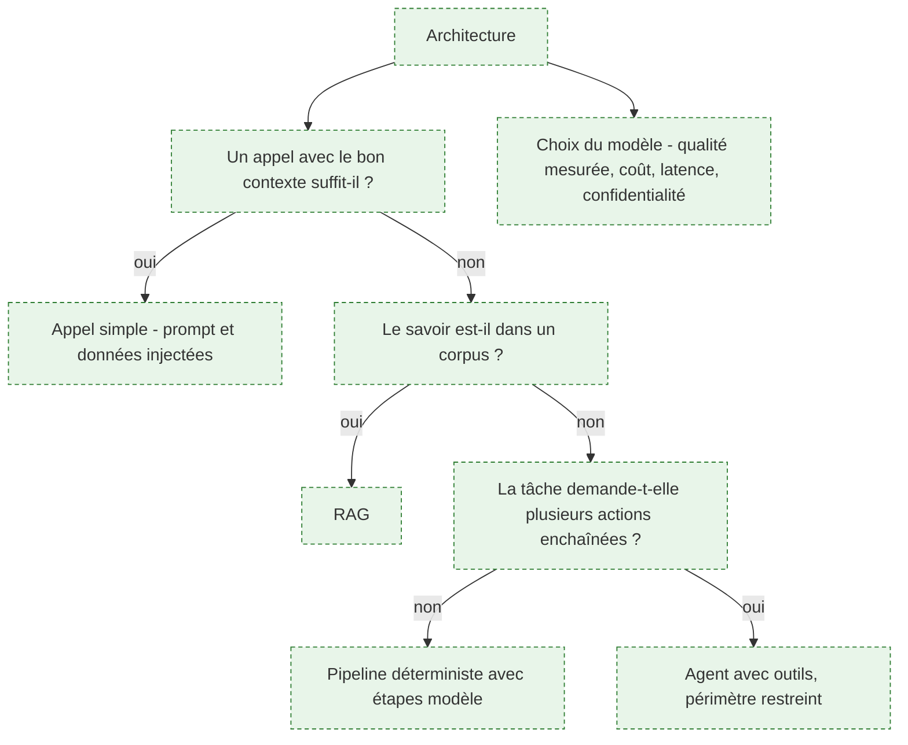
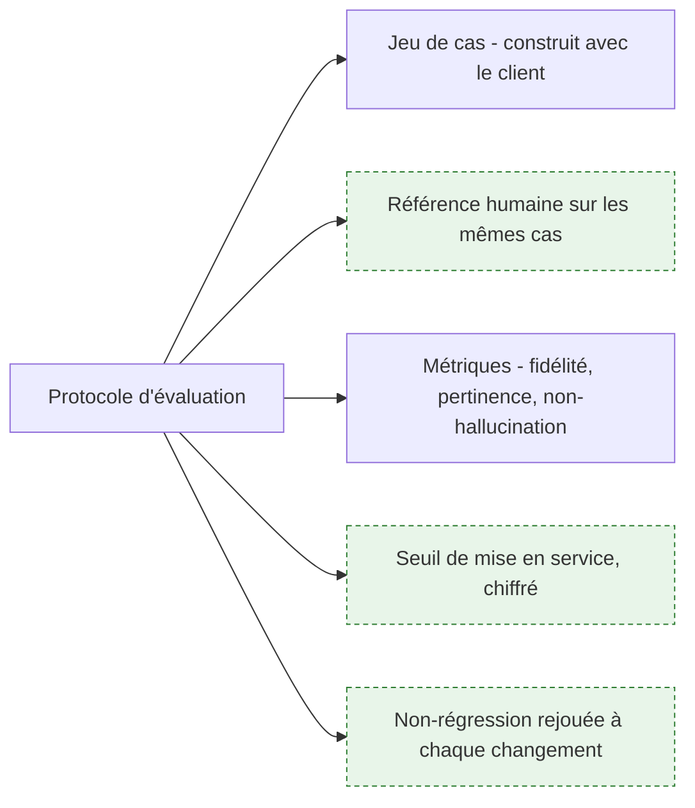
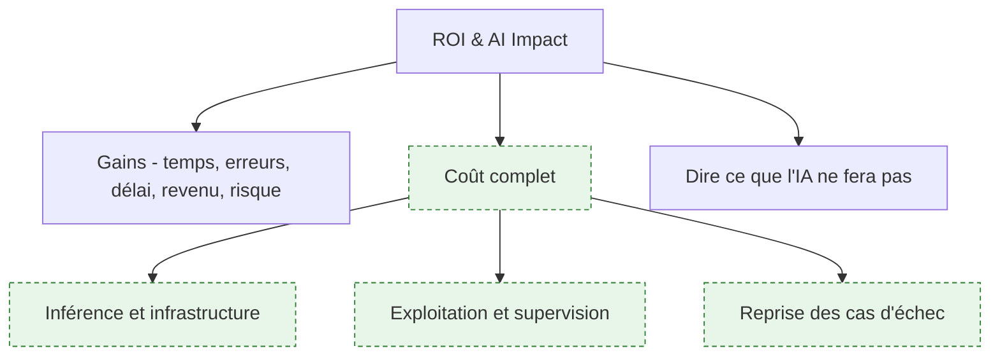
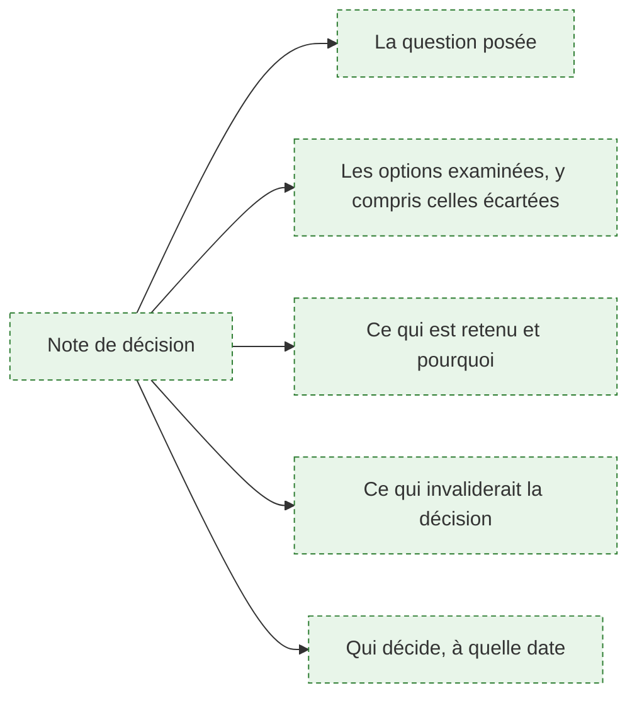

# Phase 2 — Rationalisation et arbitrage technologique

> [!abstract] La phase courte qui décide de la valeur de tout le reste : simplifier le processus avant d'écrire une ligne de code, puis trancher entre automatisation déterministe et IA générative. C'est l'endroit où se commet l'erreur de cadrage la plus coûteuse du métier, et c'est aussi le seul moment où elle ne coûte encore rien à corriger.

**Source** : roadmap.sh/forward-deployed-engineer, capturée le 16 septembre 2026 · **Rédigée** le 16 septembre 2026
Le retour sur investissement et les arbitrages de périmètre viennent de l'amont. La réingénierie de processus et l'arbitrage déterministe/probabiliste viennent du brief de commande ; la grille de décision et le protocole d'évaluation comme porte de sortie sont des apports propres. Phase précédente : [[parcours/forward-deployed-engineer/audit-et-cartographie]] · Phase suivante : [[parcours/forward-deployed-engineer/industrialisation]].

---

## La phase en un coup d'œil

**Porte de sortie** : un seuil de réussite chiffré, un protocole pour le mesurer, et un arbitrage écrit signé par celui qui décide. Sans les trois, le développement commence sur un malentendu.

---

## 1. Supprimer avant d'automatiser

**À quoi ça sert.** Le brief est catégorique : simplifier le processus en supprimant les étapes superflues **avant toute écriture de code**. C'est la formulation contemporaine d'un principe de réingénierie posé au début des années 1990 — n'automatisez pas, supprimez. La raison est mécanique : automatiser une étape inutile la rend permanente. Ce qui était une lourdeur discutable devient un composant logiciel que plus personne n'osera retirer, avec sa documentation, sa supervision et son coût de maintenance.

**Ce qu'il faut savoir**

- Les trois questions dans l'ordre, sur chaque étape : est-elle encore justifiée, le contrôle protège-t-il d'un risque réel et actuel, l'information est-elle ressaisie d'un système à un autre.
- Beaucoup de contrôles existent à cause d'un incident ancien dont plus personne ne se souvient. Les interroger n'est pas de l'imprudence — mais il faut l'incident d'origine, et parfois il est toujours d'actualité.
- La suppression pure est le gain le plus rentable et le plus difficile à obtenir : elle n'appartient pas au FDE, elle appartient au propriétaire du processus. Voir [[notions/conduite-du-changement]].
- Les gains sans IA sont les premiers à prendre : connecter deux systèmes qui s'ignorent, supprimer une ressaisie, remplacer une validation systématique par un contrôle par sondage. Ils sont peu spectaculaires et ils financent la suite.
- Voir [[notions/reingenierie-de-processus]]. L'angle FDE : la réingénierie n'est pas un projet séparé, c'est la première semaine du projet d'IA — et le FDE l'obtient parce qu'il est sur place, pas parce qu'il a un mandat pour ça.

> [!tip] Ajout 2026
> Mesure ce que vaut la simplification seule, avant toute IA, et annonce-le. Un processus qui passe de onze à six jours par suppression d'attentes et connexion de deux systèmes, c'est un résultat acquis en trois semaines, sans risque technique, qui achète la confiance nécessaire à la partie incertaine. Un FDE qui commence par la démonstration d'IA la plus impressionnante dépense son capital de confiance au lieu de le constituer.

> [!warning] Piège
> Découvrir en phase 2 que la vraie demande était de ne rien changer au processus. Cela arrive : un commanditaire veut de l'IA sur son organisation actuelle, pas une remise en cause de son organisation. C'est une contrainte politique légitime qu'il vaut mieux nommer tôt, quitte à réduire le périmètre — pas une contrainte technique à contourner en silence.

---

## 2. Déterministe ou probabiliste

**À quoi ça sert.** C'est le cœur du métier et l'erreur la plus chère. Un système génératif placé sur une tâche déterministe coûte plus cher, répond plus lentement, se trompe parfois, et remplace un comportement vérifiable par un comportement à surveiller. L'inverse — un moteur de règles sur une tâche qui demande de l'interprétation — produit un arbre de conditions ingérable que personne ne maintiendra. La grille ci-dessus se parcourt étape par étape sur la carte de la phase 1, pas une fois pour le projet entier : un même processus mélange presque toujours les deux natures.

**Ce qu'il faut savoir**

- Règle explicite et stable, entrée structurée, résultat vérifiable : c'est du déterministe. Un script, une requête, un webhook, un moteur de règles ou de la RPA. Moins cher, testable, explicable à un auditeur.
- Entrée non structurée — texte libre, courriel, document scanné, transcription — et jugement nécessaire : l'IA générative devient pertinente.
- Entre les deux, tout un espace couvert par le ML classique ou l'analyse : classer, prédire, détecter une anomalie sur des données tabulaires ne demande pas un modèle de langage. Voir [[roadmaps/04 - Roadmap — Machine Learning]].
- La question qui tranche vraiment n'est pas la difficulté de la tâche, c'est le coût d'une erreur et sa détectabilité. Une erreur rare et invisible dans un processus comptable coûte plus qu'une erreur fréquente et visible dans une aide à la rédaction.
- La RPA — automatisation par pilotage de l'interface — est une solution de dernier recours quand aucune interface programmatique n'existe. Elle casse à chaque changement d'écran ; l'assumer comme dette explicite ou ne pas la retenir.
- Voir [[notions/arbitrage-deterministe-probabiliste]]. L'angle FDE : cet arbitrage doit être rendu **par étape du processus**, écrit, et présenté au client — c'est un livrable, pas une intuition d'ingénieur.

> [!tip] Ajout 2026
> L'architecture qui gagne le plus souvent en mission est hybride, et elle se décrit simplement : le déterministe fait le travail, le modèle fait la traduction. Un modèle extrait des informations structurées d'un document, puis un code classique applique les règles métier, vérifie la cohérence et écrit dans le système. On obtient la souplesse sur l'entrée et la vérifiabilité sur la décision. Un système où le modèle décide **et** agit est beaucoup plus difficile à faire accepter par un service de contrôle interne.

> [!warning] Piège
> Laisser l'arbitrage se faire par la commande. Quand le budget est intitulé « projet IA », toute réponse qui n'utilise pas d'IA paraît hors sujet, y compris aux yeux du FDE. C'est précisément le moment de dire que la moitié du gain vient d'un connecteur et d'une suppression d'étape — c'est ce qui distingue un ingénieur en immersion d'un fournisseur de technologie. L'amont le formule en une phrase dans sa section communication : savoir dire quand l'IA n'est pas la bonne réponse.

---

## 3. Choisir l'architecture et le modèle

**À quoi ça sert.** Le brief demande de maîtriser les architectures RAG, l'orchestration d'agents, le prompting avancé, l'affinage ciblé et la sélection de modèles. La difficulté en mission n'est pas de savoir faire : c'est de choisir le plus simple qui passe le seuil. Chaque niveau d'autonomie ajouté multiplie les modes de défaillance et le coût de supervision, et ce coût sera porté par le client après le départ du FDE.

**Ce qu'il faut savoir**

- Monter dans l'échelle seulement quand le niveau inférieur a été mesuré insuffisant. L'amont dit la même chose côté déploiement : commencer par la plus petite unité d'autonomie et n'ajouter une capacité qu'une fois la précédente prouvée. C'est le meilleur conseil de la roadmap.
- [[notions/rag]] — angle FDE : le corpus client conditionne tout, et l'effort réel est dans l'ingestion — documents scannés, versions multiples, droits d'accès par document.
- [[notions/agents-llm]] — angle FDE : un agent en environnement client doit avoir un périmètre d'action explicitement borné, journalisé, et réversible. Ce qui est difficile n'est pas la boucle, c'est de faire accepter qu'un système agisse.
- [[notions/choix-de-modele]] — angle FDE : la confidentialité tranche souvent avant la qualité. Si les données ne peuvent pas sortir, le débat est clos et l'arbitrage porte sur les modèles hébergeables.
- [[notions/affinage-de-modele]] — angle FDE : presque jamais justifié en mission ; il crée une dette de ré-entraînement que le client ne saura pas porter. Le réserver au cas où un format ou un vocabulaire métier résiste réellement au contexte.
- [[notions/cout-et-latence-inference]] — angle FDE : calculer le coût unitaire par dossier traité et l'extrapoler au volume annuel réel, avant de construire. Un coût par requête acceptable en démonstration peut devenir insoutenable au volume de production.
- Le contenu technique complet est dans [[roadmaps/05 - Roadmap — AI Engineer]] et [[roadmaps/07 - Roadmap — AI Agents]].

> [!tip] Ajout 2026
> Chiffre le coût annuel complet avant de choisir l'architecture, et présente-le avec la facture actuelle du processus. Un système à quarante centimes le dossier sur quatre-vingt mille dossiers par an, c'est trente-deux mille euros d'inférence annuelle qui apparaîtront dans le budget d'exploitation du client, sans le FDE pour les expliquer. Cette ligne doit être connue et acceptée avant le développement, pas découverte à la première facture.

> [!warning] Piège
> Choisir l'architecture sur ce qui est intéressant à construire. Le biais est réel et il est d'autant plus fort que la mission est courte et le sujet à la mode. Le critère est la capacité de reprise du client, pas la sophistication. Un pipeline lisible qu'une équipe d'exploitation sait modifier vaut mieux qu'un système multi-agents dont le FDE est le seul à comprendre le comportement.

---

## 4. Le protocole d'évaluation, porte de sortie de la phase

**À quoi ça sert.** L'amont fait de l'évaluation une phase à part entière du métier, entre l'audit et le déploiement, et insiste sur un point juste : il ne s'agit pas de vérifier que le système produit une réponse, mais qu'il raisonne sur le problème comme le ferait un professionnel compétent. Ce dossier en fait la porte de sortie de la phase 2 pour une raison précise : le jeu d'évaluation **est** la spécification. Il dit ce qu'on attend mieux que n'importe quel document, il est vérifiable, et il transforme une discussion d'opinion en une discussion sur des cas.

**Ce qu'il faut savoir**

- Le jeu se construit avec les opérationnels, à partir de cas réels, y compris les cas limites collectés en phase 1. Cinquante à deux cents cas suffisent pour trancher.
- Établir la référence humaine sur les mêmes cas : ce que fait l'équipe aujourd'hui, avec son propre taux d'erreur. Sans cette référence, le seuil est arbitraire et le débat sans fin.
- Le protocole est versionné dans le dépôt et rejoué automatiquement. Voir [[notions/tests-logiciels]] et [[notions/integration-continue]].
- Distinguer l'évaluation du composant — la récupération remonte-t-elle le bon passage — et l'évaluation de bout en bout. Une note globale ne dit pas où corriger.
- Voir [[notions/evaluation-llm]]. L'angle FDE : le jeu d'évaluation est autant un instrument de négociation qu'un outil technique. Il déplace la recette d'une impression vers un chiffre, et il protège le FDE du cas unique montré en réunion comme preuve que « ça ne marche pas ».

> [!tip] Ajout 2026
> Fais annoter une trentaine de cas par deux personnes du métier, séparément, et mesure leur taux d'accord. Il est presque toujours plus bas que ce que tout le monde croit. Ce chiffre a deux effets : il fixe un plafond réaliste à ce qu'on peut demander au système, et il ouvre une conversation que personne n'avait eue sur ce qu'est une bonne réponse. C'est souvent le moment le plus utile de la phase 2.

> [!warning] Piège
> Construire le jeu d'évaluation soi-même, par gain de temps. Il reflétera alors la compréhension du FDE, qui est justement ce qu'il fallait vérifier. Le jeu doit venir du métier, même si l'obtenir prend deux semaines de plus — ces deux semaines sont l'investissement le plus rentable de la mission.

---

## 5. Valeur, coût et honnêteté

**À quoi ça sert.** L'amont demande de savoir quantifier la valeur et d'être honnête sur ce que l'IA peut réellement livrer. Le calcul est faisable parce que la phase 1 a produit des volumes et des durées. Ce que l'amont ne dit pas, c'est que la moitié du coût est ailleurs que dans l'inférence : la supervision, le traitement des cas d'échec et le temps que l'équipe passera à contrôler les sorties pèsent souvent plus que la facture du fournisseur. Un gain de quinze minutes par dossier qui crée trois minutes de vérification par dossier n'est pas un gain de quinze minutes.

**Ce qu'il faut savoir**

- Compter les gains en unités métier — dossiers par jour, jours de délai, taux de reprise — et non en pourcentages de productivité, qui ne se vérifient jamais.
- Compter le coût complet : inférence, infrastructure, supervision, traitement des cas rejetés, maintenance après le départ du FDE.
- Le taux de rejet pilote l'économie du système : un système qui traite quatre-vingts pour cent des cas et passe la main proprement sur les vingt restants est souvent plus rentable qu'un système qui prétend tout traiter.
- Voir [[notions/roi-des-projets-ia]]. L'angle FDE : le calcul se fait avec le contrôle de gestion du client, avec ses conventions, sinon il ne sera pas repris. Un chiffre produit par le prestataire seul est toujours suspect, et il a souvent raison de l'être.
- Dire ce que l'IA ne fera pas, par écrit, dans le même document que ce qu'elle fera.

> [!tip] Ajout 2026
> Le gain le plus solide à annoncer n'est pas la suppression de travail, c'est la réduction du délai et de la variabilité. Il est mesurable, il ne menace personne dans son poste, et il résiste à la contestation. Les annonces de réduction d'effectif rendent la conduite du changement impossible et se révèlent presque toujours fausses à l'échelle d'une première mission. Voir [[parcours/forward-deployed-engineer/competences-relationnelles]].

> [!warning] Piège
> Présenter un retour sur investissement calculé sur le cas nominal. Le cas nominal est celui qui passait déjà bien. La valeur réelle se joue sur la queue de distribution — les dossiers atypiques, les pics d'activité, les absences — et c'est là que le calcul doit être fait pour ne pas se retourner contre son auteur.

---

## 6. Écrire l'arbitrage

**À quoi ça sert.** Une phase 2 non écrite n'a pas eu lieu. Les arbitrages sont pris en réunion, avec des gens qui changeront de poste, et ils seront rejoués au troisième mois par quelqu'un qui n'était pas là. La note de décision — une page, pas dix — sert à répondre en trente secondes, avec une trace datée, et à distinguer un changement de contexte légitime d'un changement d'avis.

**Ce qu'il faut savoir**

- Une note par arbitrage structurant : le périmètre, la nature déterministe ou probabiliste de chaque étape, l'architecture, le modèle, le seuil de mise en service.
- Documenter les options écartées et le motif. C'est la partie qui sert le plus longtemps.
- Nommer la condition d'invalidation : « si le volume dépasse X » ou « si la latence tolérée descend sous Y ». Cela transforme une décision en décision révisable, ce qui la rend plus facile à accepter.
- Dans le dépôt, en Markdown, datées. Voir [[notions/redaction-technique]].
- Faire valider explicitement par celui qui a le mandat — pas par la salle. Voir [[notions/gestion-parties-prenantes]].

> [!tip] Ajout 2026
> Formule chaque note de décision de façon à ce qu'elle reste lisible par quelqu'un qui n'a aucun contexte, dans un an. C'est le seul critère qui compte, et il est facile à tester : la faire lire à quelqu'un du client qui n'était pas dans le projet. S'il comprend l'enjeu, la note est bonne.

> [!warning] Piège
> Écrire la note pour se couvrir. Le ton se sent immédiatement, et le document devient une pièce de dossier plutôt qu'un outil de travail. La note sert à ce que la décision reste compréhensible, pas à désigner un responsable si elle se révèle mauvaise.

---

## Ressources

Issues de l'amont, capture du 16 septembre 2026 :

- [How to maximize AI ROI in 2026](https://www.ibm.com/think/insights/ai-roi) — contenu d'éditeur, utile pour les catégories de valeur, à lire en sachant qui le publie.
- [Project management triangle: Triple constraint guide](https://asana.com/resources/project-management-triangle) — le triangle périmètre/vitesse/qualité, correctement exposé.
- [How to effectively scope your software projects](https://medium.com/free-code-camp/how-to-effectively-scope-your-software-projects-from-planning-to-execution-e96cbcac54b9) — découpage et séquencement.

Ajoutées :

- Michael Hammer, « Reengineering Work: Don't Automate, Obliterate », *Harvard Business Review*, juillet-août 1990 — l'article fondateur de la réingénierie de processus. Trente-six ans plus tard, sa thèse est exactement celle du brief : automatiser une étape inutile la rend permanente.
- [Spécification BPMN 2.0, Object Management Group](https://www.omg.org/spec/BPMN/2.0/) — pour la modélisation du processus cible.
