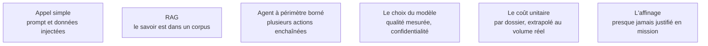

Niveau attendu : **référence**. Choisir le plus simple qui passe le seuil relève de l'AI engineering, où le client n'a personne pour corriger un surdimensionnement qu'il paiera en supervision.

La difficulté en mission n'est pas de savoir faire : c'est de choisir le plus simple qui passe le seuil. Chaque niveau d'autonomie ajouté multiplie les modes de défaillance et le coût de supervision, et ce coût sera porté par le client après le départ du FDE.

## Ce qu'il faut savoir faire

- Ne monter dans l'échelle qu'après avoir **mesuré** le niveau inférieur insuffisant. Commencer par la plus petite unité d'autonomie et n'ajouter une capacité qu'une fois la précédente prouvée.
- Chiffrer le coût annuel complet avant de choisir, et le présenter avec la facture actuelle du processus. Quarante centimes le dossier sur quatre-vingt mille dossiers par an, ce sont trente-deux mille euros qui apparaîtront dans le budget d'exploitation du client, sans le FDE pour les expliquer.
- Vérifier tôt que les données ont le droit de sortir. Si elles n'ont pas ce droit, le débat est clos et l'arbitrage porte sur les modèles hébergeables.
- Dimensionner l'effort d'ingestion à sa vraie taille : documents scannés, versions multiples, droits d'accès par document. C'est là qu'est le travail, pas dans la génération.
- Choisir sur la capacité de reprise du client, pas sur la sophistication. Un pipeline lisible qu'une équipe d'exploitation sait modifier vaut mieux qu'un système multi-agents dont le FDE est le seul à comprendre le comportement.

## Les notions mobilisées

- [[notions/ingenierie-de-prompt]] — l'angle FDE est que le niveau le plus bas suffit plus souvent qu'on ne croit, et qu'il se teste en une journée.
- [[notions/rag]] — le corpus client conditionne tout, et l'effort réel est dans l'ingestion.
- [[notions/agents-llm]] — un agent en environnement client doit avoir un périmètre d'action borné, journalisé et réversible. Ce qui est difficile n'est pas la boucle, c'est de faire accepter qu'un système agisse.
- [[notions/choix-de-modele]] — la confidentialité tranche souvent avant la qualité.
- [[notions/cout-et-latence-inference]] — un coût par requête acceptable en démonstration devient insoutenable au volume de production.
- [[notions/affinage-de-modele]] — il crée une dette de ré-entraînement que le client ne saura pas porter ; le réserver au cas où un format ou un vocabulaire métier résiste réellement au contexte.

Le contenu technique complet est dans [[parcours/ai-engineer/index|AI Engineer]] et [[parcours/ai-agents/index|AI Agents]].

> [!warning] Piège
> Choisir l'architecture sur ce qui est intéressant à construire. Le biais est réel, et d'autant plus fort que la mission est courte et le sujet à la mode.
