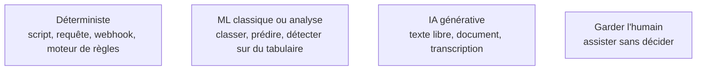

Le cœur du métier et l'erreur la plus chère. La grille se parcourt **étape par étape** sur la carte de la phase 1, jamais une fois pour le projet entier : un même processus mélange presque toujours les deux natures.

## Ce qu'il faut savoir faire

- Reconnaître le déterministe : règle explicite et stable, entrée structurée, résultat vérifiable. Moins cher, testable, explicable à un auditeur.
- Ne pas monter d'un cran par réflexe : classer, prédire ou détecter une anomalie sur des données tabulaires ne demande pas un modèle de langage.
- Réserver le génératif à l'entrée non structurée — courriel, document scanné, transcription — quand du jugement est nécessaire.
- Trancher sur le coût d'une erreur et sa détectabilité, pas sur la difficulté de la tâche. Une erreur rare et invisible dans un processus comptable coûte plus qu'une erreur fréquente et visible dans une aide à la rédaction.
- Traiter la RPA comme un dernier recours, quand aucune interface programmatique n'existe : elle casse à chaque changement d'écran, et il faut l'assumer comme dette explicite ou ne pas la retenir.
- Rendre l'arbitrage par étape, par écrit, et le présenter au client. C'est un livrable, pas une intuition d'ingénieur.

## Les notions mobilisées

- [[notions/arbitrage-deterministe-probabiliste]] — l'angle FDE est que la grille se rend étape par étape et se signe : c'est ce qui la distingue d'une préférence technique.
- [[notions/apprentissage-supervise]] — tout un espace de tâches se traite par un modèle classique, moins cher et plus vérifiable qu'un modèle de langage. Le contenu complet est dans [[parcours/machine-learning/index|le parcours Machine Learning]].
- [[notions/choix-de-modele]] — dès qu'on entre dans le génératif, la première question n'est pas quel modèle mais quelles données ont le droit de sortir.
- [[notions/garde-fous]] — « ne pas automatiser » est une réponse valide : le système prépare, l'humain décide.

> [!tip] L'architecture qui gagne le plus souvent
> Elle est hybride et se décrit simplement : le déterministe fait le travail, le modèle fait la traduction. Un modèle extrait des informations structurées d'un document, puis du code classique applique les règles métier, vérifie la cohérence et écrit dans le système. Souplesse sur l'entrée, vérifiabilité sur la décision — et un système où le modèle décide **et** agit est beaucoup plus difficile à faire accepter par un contrôle interne.

> [!warning] Piège
> Laisser l'arbitrage se faire par la commande. Quand le budget s'intitule « projet IA », toute réponse qui n'utilise pas d'IA paraît hors sujet, y compris aux yeux du FDE. C'est précisément le moment de dire que la moitié du gain vient d'un connecteur et d'une suppression d'étape.
