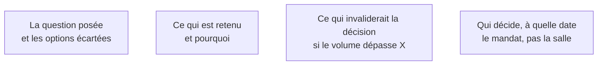

Une phase 2 non écrite n'a pas eu lieu. Les arbitrages sont pris en réunion, avec des gens qui changeront de poste, et ils seront rejoués au troisième mois par quelqu'un qui n'était pas là.

## Ce qu'il faut savoir faire

- Écrire une note par arbitrage structurant : le périmètre, la nature déterministe ou probabiliste de chaque étape, l'architecture, le modèle, le seuil de mise en service. Une page, pas dix.
- Documenter les options écartées et le motif. C'est la partie qui sert le plus longtemps.
- Nommer la condition d'invalidation — « si le volume dépasse X », « si la latence tolérée descend sous Y ». Cela transforme une décision en décision révisable, ce qui la rend plus facile à accepter.
- Tenir les notes dans le dépôt, en Markdown, datées, à côté du code.
- Faire valider par celui qui a le mandat, pas par la salle.
- Tester la note en la faisant lire à quelqu'un du client qui n'était pas dans le projet. S'il comprend l'enjeu, elle est bonne.

## Les notions mobilisées

- [[notions/redaction-technique]] — l'angle FDE est que la note sert à répondre en trente secondes, avec une trace datée, et à distinguer un changement de contexte légitime d'un changement d'avis.
- [[notions/arbitrage-deterministe-probabiliste]] — c'est l'arbitrage qui se rejoue le plus souvent, donc celui qui mérite le plus d'être écrit.
- [[notions/roi-des-projets-ia]] — la condition d'invalidation est presque toujours un seuil de volume ou de coût.
- [[notions/gestion-parties-prenantes]] — une décision validée par la salle n'engage personne.

> [!warning] Piège
> Écrire la note pour se couvrir. Le ton se sent immédiatement, et le document devient une pièce de dossier plutôt qu'un outil de travail.
