La phase courte qui décide de la valeur de tout le reste : simplifier le processus avant d'écrire une ligne de code, puis trancher étape par étape entre automatisation déterministe et IA générative.

## Les six sujets

```mermaid
flowchart TD
  S["Simplifier avant d'automatiser<br/>Référence"]
  A["Déterministe ou probabiliste<br/>Référence"]
  C["Choisir l'architecture<br/>Référence"]
  E["Le protocole d'évaluation<br/>Référence"]
  V["Valeur et coût<br/>Autonomie"]
  N["Écrire l'arbitrage<br/>Autonomie"]

  click S "/parcours/forward-deployed-engineer/arbitrage-technologique/simplifier-avant-d-automatiser"
  click A "/parcours/forward-deployed-engineer/arbitrage-technologique/deterministe-ou-probabiliste"
  click C "/parcours/forward-deployed-engineer/arbitrage-technologique/choisir-l-architecture"
  click E "/parcours/forward-deployed-engineer/arbitrage-technologique/le-protocole-d-evaluation"
  click V "/parcours/forward-deployed-engineer/arbitrage-technologique/valeur-et-cout"
  click N "/parcours/forward-deployed-engineer/arbitrage-technologique/ecrire-l-arbitrage"
```

**Porte de sortie** : un seuil de réussite chiffré, un protocole pour le mesurer, et un arbitrage écrit signé par celui qui décide.

## Ma progression

- [ ] [[parcours/forward-deployed-engineer/arbitrage-technologique/simplifier-avant-d-automatiser|Simplifier avant d'automatiser]] — automatiser une étape inutile la rend permanente
- [ ] [[parcours/forward-deployed-engineer/arbitrage-technologique/deterministe-ou-probabiliste|Déterministe ou probabiliste]] — la grille qui se parcourt étape par étape
- [ ] [[parcours/forward-deployed-engineer/arbitrage-technologique/choisir-l-architecture|Choisir l'architecture]] — appel simple, RAG, pipeline, agent, et le choix du modèle
- [ ] [[parcours/forward-deployed-engineer/arbitrage-technologique/le-protocole-d-evaluation|Le protocole d'évaluation]] — le jeu de cas est la spécification
- [ ] [[parcours/forward-deployed-engineer/arbitrage-technologique/valeur-et-cout|Valeur et coût]] — compter la supervision et la reprise des échecs
- [ ] [[parcours/forward-deployed-engineer/arbitrage-technologique/ecrire-l-arbitrage|Écrire l'arbitrage]] — une phase 2 non écrite n'a pas eu lieu
