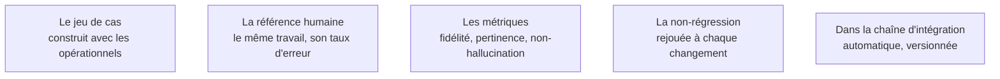

Niveau attendu : **référence**. Le jeu d'évaluation est la spécification et il survit au modèle comme au prestataire : un protocole mal construit ne se voit qu'à la dérive, trop tard.

Le jeu d'évaluation **est** la spécification. Il dit ce qu'on attend mieux que n'importe quel document, il est vérifiable, et il transforme une discussion d'opinion en une discussion sur des cas.

## Ce qu'il faut savoir faire

- Construire le jeu avec les opérationnels, à partir de cas réels, y compris les cas limites collectés en phase 1. Cinquante à deux cents cas suffisent à trancher.
- Établir la référence humaine sur les mêmes cas : ce que fait l'équipe aujourd'hui, avec son propre taux d'erreur. Sans elle, le seuil est arbitraire et le débat sans fin.
- Faire annoter une trentaine de cas par deux personnes du métier, séparément, et mesurer leur taux d'accord. Il est presque toujours plus bas que ce que tout le monde croit — ce chiffre fixe un plafond réaliste et ouvre une conversation que personne n'avait eue sur ce qu'est une bonne réponse.
- Distinguer l'évaluation du composant — la récupération remonte-t-elle le bon passage — et l'évaluation de bout en bout. Une note globale ne dit pas où corriger.
- Versionner le protocole dans le dépôt et le rejouer automatiquement.

## Les notions mobilisées

- [[notions/evaluation-llm]] — l'angle FDE est que le jeu d'évaluation est autant un instrument de négociation qu'un outil technique : il protège du cas unique montré en réunion comme preuve que « ça ne marche pas ».
- [[notions/metriques-evaluation-ml]] — la référence humaine se mesure avec les mêmes conventions que le système, sinon la comparaison ne vaut rien.
- [[notions/garde-fous]] — une partie des métriques porte sur ce que le système doit refuser de faire, pas sur la qualité de ce qu'il produit.
- [[notions/tests-logiciels]] — la non-régression est la seule documentation que le client relira, parce qu'elle échoue quand elle ment.
- [[notions/integration-continue]] — un protocole qu'on rejoue à la main n'est rejoué qu'une fois.

> [!warning] Piège
> Construire le jeu d'évaluation soi-même, par gain de temps. Il reflétera alors la compréhension du FDE, qui est justement ce qu'il fallait vérifier. Le jeu doit venir du métier, même si l'obtenir prend deux semaines de plus.
