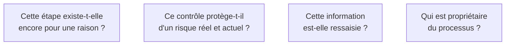

Automatiser une étape inutile la rend permanente : ce qui était une lourdeur discutable devient un composant logiciel que plus personne n'osera retirer, avec sa documentation, sa supervision et son coût de maintenance.

## Ce qu'il faut savoir faire

- Poser les trois questions dans l'ordre sur chaque étape : est-elle encore justifiée, le contrôle protège-t-il d'un risque actuel, l'information est-elle ressaisie d'un système à un autre.
- Retrouver l'incident d'origine derrière un contrôle avant de le supprimer. Beaucoup existent à cause d'un événement ancien dont plus personne ne se souvient — et parfois il est toujours d'actualité.
- Prendre d'abord les gains sans IA : connecter deux systèmes qui s'ignorent, supprimer une ressaisie, remplacer une validation systématique par un contrôle par sondage. Peu spectaculaires, ils financent la suite.
- Mesurer ce que vaut la simplification seule, avant toute IA, et l'annoncer. Un processus qui passe de onze à six jours en trois semaines sans risque technique achète la confiance nécessaire à la partie incertaine.
- Reconnaître quand la demande réelle est de ne rien changer au processus. C'est une contrainte politique légitime, à nommer tôt quitte à réduire le périmètre — pas à contourner en silence.

## Les notions mobilisées

- [[notions/reingenierie-de-processus]] — l'angle FDE est que la réingénierie n'est pas un projet séparé : c'est la première semaine du projet d'IA, et le FDE l'obtient parce qu'il est sur place, pas parce qu'il a un mandat.
- [[notions/gouvernance-ia]] — supprimer un contrôle engage une responsabilité ; il faut savoir laquelle avant de proposer.
- [[notions/systemes-patrimoniaux]] — la ressaisie disparaît en connectant deux systèmes, ce qui relève de l'intégration et pas de l'IA.
- [[notions/conduite-du-changement]] — la suppression pure est le gain le plus rentable et le plus difficile à obtenir : elle appartient au propriétaire du processus, pas au FDE.

> [!warning] Piège
> Commencer par la démonstration d'IA la plus impressionnante. Le FDE dépense alors son capital de confiance au lieu de le constituer, et il devra négocier les suppressions utiles sans rien avoir prouvé.
