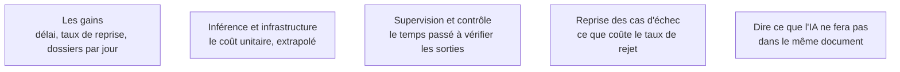

Le calcul est faisable parce que la phase 1 a produit des volumes et des durées. Ce qu'on oublie, c'est que la moitié du coût est ailleurs que dans l'inférence.

## Ce qu'il faut savoir faire

- Compter les gains en unités métier — dossiers par jour, jours de délai, taux de reprise — et non en pourcentages de productivité, qui ne se vérifient jamais.
- Compter le coût complet : inférence, infrastructure, supervision, traitement des cas rejetés, maintenance après le départ du FDE. Un gain de quinze minutes par dossier qui crée trois minutes de vérification n'est pas un gain de quinze minutes.
- Traiter le taux de rejet comme un paramètre économique : un système qui traite quatre-vingts pour cent des cas et passe la main proprement sur le reste est souvent plus rentable qu'un système qui prétend tout traiter.
- Faire le calcul avec le contrôle de gestion du client et ses conventions, sinon il ne sera pas repris. Un chiffre produit par le prestataire seul est toujours suspect, et il a souvent raison de l'être.
- Calculer sur la queue de distribution — dossiers atypiques, pics d'activité, absences — et non sur le cas nominal, qui passait déjà bien.

## Les notions mobilisées

- [[notions/roi-des-projets-ia]] — l'angle FDE est que le gain le plus solide à annoncer est la réduction du délai et de la variabilité : mesurable, il ne menace personne dans son poste et il résiste à la contestation.
- [[notions/cout-et-latence-inference]] — le coût unitaire par dossier, extrapolé au volume annuel réel, avant de construire.
- [[notions/observabilite]] — la supervision ne se chiffre que si elle est instrumentée ; sinon elle reste un coût invisible porté par l'équipe du client.
- [[notions/garde-fous]] — le routage vers l'humain est ce qui borne le coût des erreurs, donc ce qui rend le calcul défendable.
- [[notions/gouvernance-ia]] — dire ce que le système ne fera pas fait partie de la documentation de conformité, pas seulement de l'honnêteté commerciale.

> [!warning] Piège
> Annoncer une réduction d'effectif. Elle rend la conduite du changement impossible et se révèle presque toujours fausse à l'échelle d'une première mission.
