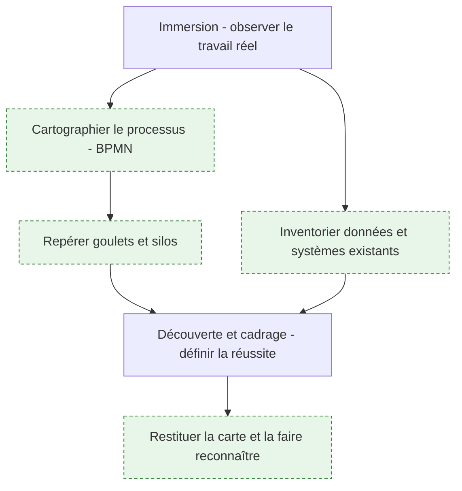
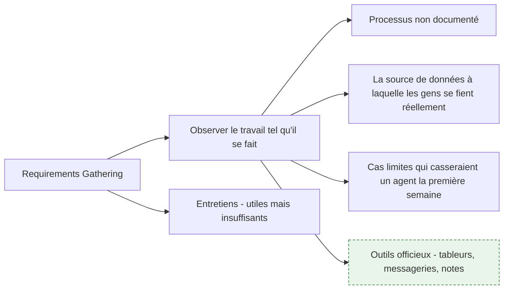
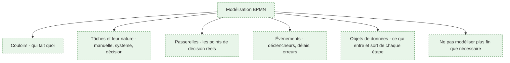
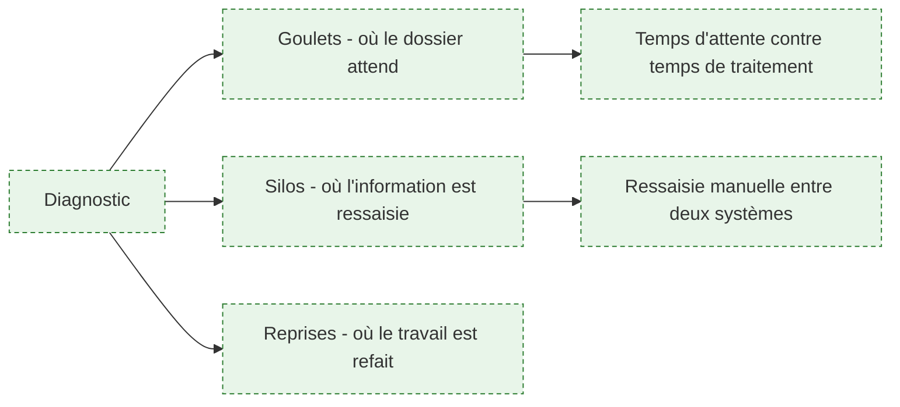
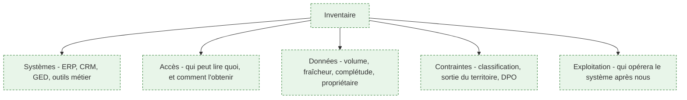
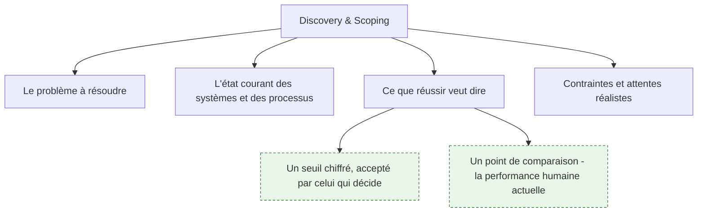
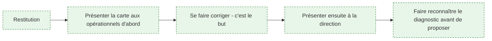

> [!abstract] La phase où l'on regarde les gens travailler. Elle produit la carte du processus réel, l'inventaire de ce qui existe et la liste des cas limites — trois livrables sans lesquels tout ce qui suit est une hypothèse. C'est la phase la plus sous-estimée du métier, et celle dont les erreurs coûtent le plus cher parce qu'elles se découvrent en production.

## La phase en un coup d'œil

**Porte de sortie** : le client reconnaît son processus dans la carte, y compris les parties qui le dérangent. Tant que quelqu'un dit « ce n'est pas comme ça que ça se passe », la phase n'est pas finie — et c'est une chance de l'entendre maintenant.

---

## 1. L'immersion : observer plutôt que demander

**À quoi ça sert.** L'amont pose la bonne phrase : les exigences viennent de l'observation autant que de la conversation, parce que la façon dont les équipes travaillent et la façon dont elles la décrivent sont deux choses différentes. Ce n'est pas de la mauvaise foi. Personne ne décrit spontanément les contournements qu'il a mis en place, parce qu'ils sont devenus le travail normal — le tableur personnel qui corrige les données de l'outil officiel, la validation qu'on obtient par messagerie parce que le circuit formel prend trois jours. C'est exactement là que se trouve le gisement d'automatisation, et c'est invisible en entretien.

**Ce qu'il faut savoir**

- S'asseoir à côté de quelqu'un pendant qu'il travaille, une demi-journée, vaut cinq réunions de recueil. Demander à voir l'écran, pas à décrire l'écran.
- Chercher les outils officieux : le tableur maintenu par une personne, la base Access oubliée, le fichier partagé qui fait autorité contre l'ERP. Leur existence est une information sur ce qui manque à l'existant.
- Identifier la source de données à laquelle les gens se fient réellement, qui n'est pas toujours la source officielle. C'est celle qu'il faudra alimenter ou remplacer.
- Collecter les cas limites dès l'observation : le dossier atypique, le client qui déroge, le mois de clôture. Ce sont eux qui feront échouer un système probabiliste en production.
- Observer plusieurs personnes sur la même tâche. L'écart entre deux opérateurs sur le même poste est une mesure directe de la part de jugement dans le processus — donc de ce qui est automatisable et de ce qui ne l'est pas.
- Voir [[notions/cadrage-besoin]] ; l'angle FDE est que le cadrage est d'abord un travail d'observation, pas de rédaction.

> [!tip] Ajout 2026
> Demande à voir le dernier dossier qui s'est mal passé. Cette question précise ouvre plus que « quelles sont vos difficultés » : elle porte sur un cas concret, elle autorise à parler d'un échec sans mettre personne en cause, et elle donne d'un coup un cas limite documenté, la chaîne des personnes impliquées et le contournement qui a été employé.

> [!warning] Piège
> Mener l'audit uniquement auprès de l'encadrement. Le management décrit le processus cible, celui des procédures, et il est souvent sincèrement convaincu qu'il est appliqué. Une mission cadrée sur cette base automatise un processus qui n'existe pas. Il faut le temps des opérationnels, et il faut l'obtenir explicitement du commanditaire, sinon il sera perpétuellement repoussé.

---

## 2. Modéliser le processus

**À quoi ça sert.** Le brief demande de savoir décortiquer un processus métier complexe et de le modéliser en BPMN. L'amont ne dit rien de la modélisation. Pourtant, sans notation partagée, la discussion sur le processus reste une suite d'anecdotes et chacun garde sa version. Un schéma BPMN sert trois usages simultanés : il force le FDE à admettre ce qu'il n'a pas compris — un trou dans le diagramme se voit —, il donne aux équipes métier un objet qu'elles peuvent corriger, et il rend visibles les points de décision, qui sont précisément là où se pose la question de l'IA.

**Ce qu'il faut savoir**

- Voir [[notions/bpmn]] pour la notation. L'angle FDE : on n'utilise qu'une fraction du standard — tâches, passerelles, événements, couloirs, objets de données. Le reste est de la virtuosité inutile devant une équipe métier.
- Les couloirs sont l'information politique de la carte : ils montrent combien de services traverse un dossier, donc combien de personnes devront approuver le changement. Voir [[notions/gestion-parties-prenantes]].
- Les passerelles sont les candidats à l'automatisation. Une décision prise sur une règle explicite est déterministe ; une décision prise « au jugé » demande à comprendre sur quoi porte le jugement avant de conclure quoi que ce soit.
- Modéliser le processus **tel qu'il est**, pas tel qu'il devrait être. Le processus cible vient en phase 2, et les deux cartes doivent rester distinctes.
- Annoter chaque étape de deux chiffres quand ils sont disponibles : volume et durée. Sans eux, impossible de repérer un goulet ou de calculer un retour sur investissement.
- La granularité utile s'arrête où le changement s'arrête. Inutile de descendre sous la maille de ce qu'on peut modifier.

> [!tip] Ajout 2026
> Modélise à la main, devant les gens, sur un tableau, avant de produire un diagramme propre. Le schéma dessiné en direct se corrige pendant qu'il se construit et donne à l'équipe la propriété du résultat ; le schéma parfait envoyé par courriel reçoit trois remarques polies et aucune correction de fond. La version soignée vient après, pour la trace.

> [!warning] Piège
> Produire une cartographie exhaustive de quatre-vingts pages. Elle sera juste, personne ne la lira, et elle aura consommé la moitié du temps de mission. La carte est un outil d'arbitrage : elle doit être assez précise pour trancher, et pas plus. Si un détail ne change aucune décision, il n'a pas à figurer.

---

## 3. Goulets d'étranglement et silos

**À quoi ça sert.** Le brief demande de cartographier les goulets d'étranglement et les silos d'information. C'est le passage de la description au diagnostic, et c'est ce qui justifie la mission. Le résultat est presque toujours contre-intuitif : dans un processus de bout en bout, le temps passé à traiter est marginal devant le temps passé à attendre — attendre une validation, attendre un retour, attendre le lot de nuit. Optimiser une tâche de trente minutes dans un cycle de onze jours ne se voit pas ; supprimer une attente de trois jours se voit immédiatement.

**Ce qu'il faut savoir**

- Mesurer deux durées distinctes par étape : le temps de traitement effectif et le temps écoulé. L'écart entre les deux est le vrai gisement.
- Les silos se repèrent à la ressaisie : chaque fois qu'une information est recopiée d'un écran vers un autre, il y a une frontière de système et une source d'erreur. C'est souvent automatisable de façon parfaitement déterministe, sans IA.
- Les reprises — le travail refait parce que l'information était incomplète en amont — se traitent à la source et non au point où elles se manifestent.
- Quantifier, même grossièrement. « Quatre-vingts dossiers par semaine, vingt minutes chacun, dont la moitié en ressaisie » suffit à trancher. Voir [[notions/roi-des-projets-ia]] ; l'angle FDE est que ces chiffres se collectent en phase 1 ou jamais, car après le début du développement plus personne n'a le temps de les établir.
- Voir [[notions/reingenierie-de-processus]] pour le cadre méthodologique.

> [!tip] Ajout 2026
> Le goulet le plus fréquent dans les organisations n'est pas une tâche : c'est une personne. Un expert unique dont l'avis conditionne la suite, et qui traite quand il peut. Ce constat est pénible à formuler et il faut le formuler — sans nommer la personne, en parlant du point de passage. C'est souvent là que l'IA a le plus de valeur, non pour remplacer l'expert mais pour préparer son dossier et lui permettre de trancher en cinq minutes au lieu de quarante.

> [!warning] Piège
> Confondre le goulet et l'endroit où l'on se plaint. Le service qui exprime la douleur est souvent celui qui subit le problème, pas celui qui le crée. Remonter le flux jusqu'à la cause avant de proposer quoi que ce soit, sinon on automatise un pansement.

---

## 4. Inventorier l'existant

**À quoi ça sert.** L'amont mentionne les *Enterprise Workflows* — approbations, transferts, intégrations, conformité — sans dire comment les inventorier. Or les contraintes d'un environnement d'entreprise décident de la faisabilité bien avant la technique. Savoir dès la deuxième semaine que les données concernées sont classifiées et ne peuvent pas sortir de l'infrastructure interne élimine d'un coup la moitié des architectures envisagées, et fait gagner un mois.

**Ce qu'il faut savoir**

- Pour chaque système touché : qui en est propriétaire, comment on y accède techniquement, quel est le délai d'obtention d'un accès, et qui doit signer. Le délai est une donnée de planning.
- Pour chaque jeu de données : volume, fraîcheur, taux de complétude sur les champs utiles, propriétaire métier. Mesuré par requête, pas déclaré.
- Classification et conformité : données personnelles, secret des affaires, contraintes sectorielles. Voir [[notions/donnees-sensibles]] et [[notions/rgpd]] — l'angle FDE est qu'il faut rencontrer le délégué à la protection des données pendant la phase 1, pas avant la mise en service.
- Identifier tout de suite **qui exploitera le système après le départ du FDE**. Cette équipe est une contrainte de conception : sa stack, ses compétences, sa charge. Voir [[parcours/forward-deployed-engineer/sortie-de-mission]].
- Voir [[notions/systemes-patrimoniaux]] pour les stratégies d'interfaçage, développées en [[parcours/forward-deployed-engineer/industrialisation|phase 3]].

> [!tip] Ajout 2026
> Demande un export réel dès la première semaine, même partiel, même anonymisé. Rien ne remplace le fait de regarder les données : l'écart entre ce qu'on vous décrit et ce que contient le fichier est systématique, et il est plus grand qu'annoncé. Un export obtenu en semaine 1 vaut mieux qu'un accès complet obtenu en semaine 8.

> [!warning] Piège
> Attendre les accès pour commencer à travailler. Dans une grande organisation les habilitations prennent des semaines. Pendant ce temps, on observe, on cartographie, on quantifie, on prépare le jeu d'évaluation — tout cela ne demande aucun droit technique. Un FDE bloqué par ses accès en semaine 3 n'a pas organisé sa phase 1.

---

## 5. Découverte, cadrage et définition de la réussite

**À quoi ça sert.** C'est la phase où se joue la suite, dit l'amont, et il a raison. La question qui décide de tout n'est pas « qu'est-ce qu'on construit » mais « à quoi saura-t-on que ça marche ». Un système d'IA n'a pas de réussite binaire : il a une distribution de qualité. Sans seuil chiffré fixé **avant** le développement, la réception se fait à l'impression, et l'impression dépend du dernier cas testé par le directeur devant ses équipes.

**Ce qu'il faut savoir**

- Le seuil doit être comparé à quelque chose : la performance humaine actuelle sur les mêmes cas. Presque personne ne la connaît, et l'établir est souvent le constat le plus utile de la phase — le taux d'erreur humain sur une tâche répétitive est rarement celui qu'on imagine.
- Formuler la réussite en termes métier — délai de traitement, taux de reprise, dossiers traités par jour — et pas seulement en métriques de modèle. Voir [[notions/roi-des-projets-ia]].
- Fixer aussi le critère d'échec : ce qui, s'il se produit, fait arrêter. Un projet sans critère d'arrêt ne s'arrête jamais, il s'éteint.
- Les attentes : dire tôt et explicitement ce que l'IA ne fera pas. L'amont le note dans sa section communication ; c'est aussi un travail de cadrage.
- Le protocole d'évaluation qui matérialisera ce seuil se construit en [[parcours/forward-deployed-engineer/arbitrage-technologique|phase 2]]. Voir [[notions/evaluation-llm]].

> [!tip] Ajout 2026
> Fais nommer par le client les vingt cas qu'il veut voir passer, dès la phase 1, et écris-les. Ils deviendront le noyau du jeu d'évaluation, ils sont choisis par ceux qui jugeront, et leur simple rédaction fait apparaître les désaccords internes sur ce qu'est une bonne réponse — désaccords qu'il vaut mille fois mieux découvrir maintenant qu'en recette.

> [!warning] Piège
> Accepter un objectif formulé en pourcentage sans définir la mesure. « Quatre-vingt-quinze pour cent de précision » ne veut rien dire tant qu'on n'a pas dit précision sur quel échantillon, jugée par qui, et comparée à quoi. Le chiffre rassure tout le monde en réunion et se retourne contre le FDE en recette.

---

## 6. Restituer la carte

**À quoi ça sert.** La restitution n'est pas une formalité de fin de phase : c'est le moment où le diagnostic devient partagé, et sans diagnostic partagé aucune proposition ne tient. Un client qui n'a pas reconnu son problème discutera la solution indéfiniment. L'ordre compte : les opérationnels d'abord, parce qu'ils corrigent les erreurs factuelles et qu'être corrigé en petit comité vaut mieux qu'en comité de direction ; la direction ensuite, avec une carte déjà validée par le terrain, ce qui lui donne une autorité qu'aucun slide ne procure.

**Ce qu'il faut savoir**

- Restituer les constats gênants aussi, avec des faits et sans désigner de responsable. Une restitution complaisante détruit la crédibilité du reste.
- Séparer strictement le constat de la proposition. Mélanger les deux transforme la réunion en négociation et empêche de valider le diagnostic.
- Une page de synthèse, une carte, une liste chiffrée de goulets. Pas trente slides.
- Faire acter par écrit ce qui a été reconnu. Voir [[notions/redaction-technique]].
- Les techniques de présentation et la gestion de la salle : [[parcours/forward-deployed-engineer/competences-relationnelles]].

> [!tip] Ajout 2026
> Termine la restitution par la liste de ce que tu n'as pas pu vérifier. Cela paraît contre-productif et c'est l'inverse : en nommant tes angles morts, tu obtiens les compléments dans la salle et tu installes l'idée que ce document dit ce qu'il sait et ce qu'il ignore. C'est le fondement de tout ce qui sera annoncé plus tard sur les limites du système.

> [!warning] Piège
> Enchaîner la cartographie et la proposition technique dans la même réunion. Le diagnostic sert alors de préambule à une solution déjà écrite, tout le monde le sent, et la discussion porte sur la solution sans que le problème ait été validé. Deux réunions, deux objets — quitte à ce qu'elles soient rapprochées.

---

## Ressources

Issues de l'amont, capture du 16 septembre 2026 :

- [Requirements Gathering in Software Engineering](https://www.jamasoftware.com/requirements-management-guide/requirements-gathering-and-management-processes/what-is-requirements-gathering/) — le plus consistant des trois sur le recueil ; c'est le guide d'un éditeur d'outil de gestion des exigences, à lire en le sachant.
- [Requirements Gathering in Business Analysis](https://www.coursera.org/learn/requirements-gathering-in-business-analysis) — cours complet, format long.
- [AI Techniques (Production): Use Case Discovery & System Scoping](https://academy.openai.com/public/clubs/builders-etkn1/videos/ai-techniques-production-use-case-discovery-and-system-scoping-2025-12-11) — le plus proche du sujet réel, et daté.
- [What is enterprise workflow management?](https://www.manageengine.com/appcreator/enterprise-workflow-management.html) — introduction sommaire, contenu d'éditeur.

Ajoutée, source primaire :

- [Spécification BPMN 2.0, Object Management Group](https://www.omg.org/spec/BPMN/2.0/) — la norme elle-même. On n'en lit qu'une petite partie, mais c'est la seule référence qui ne soit pas l'interprétation d'un outil.
