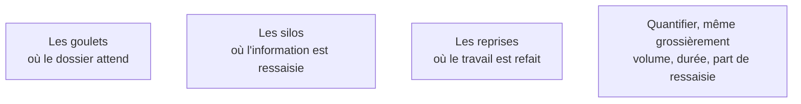

Le passage de la description au diagnostic. Dans un processus de bout en bout, le temps passé à traiter est marginal devant le temps passé à attendre — et c'est ce qui justifie la mission.

## Ce qu'il faut savoir faire

- Mesurer deux durées distinctes par étape : le temps de traitement effectif et le temps écoulé. L'écart entre les deux est le vrai gisement. Optimiser une tâche de trente minutes dans un cycle de onze jours ne se voit pas ; supprimer une attente de trois jours se voit immédiatement.
- Repérer les silos à la ressaisie : chaque information recopiée d'un écran vers un autre signale une frontière de système et une source d'erreur. C'est souvent automatisable de façon parfaitement déterministe, sans IA.
- Traiter les reprises à leur source et non au point où elles se manifestent.
- Produire un chiffre, même grossier : « quatre-vingts dossiers par semaine, vingt minutes chacun, dont la moitié en ressaisie » suffit à trancher.
- Remonter le flux jusqu'à la cause avant de proposer quoi que ce soit.

## Les notions mobilisées

- [[notions/reingenierie-de-processus]] — l'angle FDE est que le diagnostic se fait sur les attentes, pas sur les tâches : c'est là que sont les gains les moins risqués.
- [[notions/systemes-patrimoniaux]] — une ressaisie est presque toujours la trace d'une frontière entre deux systèmes qui s'ignorent.
- [[notions/qualite-des-donnees]] — le travail refait vient le plus souvent d'une information incomplète en amont, pas d'une erreur d'exécution.
- [[notions/roi-des-projets-ia]] — ces chiffres se collectent en phase 1 ou jamais : après le début du développement, plus personne n'a le temps de les établir.

> [!tip] Le goulet est souvent une personne
> Un expert unique dont l'avis conditionne la suite et qui traite quand il peut. Le constat est pénible à formuler et il faut le formuler — sans nommer la personne, en parlant du point de passage. C'est souvent là que l'IA a le plus de valeur : non pour remplacer l'expert, mais pour préparer son dossier et lui permettre de trancher en cinq minutes au lieu de quarante.

> [!warning] Piège
> Confondre le goulet et l'endroit où l'on se plaint. Le service qui exprime la douleur est souvent celui qui subit le problème, pas celui qui le crée. Automatiser là revient à poser un pansement.
