La phase où l'on regarde les gens travailler. Elle produit la carte du processus réel, l'inventaire de l'existant et la liste des cas limites — sans quoi tout ce qui suit est une hypothèse.

## Les six sujets

```mermaid
flowchart TD
  O["Observer le travail réel<br/>Référence"]
  M["Modéliser le processus<br/>Autonomie"]
  G["Goulets et silos<br/>Référence"]
  I["Inventorier l'existant<br/>Autonomie"]
  D["Définir la réussite<br/>Référence"]
  R["Restituer le diagnostic<br/>Référence"]

  click O "/parcours/forward-deployed-engineer/audit-et-cartographie/observer-le-travail-reel"
  click M "/parcours/forward-deployed-engineer/audit-et-cartographie/modeliser-le-processus"
  click G "/parcours/forward-deployed-engineer/audit-et-cartographie/goulets-et-silos"
  click I "/parcours/forward-deployed-engineer/audit-et-cartographie/inventorier-l-existant"
  click D "/parcours/forward-deployed-engineer/audit-et-cartographie/definir-la-reussite"
  click R "/parcours/forward-deployed-engineer/audit-et-cartographie/restituer-le-diagnostic"
```

**Porte de sortie** : le client reconnaît son processus dans la carte, y compris les parties qui le dérangent.

## Ma progression

- [ ] [[parcours/forward-deployed-engineer/audit-et-cartographie/observer-le-travail-reel|Observer le travail réel]] — voir l'écran plutôt que se le faire décrire
- [ ] [[parcours/forward-deployed-engineer/audit-et-cartographie/modeliser-le-processus|Modéliser le processus]] — dessiner le processus tel qu'il est, pas tel qu'il devrait être
- [ ] [[parcours/forward-deployed-engineer/audit-et-cartographie/goulets-et-silos|Goulets et silos]] — mesurer l'attente, repérer les ressaisies, quantifier
- [ ] [[parcours/forward-deployed-engineer/audit-et-cartographie/inventorier-l-existant|Inventorier l'existant]] — systèmes, accès, données, classification, équipe de reprise
- [ ] [[parcours/forward-deployed-engineer/audit-et-cartographie/definir-la-reussite|Définir la réussite]] — le seuil, la référence humaine, le critère d'arrêt
- [ ] [[parcours/forward-deployed-engineer/audit-et-cartographie/restituer-le-diagnostic|Restituer le diagnostic]] — les opérationnels d'abord, la direction ensuite
