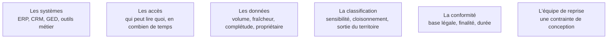

Les contraintes d'un environnement d'entreprise décident de la faisabilité bien avant la technique. Savoir dès la deuxième semaine que les données ne peuvent pas sortir de l'infrastructure interne élimine d'un coup la moitié des architectures envisagées.

## Ce qu'il faut savoir faire

- Établir pour chaque système touché : le propriétaire, le mode d'accès technique, le délai d'obtention d'un accès, et qui doit signer. Le délai est une donnée de planning, pas une formalité.
- Mesurer pour chaque jeu de données le volume, la fraîcheur, le taux de complétude sur les champs utiles et le propriétaire métier. Mesuré par requête, jamais déclaré.
- Obtenir un export réel dès la première semaine, même partiel, même anonymisé. L'écart entre ce qu'on vous décrit et ce que contient le fichier est systématique, et plus grand qu'annoncé.
- Rencontrer le délégué à la protection des données pendant la phase 1, pas avant la mise en service.
- Identifier tout de suite qui exploitera le système après le départ du FDE : sa pile technique, ses compétences et sa charge sont des contraintes d'architecture.
- Travailler sans attendre les accès : observer, cartographier, quantifier et préparer le jeu d'évaluation ne demandent aucun droit technique.

## Les notions mobilisées

- [[notions/systemes-patrimoniaux]] — l'angle FDE est de recenser les stratégies d'interfaçage possibles dès l'audit, parce qu'elles conditionnent l'architecture de la phase 3.
- [[notions/controle-d-acces]] — dans une grande organisation, l'habilitation est un délai avant d'être un mécanisme technique.
- [[notions/qualite-des-donnees]] — le diagnostic qualité est souvent le premier résultat qui impressionne le client, avant toute IA.
- [[notions/donnees-sensibles]] — la classification existe déjà chez le client et fait autorité : s'y conformer plutôt qu'en inventer une.
- [[notions/rgpd]] — un traitement découvert en fin de mission peut être bloqué ; en phase 1 il se cadre.
- [[notions/transfert-de-competences]] — l'équipe de reprise s'identifie en semaine 1, pas en semaine 20.

> [!warning] Piège
> Attendre les accès pour commencer à travailler. Un FDE bloqué par ses habilitations en semaine 3 n'a pas organisé sa phase 1.
