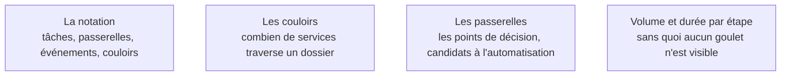

Sans notation partagée, la discussion sur le processus reste une suite d'anecdotes et chacun garde sa version. Un schéma force le FDE à admettre ce qu'il n'a pas compris — un trou dans le diagramme se voit.

## Ce qu'il faut savoir faire

- Dessiner le processus **tel qu'il est**, pas tel qu'il devrait être. Le processus cible vient en phase 2, et les deux cartes restent distinctes.
- Modéliser à la main, devant les gens, sur un tableau, avant de produire un diagramme propre. Le schéma dessiné en direct se corrige pendant qu'il se construit et donne à l'équipe la propriété du résultat.
- Annoter chaque étape de deux chiffres dès qu'ils existent : volume et durée.
- S'arrêter là où s'arrête le pouvoir de changer : si un détail ne modifie aucune décision, il n'a pas à figurer.
- Distinguer une décision prise sur règle explicite d'une décision prise « au jugé » — c'est la matière première de l'arbitrage de la phase 2.

## Les notions mobilisées

- [[notions/bpmn]] — l'angle FDE est qu'on n'utilise qu'une fraction du standard : le reste est de la virtuosité inutile devant une équipe métier.
- [[notions/gestion-parties-prenantes]] — les couloirs sont l'information politique de la carte, et le premier jet de la cartographie d'influence.
- [[notions/arbitrage-deterministe-probabiliste]] — les passerelles sont les candidats à l'automatisation, et l'arbitrage se rendra passerelle par passerelle.
- [[notions/roi-des-projets-ia]] — sans volume ni durée, aucun retour sur investissement n'est calculable après coup.

> [!warning] Piège
> Produire une cartographie exhaustive de quatre-vingts pages. Elle sera juste, personne ne la lira, et elle aura consommé la moitié du temps de mission. La carte est un outil d'arbitrage : assez précise pour trancher, et pas plus.
