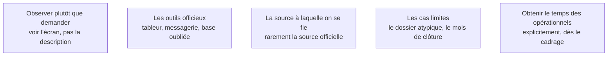

Niveau attendu : **référence**. L'écart entre le travail décrit et le travail réel est la matière première du métier : personne chez le client n'a intérêt à le mettre au jour, et personne d'autre ne le fera.

La façon dont une équipe travaille et la façon dont elle la décrit sont deux choses différentes. Ce n'est pas de la mauvaise foi : personne ne décrit spontanément les contournements qu'il a mis en place, parce qu'ils sont devenus le travail normal.

## Ce qu'il faut savoir faire

- S'asseoir une demi-journée à côté de quelqu'un qui travaille, et demander à voir l'écran plutôt qu'à se le faire décrire. Cela vaut cinq réunions de recueil.
- Repérer les outils officieux — le tableur maintenu par une personne, la base oubliée, le fichier partagé qui fait autorité contre l'ERP. Leur existence est une information sur ce qui manque à l'existant.
- Identifier la source de données à laquelle les gens se fient réellement, qui n'est pas toujours la source officielle. C'est celle qu'il faudra alimenter ou remplacer.
- Collecter les cas limites dès l'observation : ce sont eux qui feront échouer un système probabiliste en production.
- Observer plusieurs personnes sur la même tâche. L'écart entre deux opérateurs au même poste mesure directement la part de jugement dans le processus, donc ce qui est automatisable et ce qui ne l'est pas.
- Obtenir du commanditaire, par écrit, le temps des opérationnels. Sans cela il sera perpétuellement repoussé.

## Les notions mobilisées

- [[notions/cadrage-besoin]] — l'angle FDE est que le cadrage est d'abord un travail d'observation, pas de rédaction.
- [[notions/reingenierie-de-processus]] — les contournements officieux sont le gisement d'automatisation le plus rentable, et il est invisible en entretien.
- [[notions/qualite-des-donnees]] — la source de confiance réelle se repère en observant, pas en lisant le schéma de données.
- [[notions/evaluation-llm]] — les cas limites collectés ici deviendront le noyau du jeu d'évaluation en phase 2.
- [[notions/gestion-parties-prenantes]] — l'accès au terrain est une négociation, et elle se gagne au cadrage.

> [!tip] La question qui ouvre
> Demande à voir le dernier dossier qui s'est mal passé. Elle porte sur un cas concret, elle autorise à parler d'un échec sans mettre personne en cause, et elle donne d'un coup un cas limite documenté, la chaîne des personnes impliquées et le contournement employé.

> [!warning] Piège
> Mener l'audit uniquement auprès de l'encadrement. Le management décrit le processus cible, celui des procédures, et il est souvent sincèrement convaincu qu'il est appliqué. Une mission cadrée sur cette base automatise un processus qui n'existe pas.
