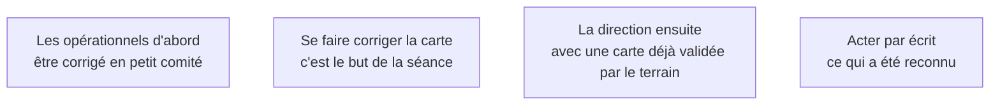

La restitution n'est pas une formalité de fin de phase : c'est le moment où le diagnostic devient partagé. Un client qui n'a pas reconnu son problème discutera la solution indéfiniment.

## Ce qu'il faut savoir faire

- Restituer dans cet ordre : les opérationnels corrigent les erreurs factuelles, la direction reçoit ensuite une carte que le terrain a validée — une autorité qu'aucun slide ne procure.
- Restituer aussi les constats gênants, avec des faits et sans désigner de responsable. Une restitution complaisante détruit la crédibilité du reste.
- Séparer strictement le constat de la proposition, et tenir deux réunions distinctes quitte à ce qu'elles soient rapprochées. Mélangées, le diagnostic sert de préambule à une solution déjà écrite et tout le monde le sent.
- Tenir en une page de synthèse, une carte et une liste chiffrée de goulets. Pas trente slides.
- Terminer par la liste de ce qu'on n'a pas pu vérifier. Nommer ses angles morts fait remonter les compléments dans la salle et installe l'idée que ce document dit ce qu'il sait et ce qu'il ignore.

## Les notions mobilisées

- [[notions/conduite-du-changement]] — l'angle FDE est que la restitution est le premier acte d'adoption : ceux qui ont corrigé la carte la défendront.
- [[notions/bpmn]] — une carte qu'on ne peut pas corriger en séance n'a rien validé.
- [[notions/gestion-parties-prenantes]] — l'ordre des auditoires est une décision tactique, pas une question de politesse.
- [[notions/redaction-technique]] — ce qui n'est pas acté par écrit sera rediscuté au troisième mois.

> [!warning] Piège
> Enchaîner la cartographie et la proposition technique dans la même réunion. La discussion porte alors sur la solution sans que le problème ait été validé.
