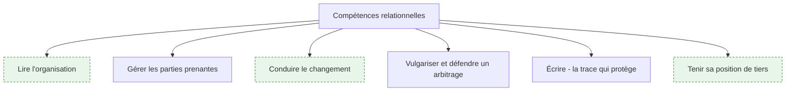
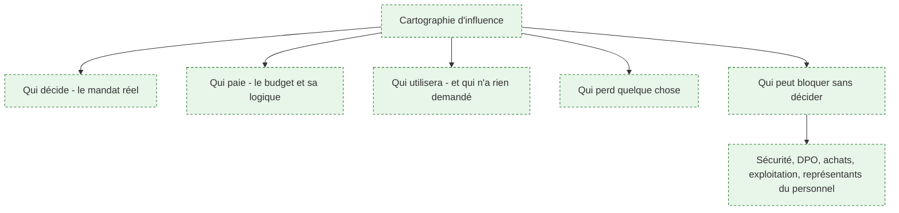
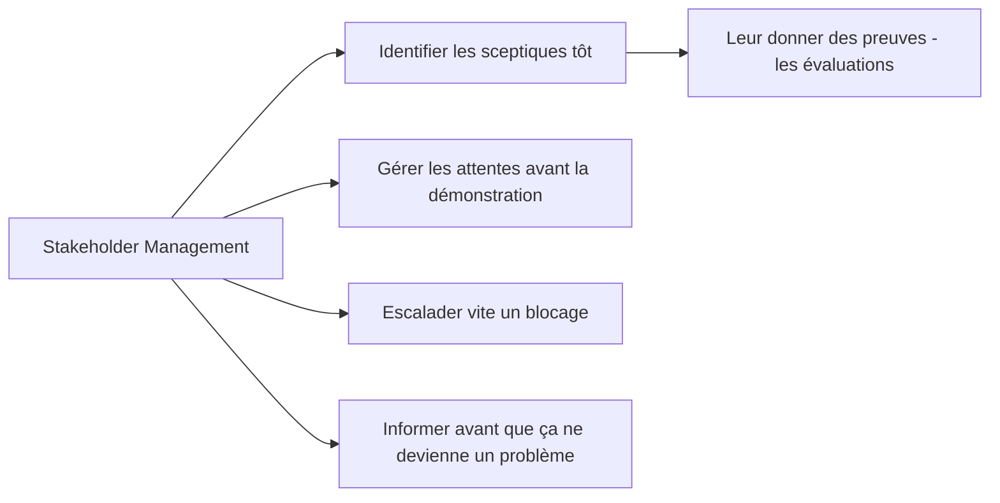
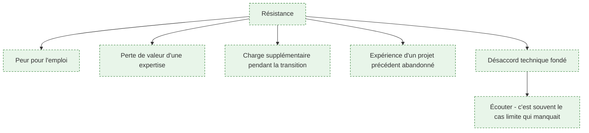
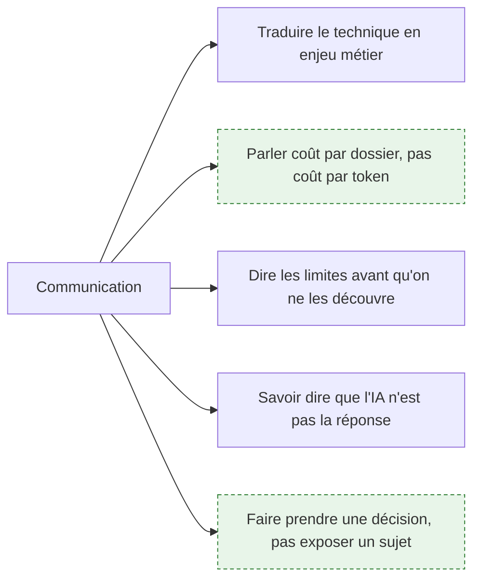
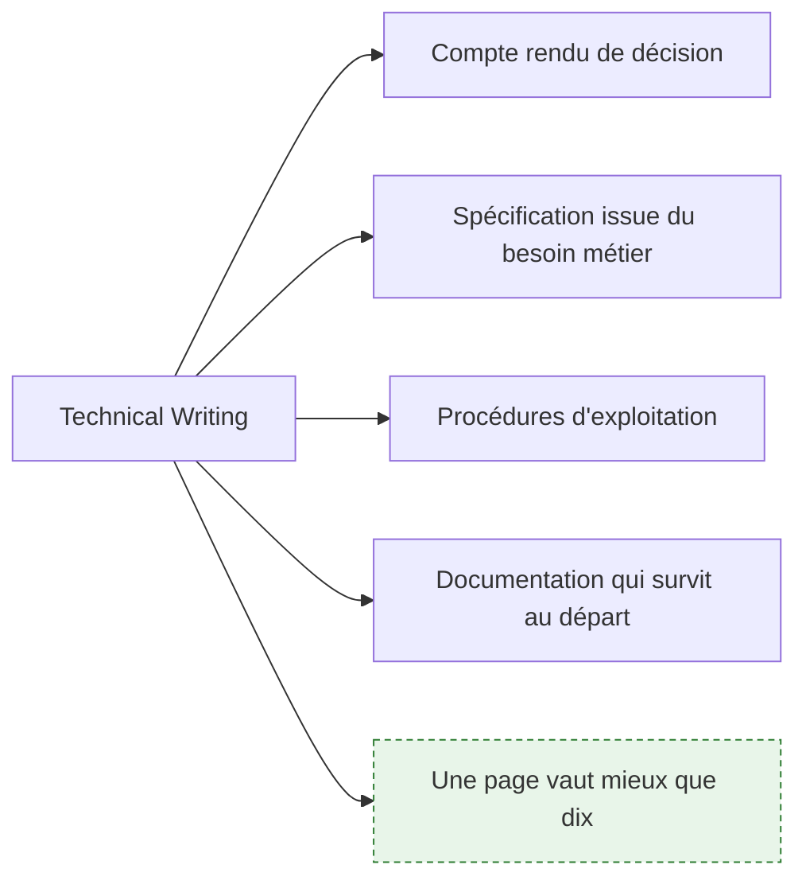
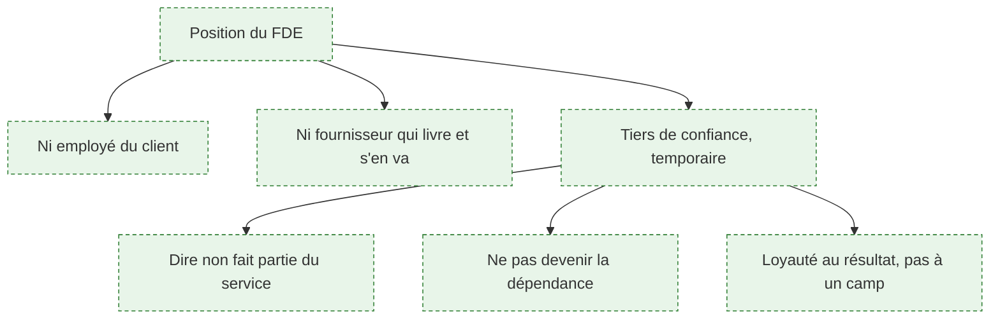

# Compétences relationnelles et politiques

> [!abstract] La partie du métier qui décide de l'issue des missions et dont on parle mal, parce qu'elle est traitée soit comme un vernis de savoir-vivre, soit comme de la manœuvre. Ce n'est ni l'un ni l'autre : lire une organisation, aligner des intérêts divergents et défendre un arbitrage devant une direction sont des compétences professionnelles, qui s'apprennent et se travaillent comme les autres.

## Vue d'ensemble

Une phrase de l'amont résume l'enjeu mieux que n'importe quel développement : *si vous ne savez pas expliquer à un directeur non technique ce que l'IA peut et ne peut pas faire, vous ne pouvez pas être FDE.* Le reste de cette page détaille ce qu'il faut savoir faire autour.

---

## 1. Lire l'organisation

**À quoi ça sert.** Le brief demande une « intelligence situationnelle pour naviguer dans la politique interne ». Concrètement, cela commence par un travail d'observation aussi méthodique que la cartographie de processus : identifier qui décide réellement, qui paie, qui utilisera, qui perd quelque chose, et surtout qui peut bloquer sans avoir le pouvoir de décider. Cette dernière catégorie est la plus sous-estimée. Une direction générale peut vouloir le projet et un responsable de la sécurité l'arrêter pendant six semaines — sans mauvaise intention, en appliquant son rôle.

**Ce qu'il faut savoir**

- Le commanditaire n'est pas toujours le décideur. Le vrai mandat se repère à ce qu'une personne peut engager seule : un budget, une ouverture de flux, une modification de processus.
- Les bloqueurs légitimes — sécurité, protection des données, achats, exploitation, instances représentatives — ne bloquent pas par principe : ils appliquent un rôle. Les intégrer tôt les transforme en alliés, les découvrir tard les transforme en obstacles.
- Repérer ceux qui perdent quelque chose : l'expert dont la compétence devient moins rare, le service dont le volume justifiait l'effectif, la personne qui maintenait le tableur devenu inutile. Leur inquiétude est fondée.
- Identifier un allié opérationnel, quelqu'un qui connaît le terrain et parle aux autres. Une mission sans relais interne n'avance pas.
- Voir [[notions/gestion-parties-prenantes]]. L'angle FDE : la cartographie se fait pendant la phase 1, en même temps que celle du processus, et les couloirs du schéma BPMN en donnent le premier jet.

> [!tip] Ajout 2026
> Tiens cette cartographie par écrit, pour toi, et relis-la toutes les deux semaines. Les positions bougent : quelqu'un qui était favorable s'est fait dire non par sa hiérarchie, un sceptique a été convaincu par une démonstration. Ce document ne se partage pas — pas par cynisme, mais parce qu'un document qui classe des collègues n'a pas à circuler dans l'organisation qui vous accueille.

> [!warning] Piège
> Se croire au-dessus de la politique interne parce qu'on est technique et de passage. C'est exactement l'inverse : le statut d'extérieur donne une liberté de parole rare, et gaspiller cette liberté par maladresse la referme définitivement. Le FDE est observé dès le premier jour, y compris sur la façon dont il parle des équipes en leur absence.

---

## 2. Gérer les parties prenantes

**À quoi ça sert.** L'amont est très juste sur ce point : la gestion des parties prenantes consiste moins à maintenir les gens contents qu'à s'assurer que les bonnes personnes savent ce qui se passe **avant** que ça ne devienne un problème. Il ajoute une observation qui mérite d'être reprise telle quelle : le travail technique peut être excellent et la mission échouer quand même, parce que ceux qui doivent approuver, adopter ou financer le système n'ont jamais été convaincus.

**Ce qu'il faut savoir**

- Identifier les sceptiques dès la phase 1 et aller les voir en premier. Leur scepticisme porte souvent sur un cas précis qu'ils ont vu échouer ; ce cas doit entrer dans le jeu d'évaluation.
- Le jeu d'évaluation est l'instrument central de cette relation : il remplace « je trouve que ça marche mal » par un chiffre et un échantillon discutables. Voir [[notions/evaluation-llm]].
- Gérer les attentes **avant** la démonstration, jamais après : dire ce qu'on va montrer, sur quel périmètre, avec quelles limites connues.
- Escalader un blocage rapidement et factuellement. Un blocage passé sous silence est un blocage qu'on découvrira à la fin, quand il aura coûté trois semaines.
- Un point hebdomadaire court et écrit : ce qui a avancé, ce qui est bloqué, ce qui est décidé. Voir [[notions/redaction-technique]].

> [!tip] Ajout 2026
> Annonce les mauvaises nouvelles le jour où tu les découvres, avec une option de traitement. Un retard annoncé tôt est un sujet de gestion ; le même retard découvert à l'échéance est une faute. C'est la règle qui protège le mieux la relation de confiance sur une mission longue, et c'est aussi celle qu'il est le plus tentant de contourner.

> [!warning] Piège
> Confondre la satisfaction du commanditaire et la réussite de la mission. Un commanditaire content d'une démonstration hebdomadaire peut découvrir au sixième mois que rien n'est en service. La seule mesure qui compte est l'usage réel, et c'est le FDE qui doit ramener la discussion là, même quand tout le monde est satisfait.

---

## 3. La résistance au changement

**À quoi ça sert.** Le brief demande de surmonter la résistance au changement. Le verbe est mal choisi et il vaut la peine de le dire : la résistance n'est pas un obstacle à contourner, c'est une information. Cinq causes reviennent, et une seule relève de la communication. Les autres sont des objections fondées — une crainte pour l'emploi qui a une base réelle, une expertise dévaluée, une surcharge de transition réelle, le souvenir d'un projet identique abandonné il y a deux ans. Traiter cela comme un problème de pédagogie, c'est ne pas l'avoir compris.

**Ce qu'il faut savoir**

- La question de l'emploi doit recevoir une réponse honnête, et le FDE n'est presque jamais celui qui peut la donner. Ce qu'il peut faire : refuser de dire « rassurez-vous » quand il n'en sait rien, et obtenir du commanditaire une position claire, à annoncer par lui.
- La charge de transition est réelle : pendant plusieurs semaines, les équipes font l'ancien processus et le nouveau. Ce coût doit être reconnu et planifié, sinon il se transforme en rejet.
- La mémoire des projets antérieurs conditionne l'accueil. Demander ce qui a été tenté avant et pourquoi ça s'est arrêté est une des questions les plus utiles du premier jour.
- Un désaccord technique venant du terrain est presque toujours une information : l'opérateur qui dit « ça ne marchera pas sur les dossiers de tel type » nomme un cas limite. Il entre dans le jeu d'évaluation.
- Voir [[notions/conduite-du-changement]]. L'angle FDE : le FDE n'a aucun pouvoir hiérarchique et une présence limitée dans le temps ; son seul levier est la preuve accumulée et la relation avec les opérationnels.

> [!tip] Ajout 2026
> Fais construire le jeu d'évaluation par les plus sceptiques. Cela paraît contre-intuitif et c'est le mécanisme le plus efficace qu'on puisse mettre en place : ils choisissent les cas difficiles, ils s'approprient le critère de réussite, et si le système passe leurs cas, ils sont les mieux placés pour le dire. S'il ne les passe pas, l'information est acquise avant la mise en service.

> [!warning] Piège
> Contourner un opposant en obtenant un arbitrage hiérarchique. Cela fonctionne une fois, et cela coûte la coopération de son équipe pour le reste de la mission — celle dont on a besoin pour les cas limites, les données de test et l'adoption. L'arbitrage hiérarchique est un outil de dernier recours, pas un raccourci.

---

## 4. Vulgariser et défendre un arbitrage

**À quoi ça sert.** L'amont pose l'exigence : parler de coût en tokens et de latence dans la même conversation où l'on explique un retour sur investissement à un dirigeant. La difficulté n'est pas de simplifier, c'est de simplifier sans mentir — supprimer la précision inutile en gardant l'arbitrage réel. Le test est simple : après l'explication, l'interlocuteur doit pouvoir **prendre une décision** et la défendre lui-même devant quelqu'un d'autre. S'il a seulement compris, c'était de la pédagogie ; s'il peut décider, c'était de la vulgarisation utile.

**Ce qu'il faut savoir**

- Convertir systématiquement dans les unités de l'interlocuteur : coût par dossier traité et non par million de tokens, délai de réponse ressenti et non latence au premier token, taux de reprise et non score de fidélité.
- Présenter un arbitrage comme un choix entre options chiffrées, avec une recommandation. Une direction qui reçoit trois options sans recommandation ne décide pas, elle demande une autre réunion.
- Annoncer les limites avant qu'elles ne soient découvertes. La crédibilité d'un FDE se construit sur la première limite qu'il annonce lui-même, pas sur la première réussite.
- Savoir dire que l'IA n'est pas la bonne réponse, et le dire tôt. C'est la phrase la plus importante de la roadmap amont, et elle est plus facile à prononcer quand on apporte en même temps la solution déterministe qui, elle, fonctionne. Voir [[parcours/forward-deployed-engineer/arbitrage-technologique]].
- Ne jamais improviser un chiffre en comité. Un ordre de grandeur donné de mémoire devient un engagement dans le compte rendu.
- Voir [[notions/roi-des-projets-ia]] pour le cadre de valeur.

> [!tip] Ajout 2026
> Prépare une réponse tenant en trois phrases à la question « pourquoi ça ne peut pas être fiable à cent pour cent ». Elle sera posée, souvent avec agacement, souvent par quelqu'un dont c'est la seule question. La réponse qui fonctionne le mieux ne parle ni de probabilités ni d'architecture : elle compare au taux d'erreur humain actuel sur la même tâche, chiffre établi en phase 2, et elle explique ce qui est fait des cas incertains. Voir [[parcours/forward-deployed-engineer/audit-et-cartographie]].

> [!warning] Piège
> Se réfugier dans la technique quand la question est politique. « Le modèle n'est pas déterministe » est une réponse exacte à une question qui n'a pas été posée. Ce qu'on demande est : qui porte la responsabilité en cas d'erreur, et qu'est-ce qu'on fait quand ça arrive. Ces questions ont des réponses — humain dans la boucle, journal d'audit, seuil de confiance, procédure de reprise — et elles ne sont pas techniques.

---

## 5. Écrire

**À quoi ça sert.** L'amont classe la rédaction technique parmi les compétences de terrain et donne la bonne justification : une bonne documentation est ce qui permet au client d'exploiter et de faire évoluer le système après la fin de la mission, sans rappeler le FDE à chaque question. Il y a une seconde fonction, plus immédiate : l'écrit est ce qui fige les décisions dans une organisation où les gens changent de poste et où les réunions se réinterprètent.

**Ce qu'il faut savoir**

- Le compte rendu de décision après chaque arbitrage, envoyé le jour même, court, avec ce qui a été décidé et par qui. Le silence vaut acceptation, et on le dit explicitement.
- La spécification traduit le besoin métier en comportement attendu et vérifiable. Le jeu d'évaluation en est la partie exécutable.
- Les procédures d'exploitation s'écrivent au fil de l'eau, à chaque incident traité. Voir [[parcours/forward-deployed-engineer/sortie-de-mission]].
- Écrire court. Un document d'une page lu vaut mieux qu'un document de trente pages archivé.
- Voir [[notions/redaction-technique]]. L'angle FDE : le lecteur n'est pas un pair, c'est quelqu'un qui reprendra le système dans six mois sans contexte et sans pouvoir poser de question.

> [!tip] Ajout 2026
> Écris pendant la mission, jamais à la fin. La documentation rédigée dans les deux dernières semaines est toujours une reconstitution : elle décrit le système tel qu'on croit l'avoir fait, pas tel qu'il est, et elle omet précisément les contournements que le lecteur cherchera. Une note de dix lignes le jour où l'on résout un problème vaut trois pages écrites deux mois plus tard.

> [!warning] Piège
> Documenter le fonctionnement sans documenter les raisons. Le code dit ce que fait le système ; il ne dit jamais pourquoi cette étape est restée manuelle, pourquoi ce connecteur passe par un export nocturne, pourquoi ce seuil est à 0,7. Ce sont exactement les points sur lesquels le successeur se trompera.

---

## 6. Tenir sa position

**À quoi ça sert.** L'immersion crée une ambiguïté permanente : le FDE partage le quotidien des équipes clientes sans en faire partie, et il représente un fournisseur sans être un commercial. Cette position a une valeur propre — c'est celle d'un tiers qui peut dire ce que les gens de l'intérieur ne peuvent pas dire, parce qu'ils ont une carrière à faire dans l'organisation. La tenir demande deux disciplines : ne pas se faire capter par un camp, et ne pas devenir indispensable.

**Ce qu'il faut savoir**

- Ne pas prendre parti dans les conflits internes, ce qui ne veut pas dire ne pas avoir d'avis technique. La distinction se voit et elle se respecte.
- Refuser une demande hors périmètre est une prestation, pas un défaut de coopération. La refuser en proposant l'alternative honnête est la façon correcte de le faire.
- Ne pas devenir la dépendance : le FDE qui règle tout lui-même, plus vite que quiconque, construit un système qui s'arrête avec son départ. Voir [[parcours/forward-deployed-engineer/sortie-de-mission]].
- Les limites déontologiques sont réelles : un système qui surveille individuellement des salariés, un traitement sans base légale, une conformité affichée qui n'existe pas. Le dire, par écrit, et le faire remonter.
- Le sens des affaires que demande l'amont — comprendre comment l'organisation fonctionne et gagne de l'argent — sert précisément à ça : savoir ce qui est en jeu pour chacun avant de proposer quoi que ce soit.

> [!tip] Ajout 2026
> Décide dès le début à quelle question tu réponds quand on te demande, en aparté, ce que tu penses d'une personne ou d'un service. La réponse qui tient sur la durée porte sur les faits observés — « sur ce processus, le point de blocage est le délai de validation » — jamais sur les personnes. Cela paraît évident à froid ; en fin de journée, dans un couloir, après trois semaines d'immersion, ça ne l'est pas.

> [!warning] Piège
> Se laisser instrumentaliser dans un arbitrage interne. Un avis technique de l'extérieur a du poids, et certains le solliciteront pour trancher un débat qui n'est pas technique — remplacer un outil parce qu'un service veut reprendre la main, par exemple. Répondre sur le terrain technique, en nommant explicitement ce qui relève d'une décision d'organisation, et laisser cette décision à ceux dont c'est le rôle.

---

## Ressources

Issues de l'amont, capture du 16 septembre 2026 :

- [Stakeholder Management Guide: Definitions, Processes & More](https://simplystakeholders.com/resources/guides/stakeholder-management/) — le cadre classique de la gestion des parties prenantes. Généraliste, pas spécifique au métier ; c'est le contenu d'un éditeur de logiciel.
- [Roadmap Technical Writer](https://roadmap.sh/technical-writer) — le renvoi de l'amont pour la rédaction technique.
