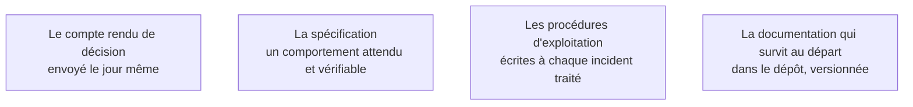

L'écrit permet au client d'exploiter le système sans rappeler le FDE à chaque question. Il a une seconde fonction, plus immédiate : il fige les décisions dans une organisation où les gens changent de poste et où les réunions se réinterprètent.

## Ce qu'il faut savoir faire

- Envoyer le compte rendu après chaque arbitrage, le jour même, court, avec ce qui a été décidé et par qui — en disant explicitement que le silence vaut acceptation.
- Traduire le besoin métier en comportement attendu et vérifiable. Le jeu d'évaluation en est la partie exécutable.
- Écrire pendant la mission, jamais à la fin. La documentation rédigée dans les deux dernières semaines est une reconstitution : elle décrit le système tel qu'on croit l'avoir fait, et elle omet précisément les contournements que le lecteur cherchera.
- Écrire court. Un document d'une page lu vaut mieux qu'un document de trente pages archivé.
- Documenter les raisons et pas seulement le fonctionnement : le code dit ce que fait le système, jamais pourquoi cette étape est restée manuelle ni pourquoi ce seuil est à 0,7.

## Les notions mobilisées

- [[notions/redaction-technique]] — l'angle FDE est que le lecteur n'est pas un pair : c'est quelqu'un qui reprendra le système dans six mois, sans contexte et sans pouvoir poser de question.
- [[notions/cadrage-besoin]] — une spécification qui ne se vérifie pas n'est pas une spécification.
- [[notions/observabilite]] — une procédure s'écrit au moment où l'incident est frais, avec sa trace.
- [[notions/transfert-de-competences]] — ce qui n'est pas dans le dépôt ne sera pas transféré.

> [!tip] Une note de dix lignes, le jour même
> Écrite le jour où l'on résout un problème, elle vaut trois pages écrites deux mois plus tard. C'est la règle qui produit, sans effort visible, la documentation d'exploitation de la phase 4.
