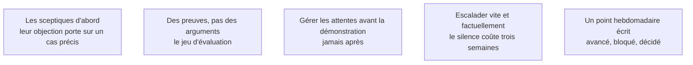

Moins maintenir les gens contents que s'assurer que les bonnes personnes savent ce qui se passe **avant** que ça ne devienne un problème. Le travail technique peut être excellent et la mission échouer, parce que ceux qui doivent approuver, adopter ou financer n'ont jamais été convaincus.

## Ce qu'il faut savoir faire

- Aller voir les sceptiques en premier, dès la phase 1. Leur scepticisme porte souvent sur un cas précis qu'ils ont vu échouer ; ce cas doit entrer dans le jeu d'évaluation.
- Annoncer avant une démonstration ce qu'on va montrer, sur quel périmètre, avec quelles limites connues.
- Annoncer les mauvaises nouvelles le jour où on les découvre, avec une option de traitement. Un retard annoncé tôt est un sujet de gestion ; le même retard découvert à l'échéance est une faute.
- Escalader un blocage rapidement et factuellement.
- Ramener la discussion sur l'usage réel, même quand tout le monde est satisfait.

## Les notions mobilisées

- [[notions/gestion-parties-prenantes]] — l'angle FDE est qu'un commanditaire content d'une démonstration hebdomadaire peut découvrir au sixième mois que rien n'est en service.
- [[notions/evaluation-llm]] — il remplace « je trouve que ça marche mal » par un chiffre et un échantillon discutables.
- [[notions/cadrage-besoin]] — gérer les attentes, c'est réénoncer le périmètre à chaque jalon.
- [[notions/conduite-du-changement]] — un blocage passé sous silence devient un rejet organisé.
- [[notions/redaction-technique]] — le point hebdomadaire écrit est ce qui empêche une réunion d'être réinterprétée.

> [!warning] Piège
> Confondre la satisfaction du commanditaire et la réussite de la mission. La seule mesure qui compte est l'usage réel, et c'est au FDE de l'imposer dans la conversation.
