Lire une organisation, aligner des intérêts divergents et défendre un arbitrage devant une direction sont des compétences professionnelles, qui s'apprennent et se travaillent comme les autres.

## Les six sujets

```mermaid
flowchart TD
  L["Lire l'organisation<br/>qui décide, qui paie, qui peut bloquer"]
  S["Gérer les parties prenantes<br/>informer avant que ça ne devienne un problème"]
  R["La résistance au changement<br/>une information, pas un obstacle"]
  V["Vulgariser et défendre<br/>faire décider, pas exposer"]
  E["Écrire<br/>la trace qui fige les décisions"]
  P["Tenir sa position<br/>un tiers de confiance, temporaire"]

  click L "/parcours/forward-deployed-engineer/competences-relationnelles/lire-l-organisation"
  click S "/parcours/forward-deployed-engineer/competences-relationnelles/gerer-les-parties-prenantes"
  click R "/parcours/forward-deployed-engineer/competences-relationnelles/la-resistance-au-changement"
  click V "/parcours/forward-deployed-engineer/competences-relationnelles/vulgariser-et-defendre"
  click E "/parcours/forward-deployed-engineer/competences-relationnelles/ecrire"
  click P "/parcours/forward-deployed-engineer/competences-relationnelles/tenir-sa-position"
```

Si vous ne savez pas expliquer à un directeur non technique ce que l'IA peut et ne peut pas faire, vous ne pouvez pas être FDE.

## Ma progression

- [ ] [[parcours/forward-deployed-engineer/competences-relationnelles/lire-l-organisation|Lire l'organisation]] — la cartographie d'influence, faite en même temps que celle du processus
- [ ] [[parcours/forward-deployed-engineer/competences-relationnelles/gerer-les-parties-prenantes|Gérer les parties prenantes]] — les sceptiques d'abord, les mauvaises nouvelles tôt
- [ ] [[parcours/forward-deployed-engineer/competences-relationnelles/la-resistance-au-changement|La résistance au changement]] — cinq causes, une seule relève de la communication
- [ ] [[parcours/forward-deployed-engineer/competences-relationnelles/vulgariser-et-defendre|Vulgariser et défendre]] — simplifier sans mentir, jusqu'à la décision
- [ ] [[parcours/forward-deployed-engineer/competences-relationnelles/ecrire|Écrire]] — compte rendu, spécification, procédure
- [ ] [[parcours/forward-deployed-engineer/competences-relationnelles/tenir-sa-position|Tenir sa position]] — ni employé du client, ni fournisseur qui livre et s'en va
